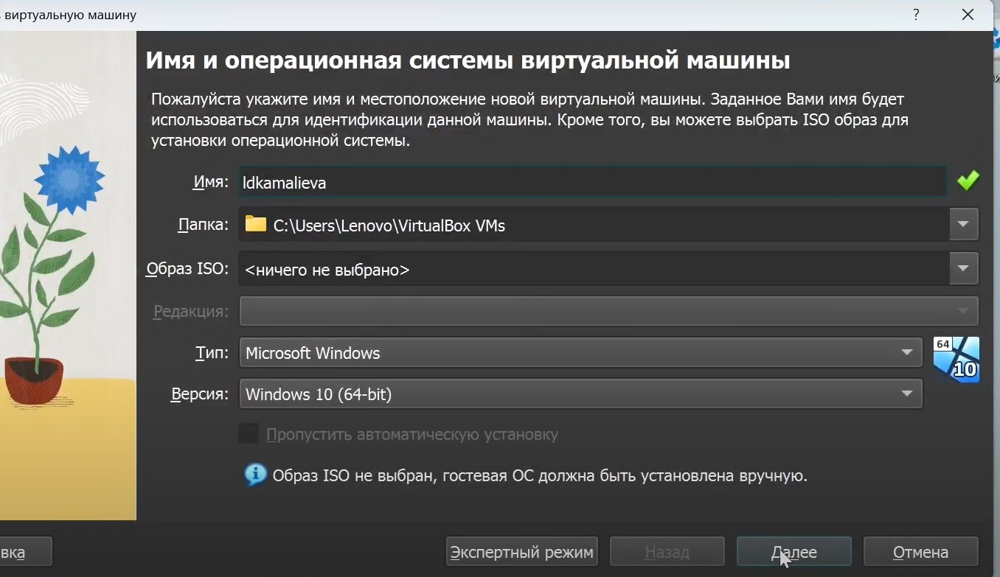
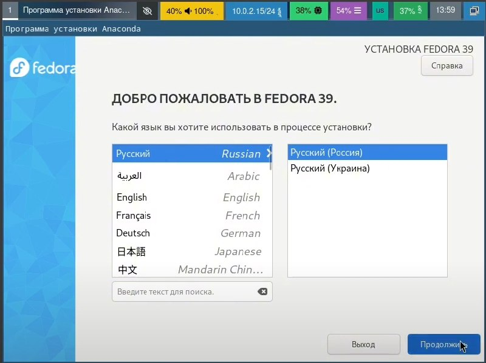
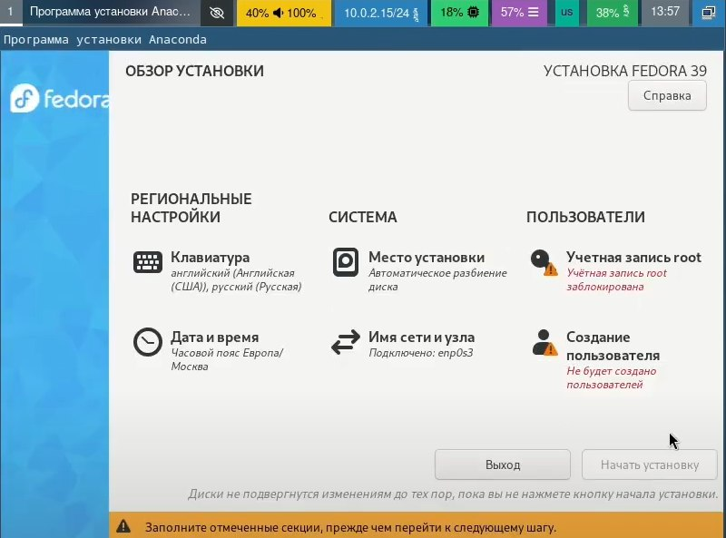
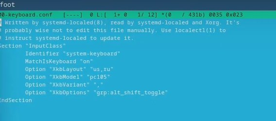
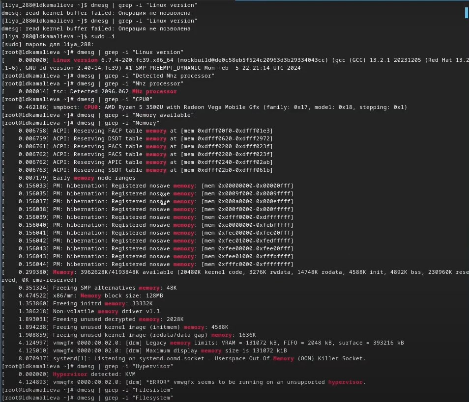

---
## Front matter
title: "Отчёта по лабораторной работе №1"
subtitle: "Создание виртуальной машины"
author: "Камалиева Лия Дамировна"

## Generic otions
lang: ru-RU
toc-title: "Содержание"

## Bibliography
bibliography: bib/cite.bib
csl: pandoc/csl/gost-r-7-0-5-2008-numeric.csl

## Pdf output format
toc: true # Table of contents
toc-depth: 2
lof: true # List of figures
lot: true # List of tables
fontsize: 12pt
linestretch: 1.5
papersize: a4
documentclass: scrreprt
## I18n polyglossia
polyglossia-lang:
  name: russian
  options:
	- spelling=modern
	- babelshorthands=true
polyglossia-otherlangs:
  name: english
## I18n babel
babel-lang: russian
babel-otherlangs: english
## Fonts
mainfont: PT Serif
romanfont: PT Serif
sansfont: PT Sans
monofont: PT Mono
mainfontoptions: Ligatures=TeX
romanfontoptions: Ligatures=TeX
sansfontoptions: Ligatures=TeX,Scale=MatchLowercase
monofontoptions: Scale=MatchLowercase,Scale=0.9
## Biblatex
biblatex: true
biblio-style: "gost-numeric"
biblatexoptions:
  - parentracker=true
  - backend=biber
  - hyperref=auto
  - language=auto
  - autolang=other*
  - citestyle=gost-numeric
## Pandoc-crossref LaTeX customization
figureTitle: "Рис."
tableTitle: "Таблица"
listingTitle: "Листинг"
lofTitle: "Список иллюстраций"
lotTitle: "Список таблиц"
lolTitle: "Листинги"
## Misc options
indent: true
header-includes:
  - \usepackage{indentfirst}
  - \usepackage{float} # keep figures where there are in the text
  - \floatplacement{figure}{H} # keep figures where there are in the text
---

# Цель работы
Целью данной работы является приобретение практических навыков установки операционной системы на виртуальную машину, настройки минимально необходимых для дальнейшей работы сервисов.

# Задание

Установить virtualbox, настройка виртуальной машины.
# Теоретическое введение
VirtualBox — программный продукт виртуализации для операционных систем Windows, Linux, FreeBSD, macOS, Solaris/OpenSolaris, ReactOS, DOS и других

# Выполнение лабораторной работы

## 1.1 Создание виртуальной машины

Шаг 1. Создаем новую виртуальную машину fedora sway, называем ее.

Шаг 2. Указываем размер основной памяти виртуальной машины — от 2048 МБ.

Шаг 3. при загрузке виртуальной машины ставим язык

Шаг 4. Открываем liveinst и делаем основные настройки

Шаг 5. Подключаем программы для удобства работы консоли
dnf -y install tmux mc

Шаг 6. Настраиваем раскладку клавиатуры

## Установка имени пользователя и названия хоста

Шаг 1. Создаем пользователя
adduser -G wheel username

Шаг 2. Задаем пароль

Шаг 3. Устанавливаем имя хоста 
hostnamectl set-hostname username

Шаг 4. Устанавливаем программу для создания отчётов и презентаций, она у меня была.

#Домашнее задание

 1. Версия ядра Linux (Linux version).
 2. Частота процессора (Detected Mhz processor).
 3. Модель процессора (CPU0).
 4. Объём доступной оперативной памяти (Memory available).
 5. Тип обнаруженного гипервизора (Hypervisor detected).
 6. Тип файловой системы корневого раздела.
 7. Последовательность монтирования файловых систем.

#Контрольные вопросы
1. Какую информацию содержит учётная запись пользователя?

Имя пользователя, домашний каталог, полное имя и начальную обложку

2. Укажите команды терминала и приведите примеры:
для получения справки по команде 
man <команда>
для перемещения по файловой системе;
cd <каталог>
для просмотра содержимого каталога;
ls
для определения объёма каталога;
du -s <каталог>
для создания / удаления каталогов / файлов;
rm <каталог>
для задания определённых прав на файл / каталог;
сdmod
для просмотра истории команд.
history
3. Что такое файловая система? Приведите примеры с краткой характеристикой.
Файловая система - это специальная структура данных на компьютере, которая определяет, как файлы организованы, хранятся и доступны к чтению и записи.
NTFS (New Technology File System) - файловая система, используемая в операционных системах Windows начиная с версии Windows NT
4. Как посмотреть, какие файловые системы подмонтированы в ОС?
с помощью команды mount
5. Как удалить зависший процесс?
командой kill <PID>

# Выводы

Я научилась устанавливать виртуальную машину в вирчал боксе, и начала работу с новой для себя ОС.

# Список литературы{.unnumbered}

