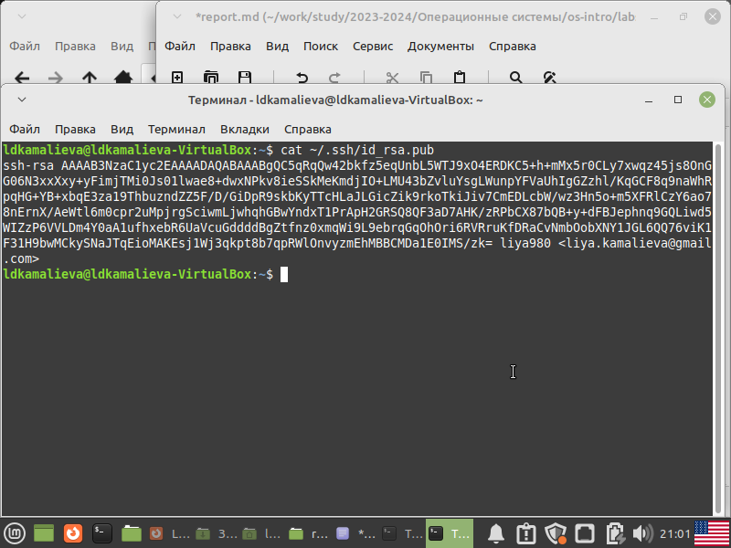
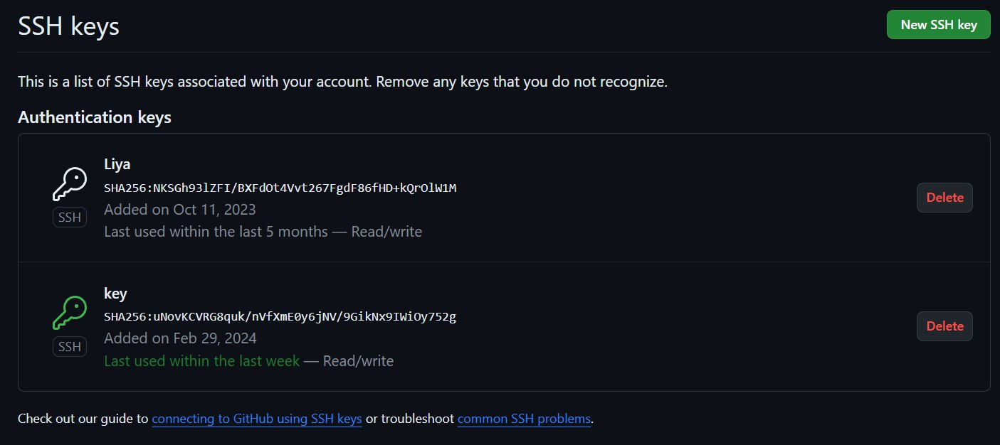
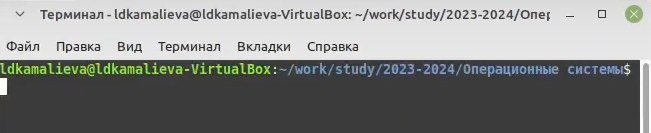
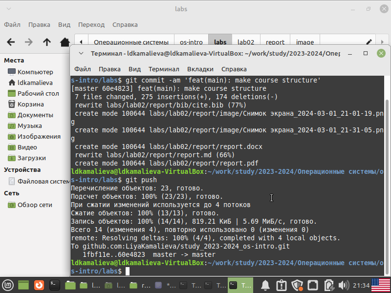

---
## Front matter
lang: ru-RU
title: Лабораторная работа №2
author:
  - Камалиева Лия Дамировна\inst{1}
institute:
   \inst{1}Российский университет дружбы народов, Москва, Россия
date: 28 февраля, 2024

## i18n babel
babel-lang: russian
babel-otherlangs: english

## Formatting pdf
toc: false
toc-title: Содержание
slide_level: 2
aspectratio: 169
section-titles: true
theme: metropolis
header-includes:
 - \metroset{progressbar=frametitle,sectionpage=progressbar,numbering=fraction}
 - '\makeatletter'
 - '\beamer@ignorenonframefalse'
 - '\makeatother'
---

## Цели и задачи

 Изучить идеологию и применение средств контроля версий.
 Освоить умения по работе с git.
 Создать свой репозиторий

# Выполнение лабораторной работы

##  Создание ssh ключа

cоздание ключа в git

{ #fig:001 width=70% }

## Добавляем ключи в github

{ #fig:002 width=70% }

## Создедим репозиторий курса с помощью команд mkdir, gh и git clone

{ #fig:003 width=70% }

## Переходим в каталог курса

{ #fig:004 width=70% }

## Создаем каталоги labs

{ #fig:004 width=70% }

## Отправляем все на github

{ #fig:004 width=70% }

#Выводы

## Итоговый слайд (вывод)

я создала репозиторий и поработала c git

