---
## Front matter
title: "отчёт по лабораторной работе № 2"
subtitle: "Дисциплина: Архитектура компьютера"
author: "Камалиева Лия Дамировна"

## Generic otions
lang: ru-RU
toc-title: "Содержание"

## Bibliography
bibliography: bib/cite.bib
csl: pandoc/csl/gost-r-7-0-5-2008-numeric.csl

## Pdf output format
toc: true # Table of contents
toc-depth: 2
lof: true # List of figures
lot: true # List of tables
fontsize: 12pt
linestretch: 1.5
papersize: a4
documentclass: scrreprt
## I18n polyglossia
polyglossia-lang:
  name: russian
  options:
	- spelling=modern
	- babelshorthands=true
polyglossia-otherlangs:
  name: english
## I18n babel
babel-lang: russian
babel-otherlangs: english
## Fonts
mainfont: PT Serif
romanfont: PT Serif
sansfont: PT Sans
monofont: PT Mono
mainfontoptions: Ligatures=TeX
romanfontoptions: Ligatures=TeX
sansfontoptions: Ligatures=TeX,Scale=MatchLowercase
monofontoptions: Scale=MatchLowercase,Scale=0.9
## Biblatex
biblatex: true
biblio-style: "gost-numeric"
biblatexoptions:
  - parentracker=true
  - backend=biber
  - hyperref=auto
  - language=auto
  - autolang=other*
  - citestyle=gost-numeric
## Pandoc-crossref LaTeX customization
figureTitle: "Рис."
tableTitle: "Таблица"
listingTitle: "Листинг"
lofTitle: "Список иллюстраций"
lotTitle: "Список таблиц"
lolTitle: "Листинги"
## Misc options
indent: true
header-includes:
  - \usepackage{indentfirst}
  - \usepackage{float} # keep figures where there are in the text
  - \floatplacement{figure}{H} # keep figures where there are in the text
---

# Цель работы

Целью работы является изучить идеологию и применение средств контроля версий. Приобрести практические навыки по работе с системой git.

# Задание

1.Установка github
2.Настройка github и перенос файлов
3.Выполнение задания для самостоятельной работы

# Теоретическое введение

GitHub — это сервис для совместной разработки и хостинга проектов. C помощью GitHub над кодом проекта может работать неограниченное количество программистов из любых точек мира.

# Выполнение лабораторной работы

1.1 Настройка github
Шаг 1. Скачаем git, при помощи команды sudo apt install git, в терминале

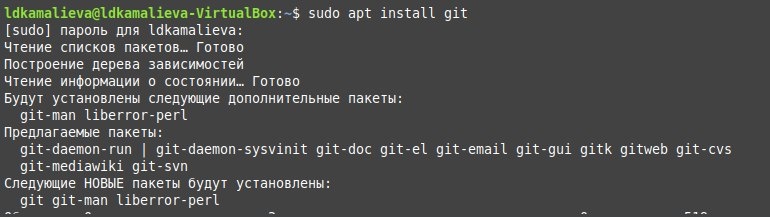{#fig:001 width=70%}

Шаг 2. Для начала давайте сделаем предварительную конфигурацию git. Откроем
терминал linux, введем команды и укажем свое имя и email:

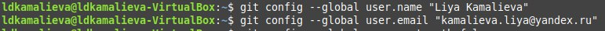{#fig:002 width=70%}

Шаг 3. Теперь же настроим utf-8 в выводе сообщений git:

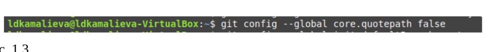{#fig:003 width=70%}

Шаг 4. Далее задаем имя начальной ветки (возьмем название master)

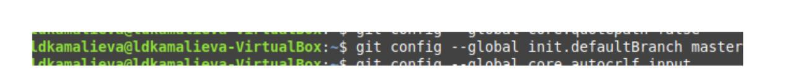{#fig:004 width=70%}

Шаг 5. Зададим параметр autocrlf:

{#fig:005 width=70%}

Шаг 6. Зададим параметры safecrlf:

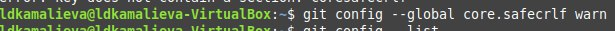{#fig:006 width=70%}

Шаг 7. сделаем проверку с помощью команды git config –list

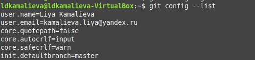{#fig:007 width=70%}

1.2 Создание SSH ключа

Шаг 1. Для идентификации пользователя на сервере репозиториев сгенерируем
несколько ключей (приватный и открытый)

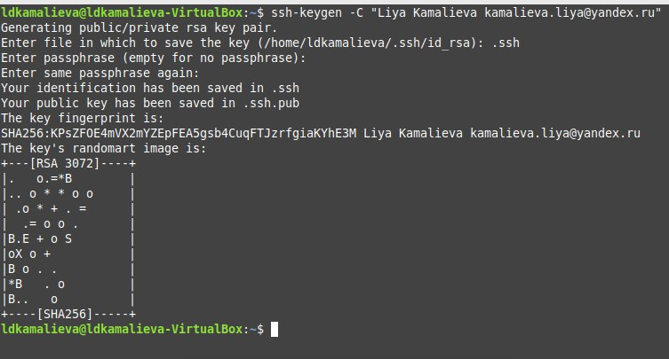{#fig:008 width=70%}

Шаг 2. Скачаем xclip, который позволяет копировать текст через терминал,
произведем скачивание с помощью команды sudo apt install xclip

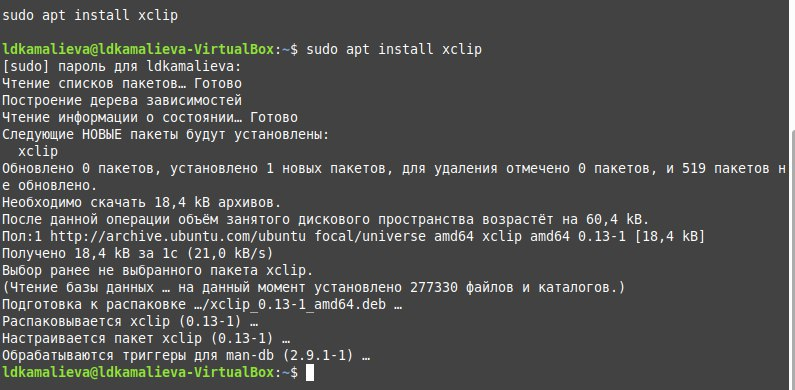{#fig:009 width=70%}

Шаг 3. Далее скопируем из локальной консоли ключ в буфер обмена

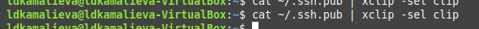{#fig:010 width=70%}

Шаг 4.Открываем GitHub, заходим в свою учетную запись, заходим во вкладку settings
→ SSH and GPG keys и нажимаем на кнопку New SSH key, туда мы вставляем ключ и
указываем имя ключа

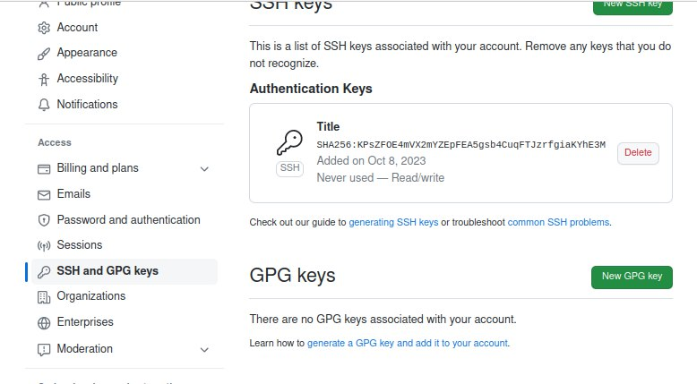{#fig:011 width=70%}

1.3 Создание рабочего пространства и репозитория курса на основе шаблона
Шаг 1. Откроем терминал и создадим каталог для предмета «Архитектура компьютера» под одноименным названием

{#fig:012 width=70%}

Шаг 2. Проверим существование каталогов

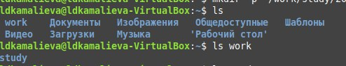{#fig:013 width=70%}

1.4 Создание репозитория курса на основе шаблона

Шаг 1. переходим на страницу репозитория. Выбираем «Use this template» .

{#fig:014 width=70%}

Шаг 2. Задаем имя репозитория и создаем репозиторий

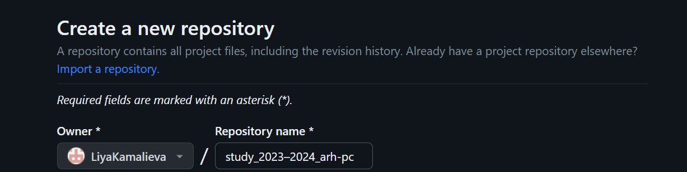{#fig:015 width=70%}

Шаг 3. Копируем ссылку для клонирования репозитория

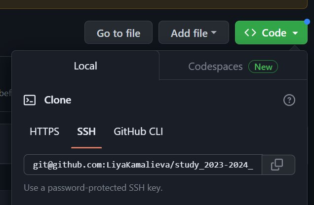{#fig:016 width=70%}

Шаг 4. Открываем терминал и перейдем каталог «Архитектура компьютера»

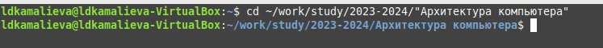{#fig:017 width=70%}

Шаг 5. Теперь клонируем созданный репозиторий

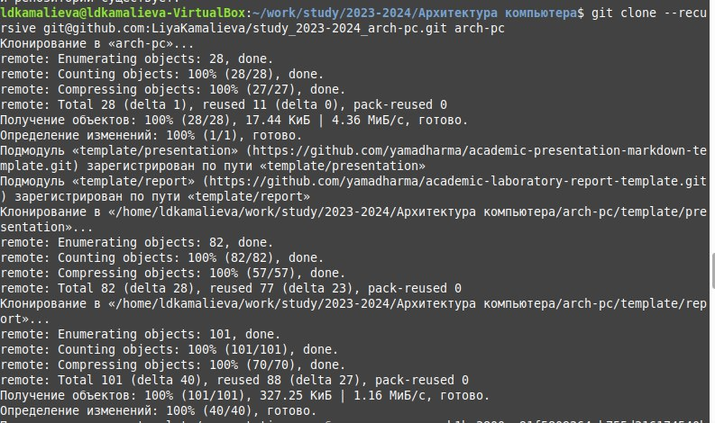{#fig:018 width=70%}

1.5 Настройка каталога курса

Шаг 1. Перейдем в каталог курса

{#fig:030 width=70%}

Шаг 2. Удалим не нужные файлы

{#fig:019 width=70%}

Шаг 3. Создадим необходимые каталоги

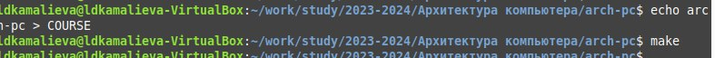{#fig:020 width=70%}

Шаг 4. И отправим файлы на сервер, при помощи команд
git add .
git commit -am ‘feat(main): make course structure’
git push

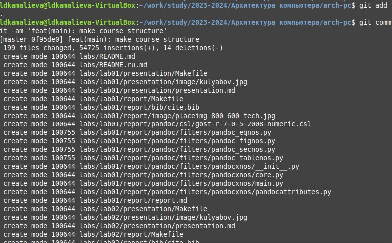{#fig:021 width=70%}

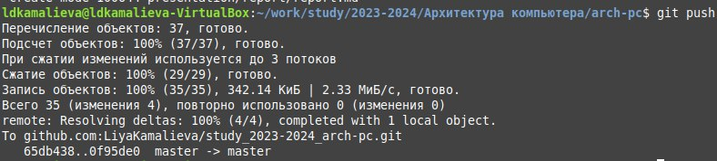{#fig:022 width=70%}

Шаг 5. проверим правильность созданной иерархии на странице git

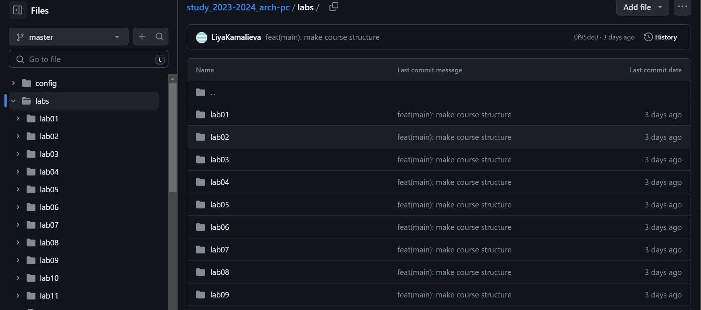{#fig:023 width=70%}

1.6. Задания для самостоятельной работы

Шаг 1. Создаём отчёт по выполнению лабораторной работы в LibreOffice

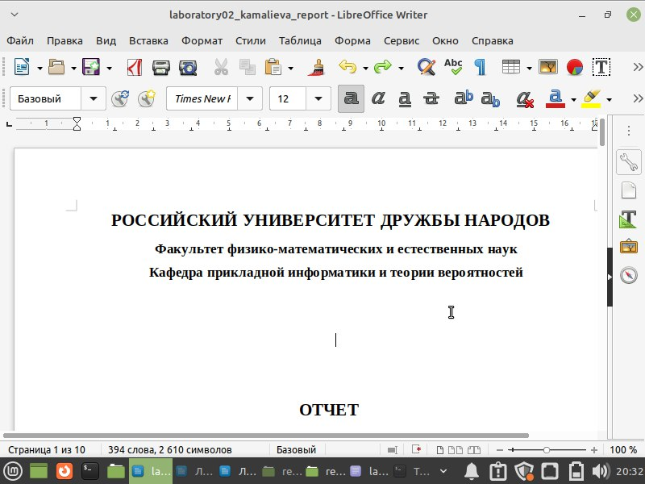{#fig:024 width=70%}

Шаг 2. Создаем файл в котором будем писать отчёт

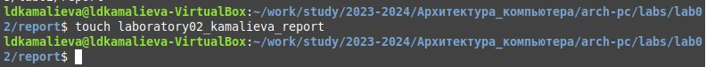{#fig:025 width=70%}

Шаг 3. С помощью команды git add и gir commit -m «Add existing files» переношу
лабораторную на github

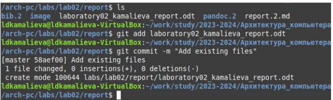{#fig:026 width=70%}

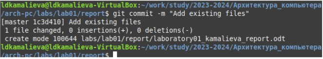{#fig:027 width=70%}

Шаг 4. Отправляем в центральный репозиторий изменения

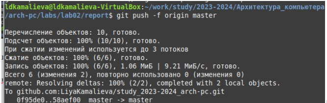{#fig:028 width=70%}

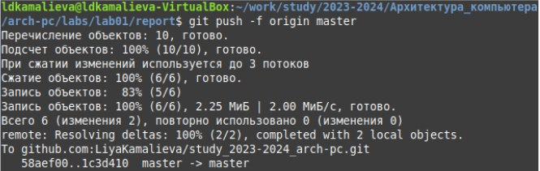{#fig:029 width=70%}

# Выводы

Выводы по работе:я научилась переносить файлы каталоге в такой ресурс, как github и приобрела другие практические навыки.

# Список литературы{.unnumbered}

::: {#refs}
:::
