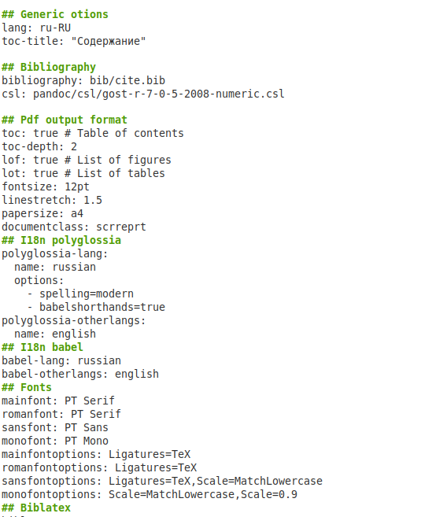
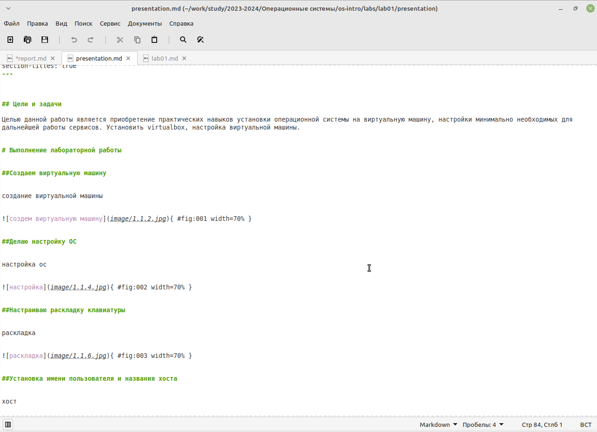

---
## Front matter
lang: ru-RU
title: Лабораторная работа №3
author:
  - Камалиева Лия Дамировна\inst{1}
institute:
   \inst{1}Российский университет дружбы народов, Москва, Россия
date: 28 февраля, 2024

## i18n babel
babel-lang: russian
babel-otherlangs: english

## Formatting pdf
toc: false
toc-title: Содержание
slide_level: 2
aspectratio: 169
section-titles: true
theme: metropolis
header-includes:
 - \metroset{progressbar=frametitle,sectionpage=progressbar,numbering=fraction}
 - '\makeatletter'
 - '\beamer@ignorenonframefalse'
 - '\makeatother'
---

## Цели и задачи

Научиться оформлять отчёты с помощью легковесного языка разметки Markdown. Напсать отчёты для прошлых лабораторных

# Выполнение лабораторной работы

## начинаем заполнение отчета с написания обложки, где указывается номер отчета, дисциплина, ФИО

{ #fig:001 width=70% }

## далее пункты Generic otions, Bibliography, Pdf output format, I18n polyglossia, I18n babel, Fonts, Biblatex, Pandoc-crossref LaTeX customization и Misc options мы не трогаем, тк они системные

{ #fig:002 width=70% }

## Указываем цель работы

{ #fig:003 width=70% }

## одной решеткой укзываем, что пишем заголовок, и двумя подзаголовок

{ #fig:004 width=70% }

## Далее я указываю пошагово свои действия и прикрепляю фото

{ #fig:005 width=70% }

## Пишу вывод по проделанной работе

{ #fig:006 width=70% }

## 1.2 Выполнение презентации

## начинаем заполнение презентации с написания обложки, где указывается номер отчета, дисциплина, ФИО

{ #fig:007 width=70% }

## Указываем цель и задачи работы 

{ #fig:008 width=70% }

## Далее я указываю пошагово свои действия и прикрепляю фото

{ #fig:009 width=70% }

Шаг 8. Пишу вывод

{ #fig:010 width=70% }

#Выводы

## Итоговый слайд (вывод)

я сделала отчёты по проделанной работе
