---
## Front matter
title: "Отчёт по лабораторной работе №3"
subtitle: "Дисциплина: Архитектура компьютера"
author: "Камалиева Лия Дамировна"

## Generic otions
lang: ru-RU
toc-title: "Содержание"

## Bibliography
bibliography: bib/cite.bib
csl: pandoc/csl/gost-r-7-0-5-2008-numeric.csl

## Pdf output format
toc: true # Table of contents
toc-depth: 2
lof: true # List of figures
lot: true # List of tables
fontsize: 12pt
linestretch: 1.5
papersize: a4
documentclass: scrreprt
## I18n polyglossia
polyglossia-lang:
  name: russian
  options:
	- spelling=modern
	- babelshorthands=true
polyglossia-otherlangs:
  name: english
## I18n babel
babel-lang: russian
babel-otherlangs: english
## Fonts
mainfont: PT Serif
romanfont: PT Serif
sansfont: PT Sans
monofont: PT Mono
mainfontoptions: Ligatures=TeX
romanfontoptions: Ligatures=TeX
sansfontoptions: Ligatures=TeX,Scale=MatchLowercase
monofontoptions: Scale=MatchLowercase,Scale=0.9
## Biblatex
biblatex: true
biblio-style: "gost-numeric"
biblatexoptions:
  - parentracker=true
  - backend=biber
  - hyperref=auto
  - language=auto
  - autolang=other*
  - citestyle=gost-numeric
## Pandoc-crossref LaTeX customization
figureTitle: "Рис."
tableTitle: "Таблица"
listingTitle: "Листинг"
lofTitle: "Список иллюстраций"
lotTitle: "Список таблиц"
lolTitle: "Листинги"
## Misc options
indent: true
header-includes:
  - \usepackage{indentfirst}
  - \usepackage{float} # keep figures where there are in the text
  - \floatplacement{figure}{H} # keep figures where there are in the text
---

# Цель работы

Целью работы является освоение процедуры оформления отчетов с помощью легковесного
языка разметки Markdown.

# Задание
    1. Установка необходимого ПО
    2. Заполнение отчета по выполнению лабораторной работы №3 с помощью языка разметки Markdown
    3. Задание для самостоятельной работы
# Теоретическое введение

Markdown — облегчённый язык разметки, созданный с целью обозначения форматирования в простом тексте, с максимальным сохранением его читаемости человеком, и пригодный для машинного преобразования в языки для продвинутых публикаций.

# Выполнение лабораторной работы

1.Скачиваем TexLive, с помощью команды sudo apt update
sudo apt instell texlive-full

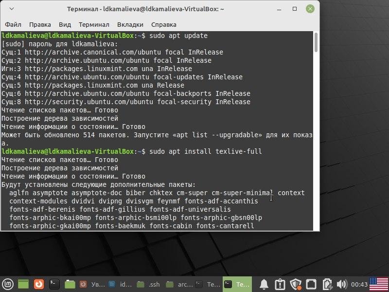{#fig:001 width=70%}

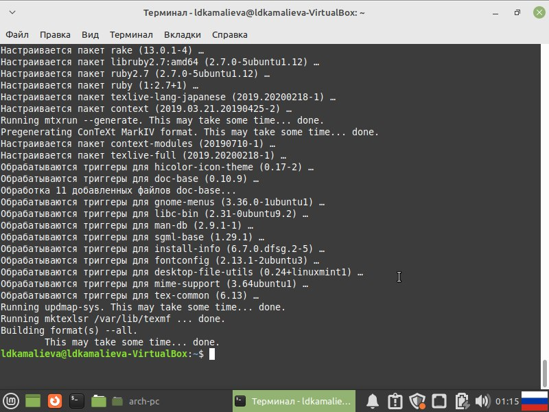{#fig:002 width=70%}

2. Скачиваем Pacdoc и Python

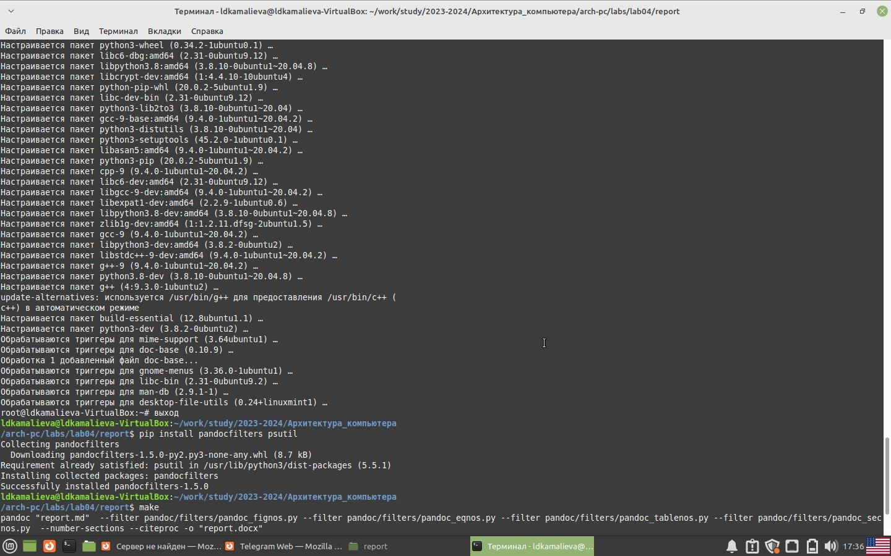{#fig:003 width=70%}

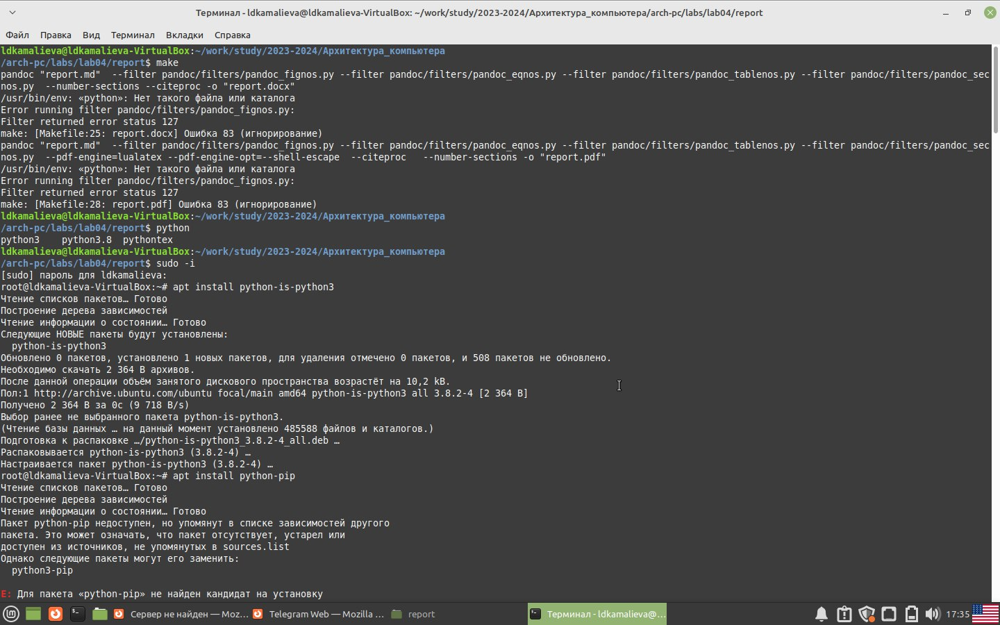{#fig:004 width=70%}

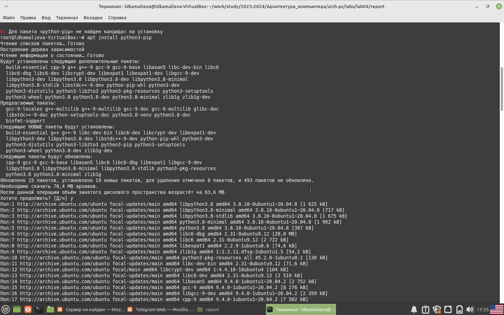{#fig:005 width=70%}

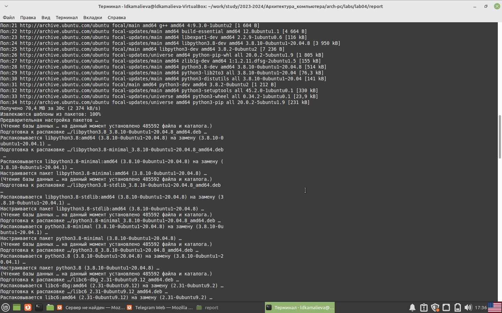{#fig:006 width=70%}

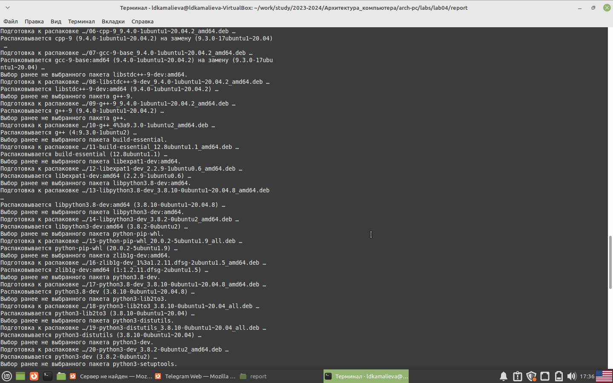{#fig:007 width=70%}

3.Проведем компиляцию шаблона с использованием Makefile. Для этого введем ко-
манду make

{#fig:008 width=70%}

4. проверим, что файлы скачались

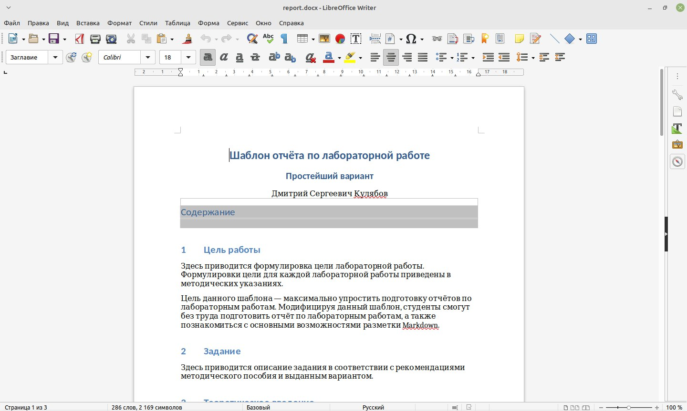{#fig:009 width=70%}

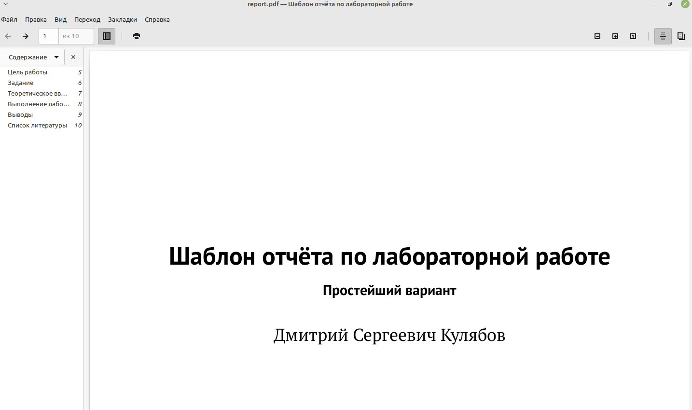{#fig:010 width=70%}

5. Удалим созданные файлы при помощи команды make clean

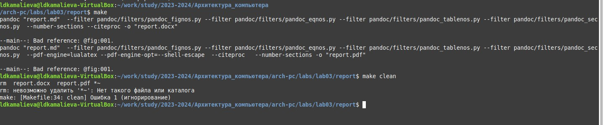{#fig:011 width=70%}

6. Откроем файл report.md c помощью любого текстового редактора, например mousepad

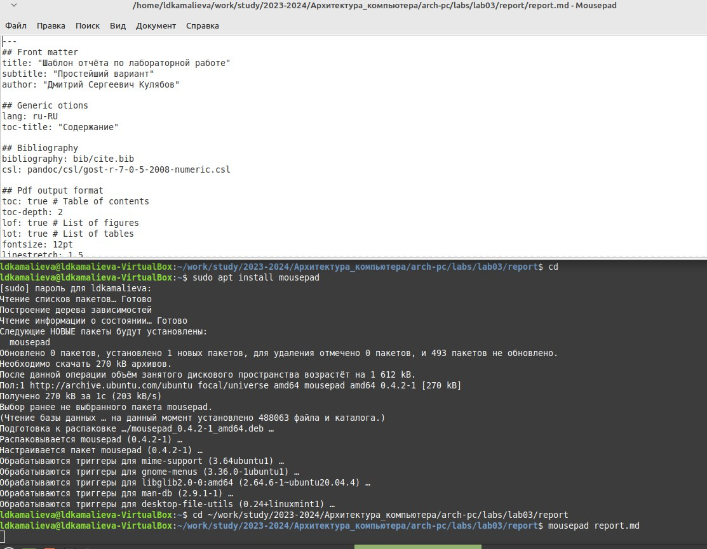{#fig:012 width=70%}

7. Начинаем заполнять отчет для 3 лабораторной

{#fig:013 width=70%}

Задания для самостоятельной работы

Шаг 1. создаем отчет по 2 лабораторной работе

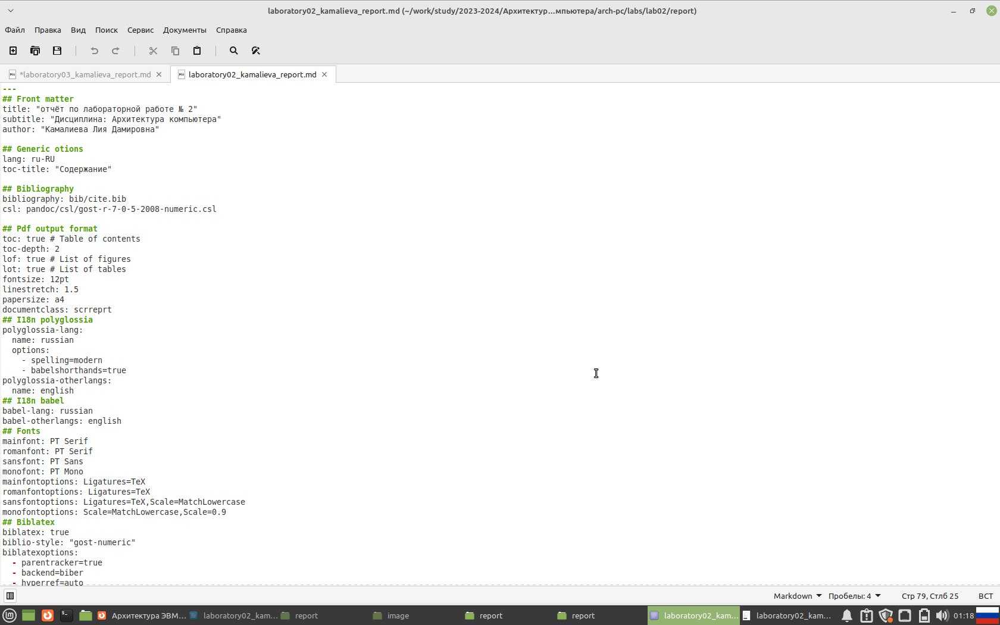{#fig:014 width=70%}

Шаг 2.проверяем перенесся ли файл в github

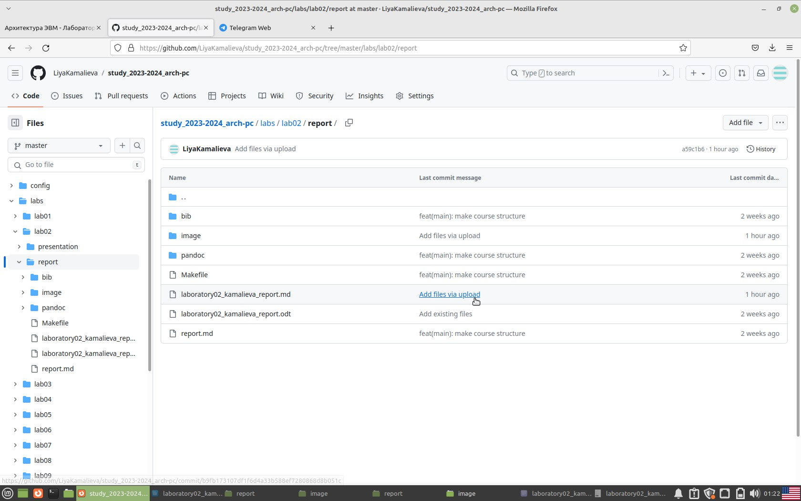{#fig:015 width=70%}

Шаг 3. проверяем созданные файлы pdf и docx

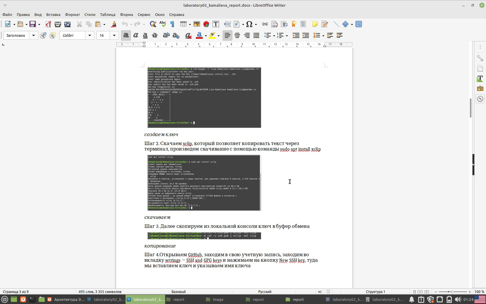{#fig:016 width=70%}

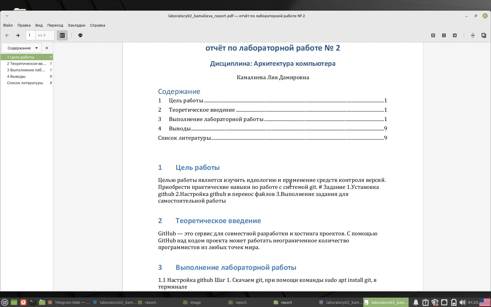{#fig:017 width=70%}

# Выводы

В ходе лабораторной, я научилась делать лабораторные в Markdown.

# Список литературы{.unnumbered}

::: {#refs}
:::
