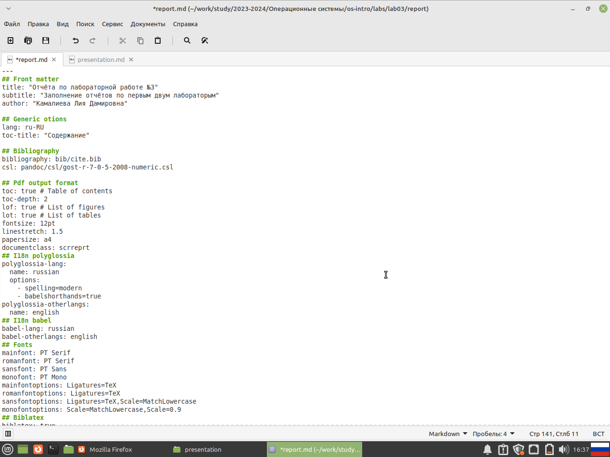
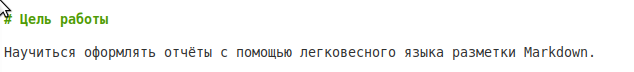
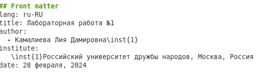
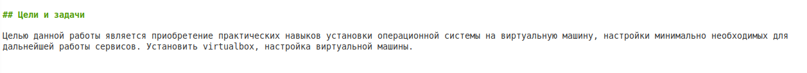

---
## Front matter
title: "Отчёта по лабораторной работе №3"
subtitle: "Заполнение отчётов по первым двум лабораторым"
author: "Камалиева Лия Дамировна"

## Generic otions
lang: ru-RU
toc-title: "Содержание"

## Bibliography
bibliography: bib/cite.bib
csl: pandoc/csl/gost-r-7-0-5-2008-numeric.csl

## Pdf output format
toc: true # Table of contents
toc-depth: 2
lof: true # List of figures
lot: true # List of tables
fontsize: 12pt
linestretch: 1.5
papersize: a4
documentclass: scrreprt
## I18n polyglossia
polyglossia-lang:
  name: russian
  options:
	- spelling=modern
	- babelshorthands=true
polyglossia-otherlangs:
  name: english
## I18n babel
babel-lang: russian
babel-otherlangs: english
## Fonts
mainfont: PT Serif
romanfont: PT Serif
sansfont: PT Sans
monofont: PT Mono
mainfontoptions: Ligatures=TeX
romanfontoptions: Ligatures=TeX
sansfontoptions: Ligatures=TeX,Scale=MatchLowercase
monofontoptions: Scale=MatchLowercase,Scale=0.9
## Biblatex
biblatex: true
biblio-style: "gost-numeric"
biblatexoptions:
  - parentracker=true
  - backend=biber
  - hyperref=auto
  - language=auto
  - autolang=other*
  - citestyle=gost-numeric
## Pandoc-crossref LaTeX customization
figureTitle: "Рис."
tableTitle: "Таблица"
listingTitle: "Листинг"
lofTitle: "Список иллюстраций"
lotTitle: "Список таблиц"
lolTitle: "Листинги"
## Misc options
indent: true
header-includes:
  - \usepackage{indentfirst}
  - \usepackage{float} # keep figures where there are in the text
  - \floatplacement{figure}{H} # keep figures where there are in the text
---

# Цель работы

Научиться оформлять отчёты с помощью легковесного языка разметки Markdown.

# Задание

Напсать отчёты для прошлых лабораторных

# Теоретическое введение

Markdown — облегчённый язык разметки, созданный с целью обозначения форматирования в простом тексте, с максимальным сохранением его читаемости человеком, и пригодный для машинного преобразования в языки для продвинутых публикаций.

# Выполнение лабораторной работы

## 1.1 Заполнение отчёта

Шаг 1. заходим в файл report.md в папке с лабораторной.

Шаг 2. начинаем заполнение отчета с написания обложки, где указывается номер отчета, дисциплина, ФИО

Шаг 3. далее пункты Generic otions, Bibliography, Pdf output format, I18n polyglossia, I18n babel, Fonts, Biblatex, Pandoc-crossref LaTeX customization и Misc options мы не трогаем, тк они системные

Шаг 4. Указываем цель работы

Шаг 5. Указываем задание и теоритическое введение

Шаг 6. одной решеткой укзываем, что пишем заголовок, и двумя подзаголовок

Шаг 7. Далее я указываю пошагово свои действия и прикрепляю фото

Шаг 8. Пишу вывод по проделанной работе

## 1.2 Выполнение презентации

Шаг 1. Заходим в папку соседнюю от report

Шаг 2. начинаем заполнение презентации с написания обложки, где указывается номер отчета, дисциплина, ФИО

Шаг 3. далее пункты I18n babel, Fonts мы не трогаем, тк они системные

Шаг 4. Указываем цель и задачи работы 

Шаг 6. Одной решеткой укзываем, что пишем заголовок, и двумя подзаголовок

Шаг 7. Далее я указываю пошагово свои действия и прикрепляю фото

Шаг 8. Пишу вывод

# Выводы

я сделала отчёты по проделанной работе

# Список литературы{.unnumbered}
