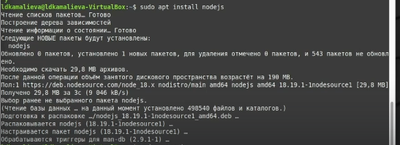
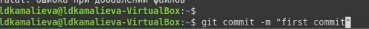
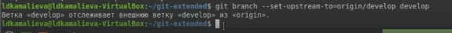

---
## Front matter
lang: ru-RU
title: Лабораторная работа №4
author:
  - Камалиева Лия Дамировна\inst{1}
institute:
   \inst{1}Российский университет дружбы народов, Москва, Россия
date: 28 февраля, 2024

## i18n babel
babel-lang: russian
babel-otherlangs: english

## Formatting pdf
toc: false
toc-title: Содержание
slide_level: 2
aspectratio: 169
section-titles: true
theme: metropolis
header-includes:
 - \metroset{progressbar=frametitle,sectionpage=progressbar,numbering=fraction}
 - '\makeatletter'
 - '\beamer@ignorenonframefalse'
 - '\makeatother'
---

## Цели и задачи

Получение навыков правильной работы с репозиториями git.

Создать новый репозиторий и настроить его с нуля

# Выполнение лабораторной работы

## Установка программного обеспечения

{ #fig:001 width=70% }

## Установка Node.js

{ #fig:002 width=70% }

## Cоздаем репозитория под названием git-extended

{ #fig:003 width=70% }

## делаем первый коммит и передаем его на github

{ #fig:004 width=70% }

## изменяем файл package.json

{ #fig:005 width=70% }

## устанавливаем внешнюю ветку как внешнестоящую

{ #fig:006 width=70% }

## создаем релиз

{ #fig:007 width=70% }

## добавим журнал изменений в индекс с помощью команды
git add CHANGELOG.md
git commit -am 'chore(site): add changelog'

{ #fig:008 width=70% }

## разработка новой функциональности

{ #fig:009 width=70% }

## создаем релиз с другой версией

{ #fig:010 width=70% }

#Выводы

я создала репозиторий и поработала c git

## Итоговый слайд (вывод)

я сделала отчёты по проделанной работе
