---
## Front matter
title: "Отчёта по лабораторной работе №4"
subtitle: "Дисциплина: Архитектура компьютера"
author: "Камалиева Лия Дамировна."

## Generic otions
lang: ru-RU
toc-title: "Содержание"

## Bibliography
bibliography: bib/cite.bib
csl: pandoc/csl/gost-r-7-0-5-2008-numeric.csl

## Pdf output format
toc: true # Table of contents
toc-depth: 2
lof: true # List of figures
fontsize: 12pt
linestretch: 1.5
papersize: a4
documentclass: scrreprt
## I18n polyglossia
polyglossia-lang:
  name: russian
  options:
	- spelling=modern
	- babelshorthands=true
polyglossia-otherlangs:
  name: english
## I18n babel
babel-lang: russian
babel-otherlangs: english
## Fonts
mainfont: PT Serif
romanfont: PT Serif
sansfont: PT Sans
monofont: PT Mono
mainfontoptions: Ligatures=TeX
romanfontoptions: Ligatures=TeX
sansfontoptions: Ligatures=TeX,Scale=MatchLowercase
monofontoptions: Scale=MatchLowercase,Scale=0.9
## Biblatex
biblatex: true
biblio-style: "gost-numeric"
biblatexoptions:
  - parentracker=true
  - backend=biber
  - hyperref=auto
  - language=auto
  - autolang=other*
  - citestyle=gost-numeric
## Pandoc-crossref LaTeX customization
figureTitle: "Рис."
listingTitle: "Листинг"
lofTitle: "Список иллюстраций"
lolTitle: "Листинги"
## Misc options
indent: true
header-includes:
  - \usepackage{indentfirst}
  - \usepackage{float} # keep figures where there are in the text
  - \floatplacement{figure}{H} # keep figures where there are in the text
---

# Цель работы

Освоение процедуры компиляции и сборки программ, написанных на ассемблере NASM.

# Задание

1.1 Программа Hello world!
1.2 Транслятор NASM
1.3 Расширенный синтаксис командной строки NASM
1.4 Компоновщик LD
1.5 Запуск исполняемого файла
1.6 Задание для самостоятельной работы

# Теоретическое введение

NASM (Netwide Assembler) — свободный (LGPL и лицензия BSD) ассемблер для архитектуры Intel x86. Используется для написания 16-, 32- и 64-разрядных программ.

# Выполнение лабораторной работы

## 1.1 Программа Hello world!

Шаг 1. Создаем новый каталог lab04 

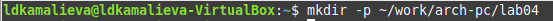

Шаг 2.При помощи команды touch создаем файл hello.asm

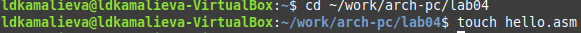

Шаг 3. Открываем его в текстовом редакторе

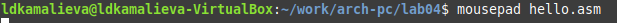

Шаг 4. Вводим в mousepad программу hello world!

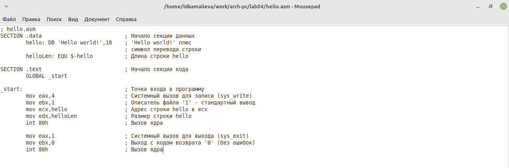

## 1.2 Транслятор NASM

Шаг 1. Компилируем наш код при помощи команды nasm -f elf hello.asm

Шаг 2. Сделаем проверку

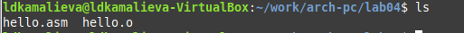

## 1.3 Расширенный синтаксис командной строки NASM

Шаг 1. скомпилируем наш файл hello.asm в obj.o при помощи команды nasm -o obj.o -f elf -g -l list.lst hello.asm и сделаем проверку с помощью команды ls

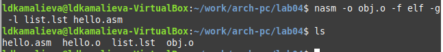

## 1.4 Компоновщик LD

Шаг 1. Чтобы получить исполняемую программу, объектный файл необходимо передать на обработку компоновщику при помощи команды ld -m elf_i386 hello.o -o hello

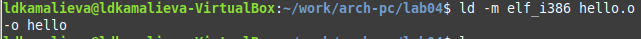

Шаг 2. Проверяем создался ли файл hello

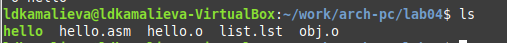

Шаг 3. Далее вводим команду ld -m elf_i386 obj.o -o main и создаем файл main, который также проверяем с  помощью команды ls

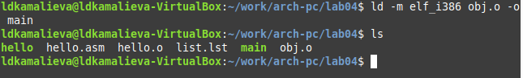

## 1.5 Запуск исполняемого файла

Шаг 1. Запускаем на выполнение созданный файл, находящийся в текущем каталоге, при помощи команды ./hello

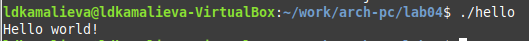

## 1.6 Задание для самостоятельной работы

### №1

Шаг 1. В каталоге ~/work/arch-pc/lab04 с помощью команды cp создаем копию файла hello.asm с именем lab4.asm

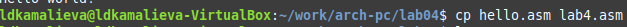

Шаг 2. Делаем проверку

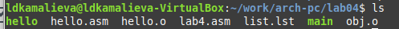

### №2 

Шаг 1. С помощью текстового редактора в программе Hello world! заменяем на Kamalieva Liya 

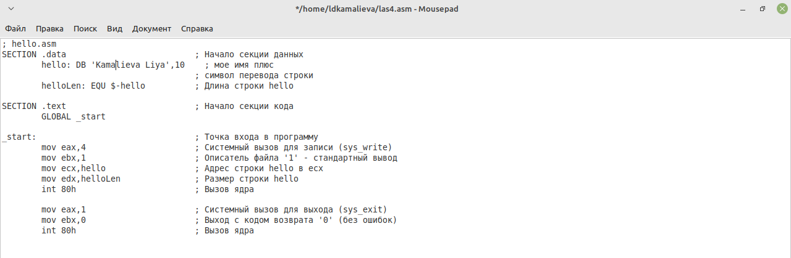

### №3 

Шаг 1. Делаем все действия, что, и с программой Hello world!, также делаем проверку

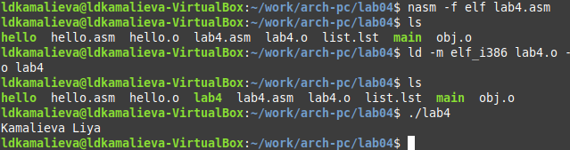

### №4

Шаг 1. Скопируем файлы hello.asm и lab4.asm в локальный репозиторий в каталог ~/work/study/2023-2024/"Архитектура компьютера"/arch-pc/labs/lab04. Загрузим файлы на Github

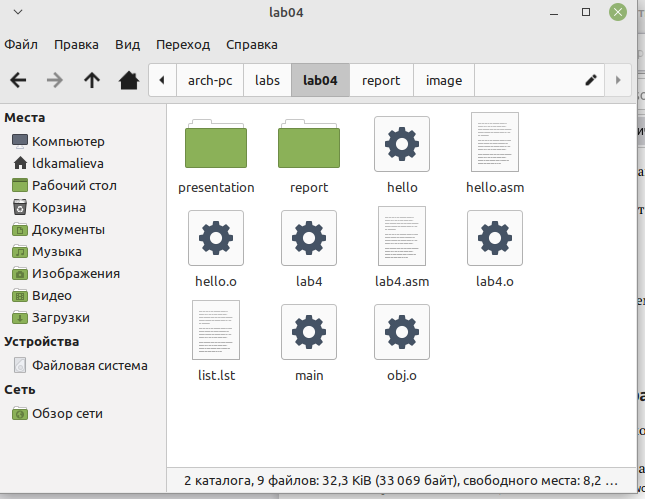

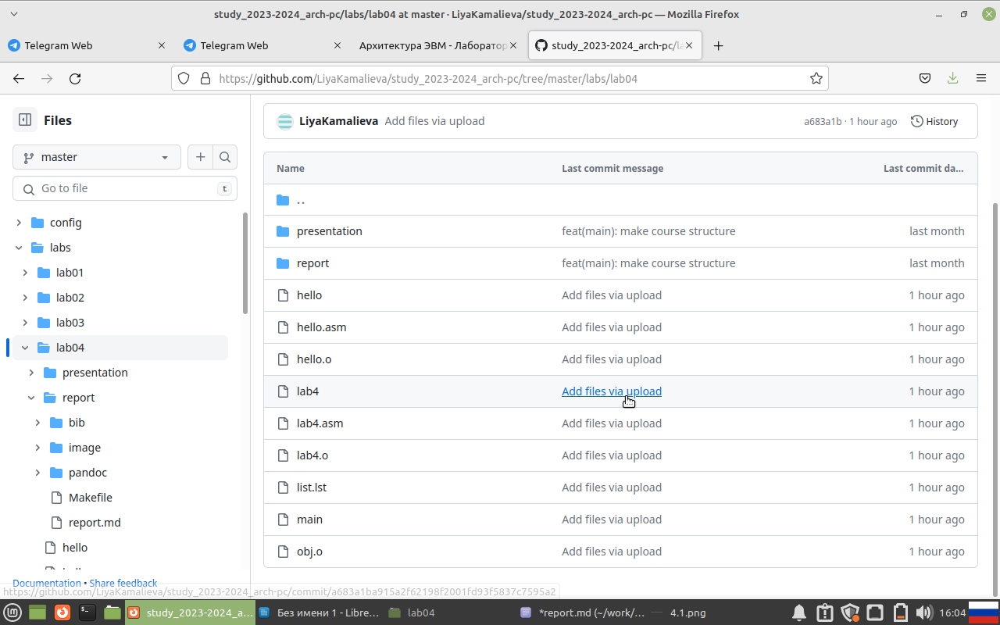

# Выводы

Мы изучили основные команды для работы с языком NASM.

