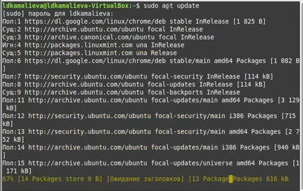
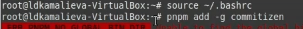
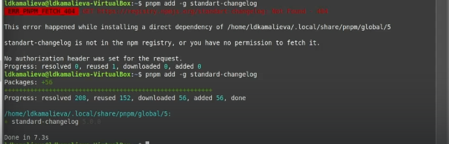
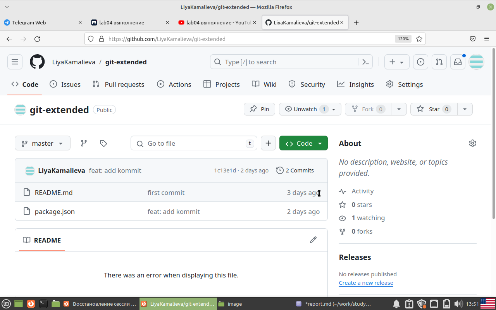
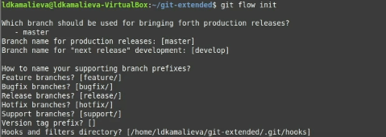
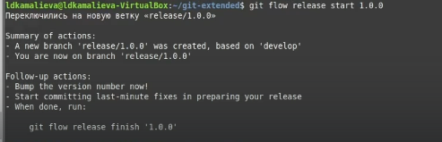
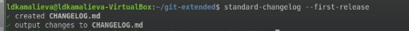
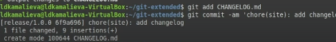
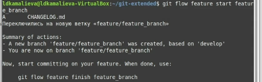
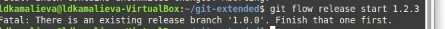

---
## Front matter
title: "Отчет по лабораторной №4"
subtitle: "Продвинутое использование git"
author: "Камалиева Лия Дамировна"

## Generic otions
lang: ru-RU
toc-title: "Содержание"

## Bibliography
bibliography: bib/cite.bib
csl: pandoc/csl/gost-r-7-0-5-2008-numeric.csl

## Pdf output format
toc: true # Table of contents
toc-depth: 2
lof: true # List of figures
lot: true # List of tables
fontsize: 12pt
linestretch: 1.5
papersize: a4
documentclass: scrreprt
## I18n polyglossia
polyglossia-lang:
  name: russian
  options:
	- spelling=modern
	- babelshorthands=true
polyglossia-otherlangs:
  name: english
## I18n babel
babel-lang: russian
babel-otherlangs: english
## Fonts
mainfont: PT Serif
romanfont: PT Serif
sansfont: PT Sans
monofont: PT Mono
mainfontoptions: Ligatures=TeX
romanfontoptions: Ligatures=TeX
sansfontoptions: Ligatures=TeX,Scale=MatchLowercase
monofontoptions: Scale=MatchLowercase,Scale=0.9
## Biblatex
biblatex: true
biblio-style: "gost-numeric"
biblatexoptions:
  - parentracker=true
  - backend=biber
  - hyperref=auto
  - language=auto
  - autolang=other*
  - citestyle=gost-numeric
## Pandoc-crossref LaTeX customization
figureTitle: "Рис."
tableTitle: "Таблица"
listingTitle: "Листинг"
lofTitle: "Список иллюстраций"
lotTitle: "Список таблиц"
lolTitle: "Листинги"
## Misc options
indent: true
header-includes:
  - \usepackage{indentfirst}
  - \usepackage{float} # keep figures where there are in the text
  - \floatplacement{figure}{H} # keep figures where there are in the text
---

# Цель работы

Получение навыков правильной работы с репозиториями git.

# Задание

Создать новый репозиторий и настроить его с нуля

# Теоретическое введение

Процесс работы с Gitflow
Основные ветки (master) и ветки разработки (develop)
Для фиксации истории проекта в рамках этого процесса вместо одной ветки master используются две ветки. В ветке master хранится официальная история релиза, а ветка develop предназначена для объединения всех функций. Кроме того, для удобства рекомендуется присваивать всем коммитам в ветке master номер версии.

При использовании библиотеки расширений git-flow нужно инициализировать структуру в существующем репозитории:

git flow init

Для github параметр Version tag prefix следует установить в v.

После этого проверьте, на какой ветке Вы находитесь:

git branch

# Выполнение лабораторной работы

## Установка программного обеспечения

Шаг 1. я установила git-flow с помощью команд в терминале

## Установка Node.js

Шаг 1. Установка Node.js

Шаг 3. Для работы с Node.js добавим каталог с исполняемыми файлами, устанавливаемыми yarn, в переменную PATH.

Шаг 4. Добавляем форматирование коммитов

Шаг 5. Добавляем программу, которая используется для создания логинов

## Практический сценарий использования git

Шаг 1. Cоздаем репозитория под названием git-extended

Шаг 2. Добавляем его себе на компьютер

Шаг 3. Создала пустой файл, чтобы передать его в гит

Шаг 4. делаем первый коммит и передаем его на github

Шаг 5. изменяем файл package.json

Шаг 6. добавляем его на github

## конфигурация git-flow

Шаг 1. инициализируем git-flow

Шаг 2. загружаем весь репозиторий в хранилище

Шаг 3. устанавливаем внешнюю ветку как внешнестоящую

Шаг 4. создаем релиз

Шаг 5. создаем журнал изменений

Шаг 6. добавим журнал изменений в индекс с помощью команды
git add CHANGELOG.md
git commit -am 'chore(site): add changelog'

Шаг 7. зальем релизную ветку в основную ветку

Шаг 8. перенесем все на git

## Работа с репозиторием

Шаг 1. разработка новой функциональности

Шаг 2. создае релиз с другой версией

# Выводы

я создала репозиторий и поработала c git

# Список литературы{.unnumbered}

