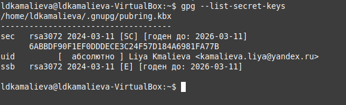
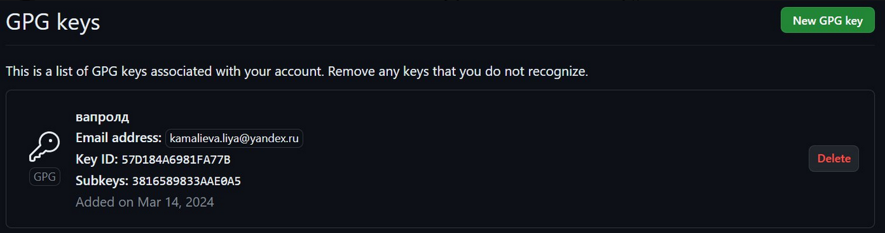
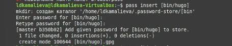
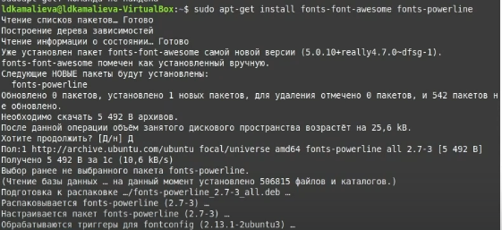

---
## Front matter
lang: ru-RU
title: Лабораторная работа №5
author:
  - Камалиева Лия Дамировна\inst{1}
institute:
   \inst{1}Российский университет дружбы народов, Москва, Россия
date: 16 марта, 2024

## i18n babel
babel-lang: russian
babel-otherlangs: english

## Formatting pdf
toc: false
toc-title: Содержание
slide_level: 2
aspectratio: 169
section-titles: true
theme: metropolis
header-includes:
 - \metroset{progressbar=frametitle,sectionpage=progressbar,numbering=fraction}
 - '\makeatletter'
 - '\beamer@ignorenonframefalse'
 - '\makeatother'
---

## Цели и задачи

Научиться пользоваться менеджером паролей
Установить и настроить менеджер паролей

# Выполнение лабораторной работы

##  Устанавливаем gopass и pass

{ #fig:001 width=70% }

## Просматриваем список ключей:

){ #fig:002 width=70% }

## Создаем новый ключ

){ #fig:003 width=70% }

## Создадим структуру git

{ #fig:004 width=70% }

## Вводим команды и переносим файл на github

{ #fig:005 width=70% }

## Настройка интерфейса с броузером

 Добавляем новый пароль

{ #fig:006 width=70% }

## Устанавливаем дополнительное программное обеспечение:

{ #fig:007 width=70% }

## Создание собственного репозитория с помощью утилит

{ #fig:007 width=70% }

## Можно автоматически фиксировать и отправлять изменения в исходный каталог в репозиторий. для этого меняем данные в файле  ~/.config/chezmoi/chezmoi.toml

{ #fig:007 width=70% }

#Выводы

## Итоговый слайд (вывод)

Я поработала с менеджером паролей pass

