---
## Front matter
title: "Отчёта по лабораторной работе №5"
subtitle: "Дисциплина: Архитектура компьютера"
author: "Камалиева Лия Дамировна."

## Generic otions
lang: ru-RU
toc-title: "Содержание"

## Bibliography
bibliography: bib/cite.bib
csl: pandoc/csl/gost-r-7-0-5-2008-numeric.csl

## Pdf output format
toc: true # Table of contents
toc-depth: 2
lof: true # List of figures
lot: true # List of tables
fontsize: 12pt
linestretch: 1.5
papersize: a4
documentclass: scrreprt
## I18n polyglossia
polyglossia-lang:
  name: russian
  options:
	- spelling=modern
	- babelshorthands=true
polyglossia-otherlangs:
  name: english
## I18n babel
babel-lang: russian
babel-otherlangs: english
## Fonts
mainfont: PT Serif
romanfont: PT Serif
sansfont: PT Sans
monofont: PT Mono
mainfontoptions: Ligatures=TeX
romanfontoptions: Ligatures=TeX
sansfontoptions: Ligatures=TeX,Scale=MatchLowercase
monofontoptions: Scale=MatchLowercase,Scale=0.9
## Biblatex
biblatex: true
biblio-style: "gost-numeric"
biblatexoptions:
  - parentracker=true
  - backend=biber
  - hyperref=auto
  - language=auto
  - autolang=other*
  - citestyle=gost-numeric
## Pandoc-crossref LaTeX customization
figureTitle: "Рис."
tableTitle: "Таблица"
listingTitle: "Листинг"
lofTitle: "Список иллюстраций"
lotTitle: "Список таблиц"
lolTitle: "Листинги"
## Misc options
indent: true
header-includes:
  - \usepackage{indentfirst}
  - \usepackage{float} # keep figures where there are in the text
  - \floatplacement{figure}{H} # keep figures where there are in the text
---

# Цель работы

Приобретение практических навыков работы в Midnight Commander. Освоение инструкций
языка ассемблера mov и int

# Задание

1.1. Подключение программы

1.2. Подключение внешнего файла in_out.asm

1.3. Задание для самостоятельной работы

# Теоретическое введение

Midnight Commander (или просто mc) — это программа, которая позволяет просматривать
структуру каталогов и выполнять основные операции по управлению файловой системой,
т.е. mc является файловым менеджером. Midnight Commander позволяет сделать работу с
файлами более удобной и наглядной.

# Выполнение лабораторной работы

## 1.1 Подключение программы

Шаг 1. открываем через терминал  Midnight Commander  

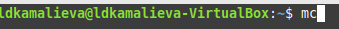

Шаг 2.Переходим в каталог ~/work/arch-pc

Шаг 3. С пощи клавиши (у меня на ноутбуке) Fn + F7, создаем папку lab05

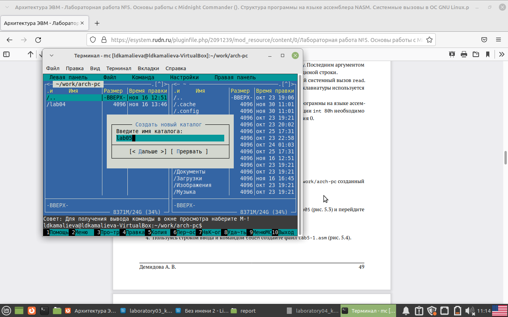

Шаг 4. Используем команду touch для создания lab5-1.asm

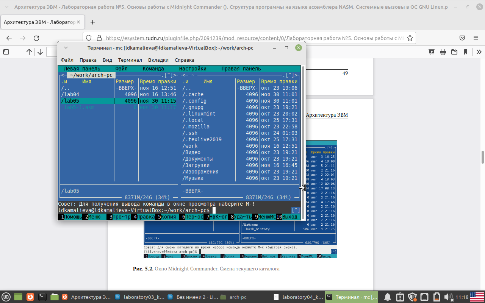

Шаг 5. открываем файл lab5-1.asm и введим текст программы и убедимся, что файл содержит текст программы

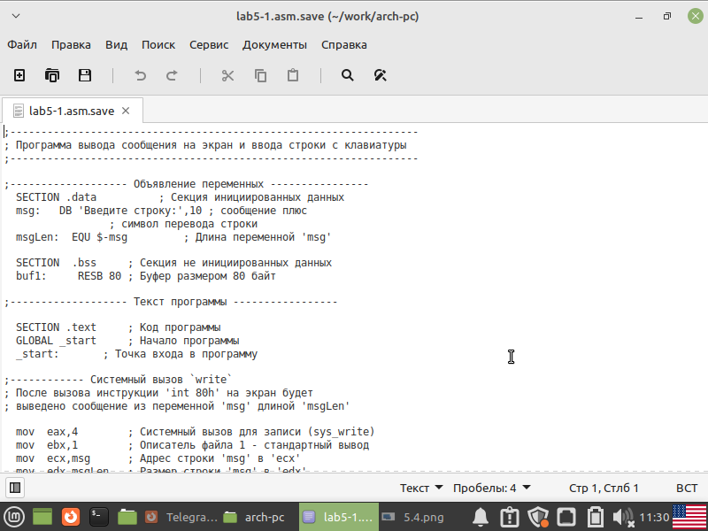

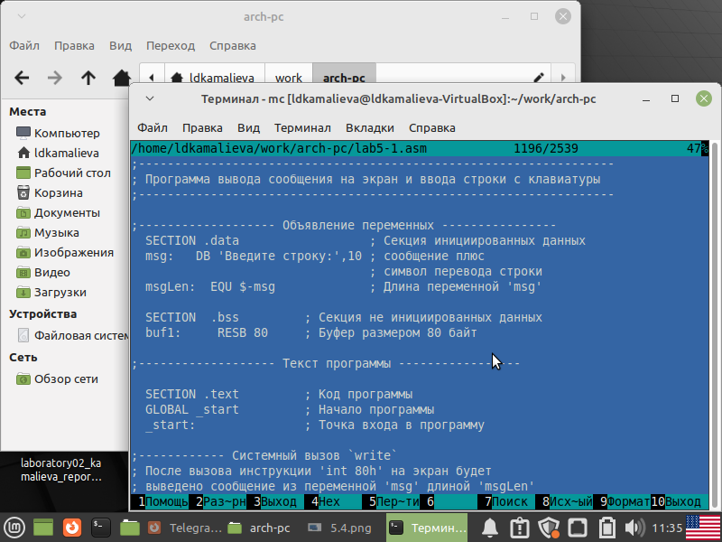

Шаг 6. Оттранслируем текст программы lab5-1.asm в объектный файл. Выполним компоновку объектного файла и запустим получившийся исполняемый файл. Программа выводит строку 'Введите строку:' и ожидает ввода с клавиатуры. На запрос вводим своё ФИО

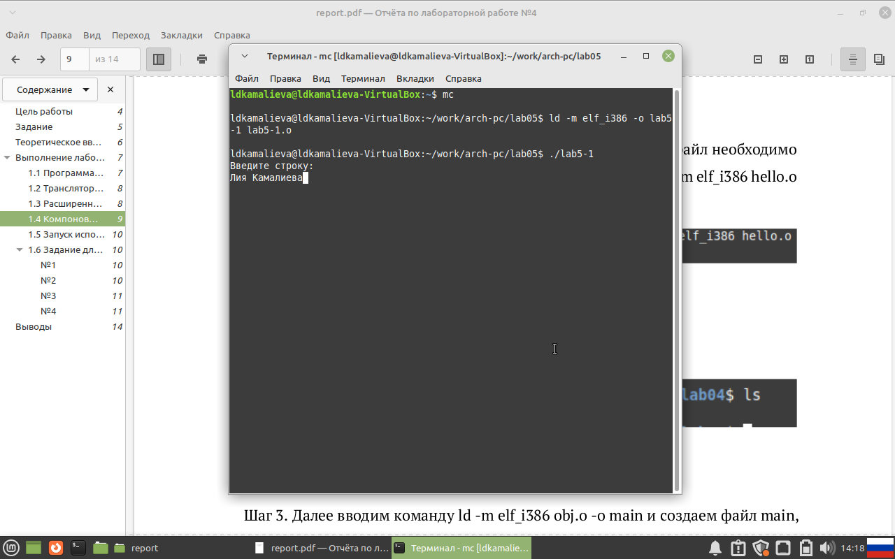

## 1.2 Подключение внешнего файла in_out.asm

Шаг 1. Скачиваем файл in_out.asm со страницы курса в ТУИС. Подключаемый файл должен лежать в том же каталоге, что и файл с программой, в которой он используемой. С помощью функциональной клавиши F6 создаём копию файла lab5-1.asm с именем lab5-2.asm. Исправляем текст программы в файле lab5-2.asm с использованием подпрограмм из внешнего файла in_out.asm. В файле lab5-2.asm заменяем подпрограмму sprintLF на sprint.

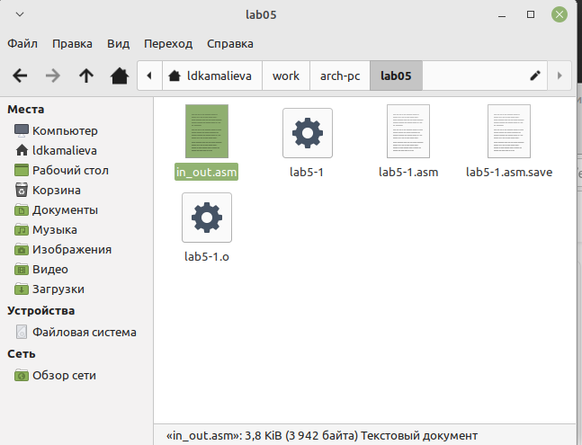

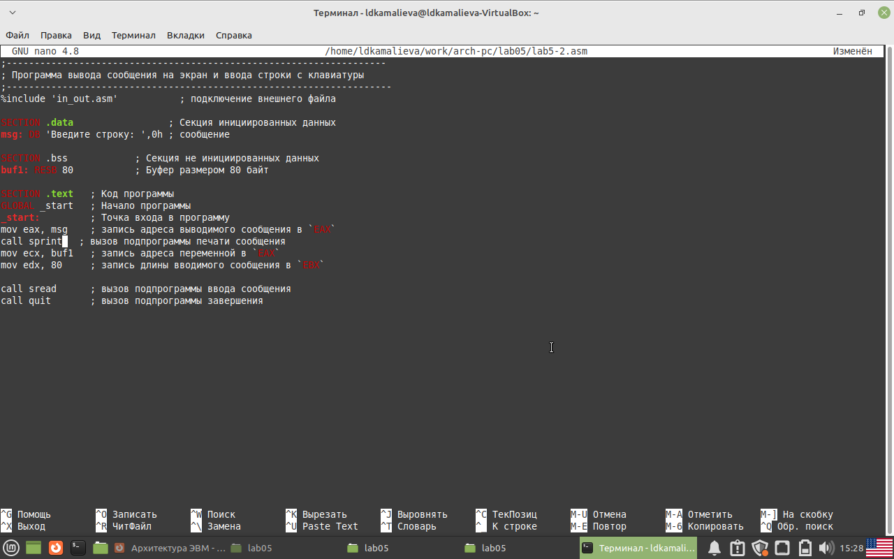

## 1.3 Задание для самостоятельной работы

### №1

Шаг 1. Создаем копию файла lab5-1.asm. Вносим изменения в программу.

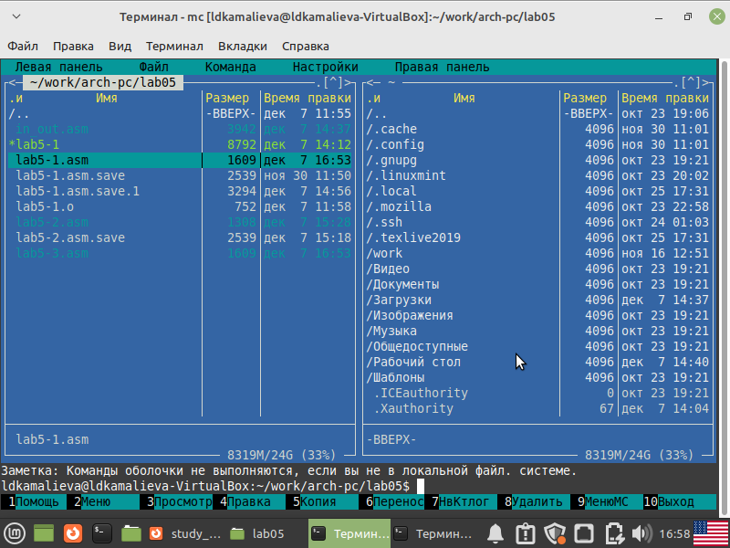

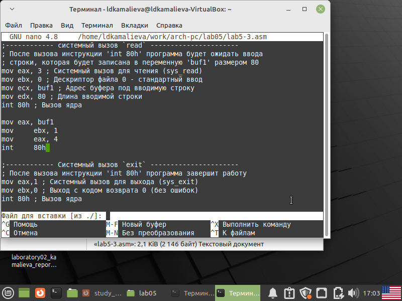

### №2 

Шаг 1. Делаем проверку. На приглашение ввести строку
вводим свое имя и фамилию

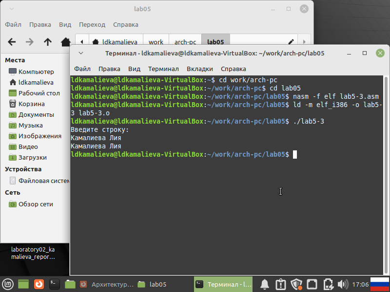

### №3 

 Создаем копию файла lab5-2.asm. И исправляем текст программы с использование подпрограмм из внешнего файла in_out.asm, так чтобы она работала по следующему
алгоритму:
• вывести приглашение типа “Введите строку:”;
• ввести строку с клавиатуры;
• вывести введённую строку на экран.

Шаг 1. Создаем файл lab5-4

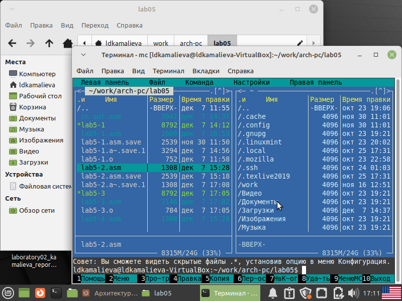

Шаг 2. Изменяем код

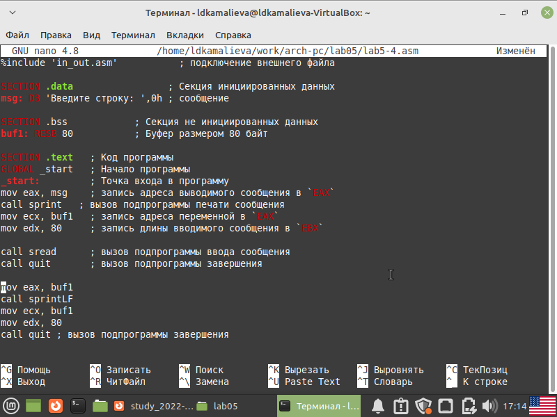

Шаг 3. Делаем проверку

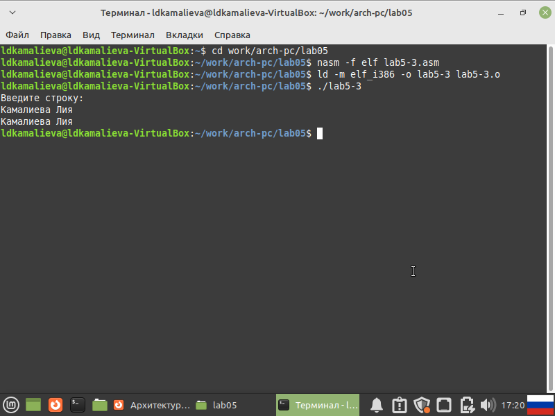

# Выводы
В ходе выполнения лабораторной работы мы научлись работать в Midnight Commander.

