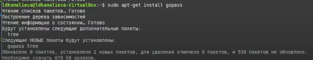
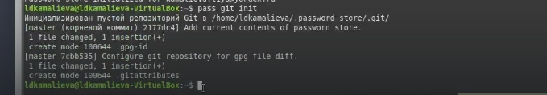
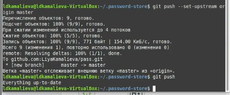
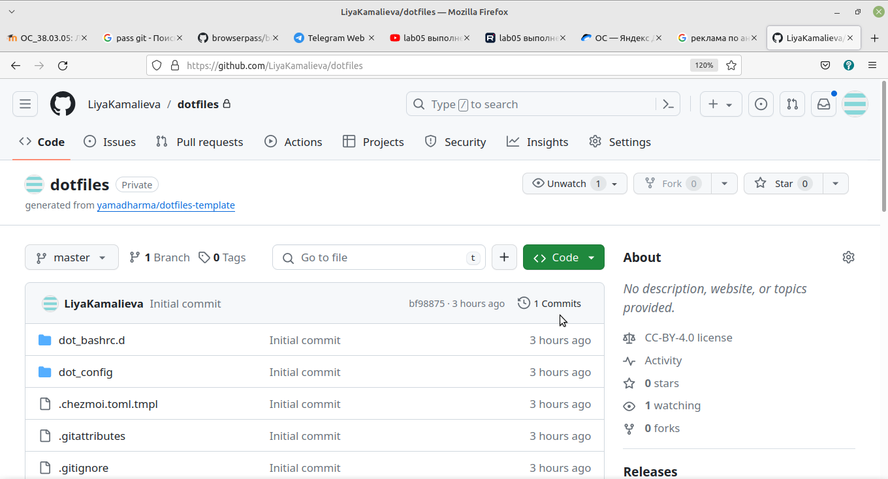
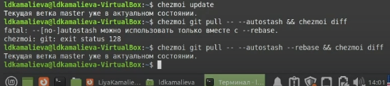
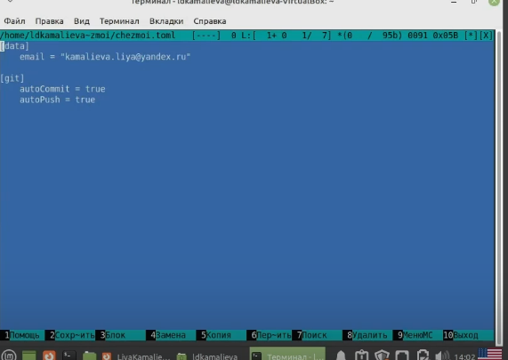

---
## Front matter
title: "Отчет по лабораторной №5"
subtitle: "Менеджер паролей pass"
author: "Камалиева Лия Дамировна"

## Generic otions
lang: ru-RU
toc-title: "Содержание"

## Bibliography
bibliography: bib/cite.bib
csl: pandoc/csl/gost-r-7-0-5-2008-numeric.csl

## Pdf output format
toc: true # Table of contents
toc-depth: 2
lof: true # List of figures
lot: true # List of tables
fontsize: 12pt
linestretch: 1.5
papersize: a4
documentclass: scrreprt
## I18n polyglossia
polyglossia-lang:
  name: russian
  options:
	- spelling=modern
	- babelshorthands=true
polyglossia-otherlangs:
  name: english
## I18n babel
babel-lang: russian
babel-otherlangs: english
## Fonts
mainfont: PT Serif
romanfont: PT Serif
sansfont: PT Sans
monofont: PT Mono
mainfontoptions: Ligatures=TeX
romanfontoptions: Ligatures=TeX
sansfontoptions: Ligatures=TeX,Scale=MatchLowercase
monofontoptions: Scale=MatchLowercase,Scale=0.9
## Biblatex
biblatex: true
biblio-style: "gost-numeric"
biblatexoptions:
  - parentracker=true
  - backend=biber
  - hyperref=auto
  - language=auto
  - autolang=other*
  - citestyle=gost-numeric
## Pandoc-crossref LaTeX customization
figureTitle: "Рис."
tableTitle: "Таблица"
listingTitle: "Листинг"
lofTitle: "Список иллюстраций"
lotTitle: "Список таблиц"
lolTitle: "Листинги"
## Misc options
indent: true
header-includes:
  - \usepackage{indentfirst}
  - \usepackage{float} # keep figures where there are in the text
  - \floatplacement{figure}{H} # keep figures where there are in the text
---

# Цель работы

Научиться пользоваться менеджером паролей

# Задание

Установить и настроить менеджер паролей

# Теоретическое введение

Менеджер паролей pass — программа, сделанная в рамках идеологии Unix.
Также носит название стандартного менеджера паролей для Unix (The standard Unix password manager).

# Выполнение лабораторной работы

Шаг 1. Устанавливаем pass

Шаг 2. Устанавливаем gopass

Шаг 3. Просматриваем список ключей:

Шаг 4. Создаем новый ключ

Шаг 5. Создадим структуру git

Шаг 6. Вводим команды и переносим файл на github

# Настройка интерфейса с броузером

Шаг 1. Устанавливаем броузер с помощью команд 
dnf copr enable maximbaz/browserpass
dnf install browserpass

Шаг 2. Добавляем новый пароль

Шаг 3. Устанавливаем дополнительное программное обеспечение:

Шаг 4. Установка бинарного файла. Скрипт определяет архитектуру процессора и операционную систему и скачивает необходимый файл:

Шаг 5. Создание собственного репозитория с помощью утилит

Шаг 6. Инициализируйте chezmoi с вашим репозиторием dotfiles:

Шаг 7. Проверьте, какие изменения внесёт chezmoi в домашний каталог, запустив:

Шаг 8. Выполняем команду

chezmoi git pull -- --autostash --rebase && chezmoi diff

Шаг 9. Можно автоматически фиксировать и отправлять изменения в исходный каталог в репозиторий. для этого меняем данные в файле  ~/.config/chezmoi/chezmoi.toml

# Выводы

Я поработала с менеджером паролей pass

# Список литературы{.unnumbered}

