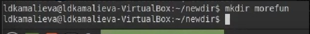

---
## Front matter
lang: ru-RU
title: Лабораторная работа №6
author:
  - Камалиева Лия Дамировна\inst{1}
institute:
   \inst{1}Российский университет дружбы народов, Москва, Россия
date: 23 марта, 2024

## i18n babel
babel-lang: russian
babel-otherlangs: english

## Formatting pdf
toc: false
toc-title: Содержание
slide_level: 2
aspectratio: 169
section-titles: true
theme: metropolis
header-includes:
 - \metroset{progressbar=frametitle,sectionpage=progressbar,numbering=fraction}
 - '\makeatletter'
 - '\beamer@ignorenonframefalse'
 - '\makeatother'
---

## Цели и задачи

Приобретение практических навыков взаимодействия пользователя с системой по средствам командной строки. Работа с командами mkdir, rmdir, ls, cd в терминале.

# Выполнение лабораторной работы

##  используя команду echo $HOME, определяем полное имя домашнего каталога

{ #fig:001 width=70% }

## Далее переходим в каталог /tmp

){ #fig:002 width=70% }

## используем команду ls -l, она позволяет вывести содержимое каталога в длинном формате, показывая различные атрибуты файлов

){ #fig:003 width=70% }

## использую команду ls -a, чтобы выводит все файлы, включая скрытые файлы 

{ #fig:004 width=70% }

## использую команду ls -lh, которая выводит содержимое каталога в удобночитаемом формате, указывая размеры файлов в байтах, килобайтах и так далее. 

{ #fig:005 width=70% }

##  При помощи команды ls -l ~/ определяю, кто является владельцем файлов и подкаталогов

{ #fig:006 width=70% }

## В новом каталоге создаем новый каталог morefun 

{ #fig:007 width=70% }

## В домашнем каталоге создаю одной командой три новых каталога с именами letters, memos, misk.

{ #fig:008 width=70% }

## С помощью команды man ls определяю какую команду надо использовать для для просмотра содержимое не только указанного каталога, но и подкаталогов, входящих в него, это команда ls -R

{ #fig:009 width=70% }

## ls -lt команда позволяющая отсортировать по времени последнего изменения выводимый список содержимого каталога с развёрнутым описанием файлов

{ #fig:010 width=70% }

## Используя информацию, полученную при помощи команды history, выполните модификацию и исполнение нескольких команд из буфера команд.

{ #fig:011 width=70% }

#Выводы

## Итоговый слайд (вывод)

я научилась пользоваться файловой системой при помощи терминала

