---
## Front matter
title: "Отчёта по лабораторной работе №6"
subtitle: "Дисциплина: Архитектура компьютера"
author: "Камалиева Лия Дамировна."

## Generic otions
lang: ru-RU
toc-title: "Содержание"

## Bibliography
bibliography: bib/cite.bib
csl: pandoc/csl/gost-r-7-0-5-2008-numeric.csl

## Pdf output format
toc: true # Table of contents
toc-depth: 2
lof: true # List of figures
lot: true # List of tables
fontsize: 12pt
linestretch: 1.5
papersize: a4
documentclass: scrreprt
## I18n polyglossia
polyglossia-lang:
  name: russian
  options:
	- spelling=modern
	- babelshorthands=true
polyglossia-otherlangs:
  name: english
## I18n babel
babel-lang: russian
babel-otherlangs: english
## Fonts
mainfont: PT Serif
romanfont: PT Serif
sansfont: PT Sans
monofont: PT Mono
mainfontoptions: Ligatures=TeX
romanfontoptions: Ligatures=TeX
sansfontoptions: Ligatures=TeX,Scale=MatchLowercase
monofontoptions: Scale=MatchLowercase,Scale=0.9
## Biblatex
biblatex: true
biblio-style: "gost-numeric"
biblatexoptions:
  - parentracker=true
  - backend=biber
  - hyperref=auto
  - language=auto
  - autolang=other*
  - citestyle=gost-numeric
## Pandoc-crossref LaTeX customization
figureTitle: "Рис."
tableTitle: "Таблица"
listingTitle: "Листинг"
lofTitle: "Список иллюстраций"
lotTitle: "Список таблиц"
lolTitle: "Листинги"
## Misc options
indent: true
header-includes:
  - \usepackage{indentfirst}
  - \usepackage{float} # keep figures where there are in the text
  - \floatplacement{figure}{H} # keep figures where there are in the text
---

# Цель работы

Освоение арифметических инструкций языка ассемблера NASM

# Задание

1.1 Символьные и численные данные в NASM

1.2. Выполнение арифметических операций в NASM

1.3. Задание для самостоятельной работы

# Теоретическое введение

Адресация в NASM
Большинство инструкций на языке ассемблера требуют обработки операндов. Адрес операнда предоставляет место, где хранятся данные, подлежащие обработке. Это могут быть данные хранящиеся в регистре или в ячейке памяти. Далее рассмотрены все существующие способы задания адреса хранения операндов – способы адресации.
                                                                                                                                                                      
# Выполнение лабораторной работы

## 1.1 Символьные и численные данные в NASM

Шаг 1. Создаем каталог для программ лабраторной работы №6.

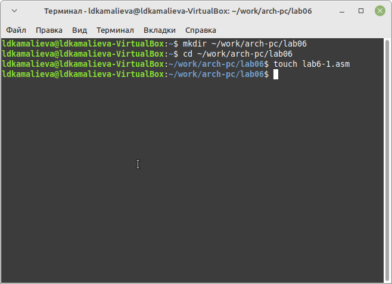

Шаг 2. Запишем программу вывода значения регистра eax

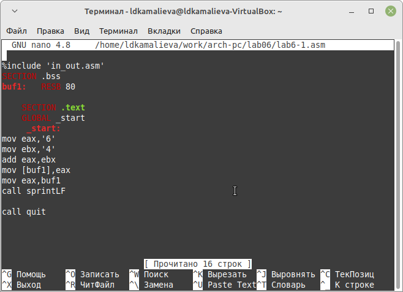

Шаг 3.  Для корректной работы программы подключаемый файл in_out.asm

Шаг 4.Создаем исполняемый файл и запускаем его

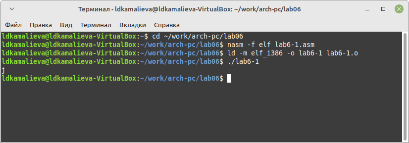

Шаг 5. Изменяем файл убираем ковычки

Шаг 6. Снова создаем исполняемый файл и запускаем его

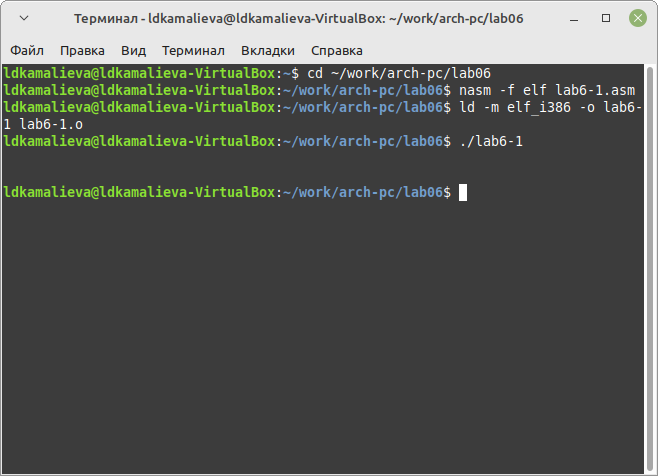

Шаг 7. Cоздаём файл lab6-2.asm в каталоге ~/work/arch-pc/lab06 и вводим в него текст программы из листинга 

%include 'in_out.asm'
SECTION .text
GLOBAL _start
_start:
mov eax,'6'
mov ebx,'4'
add eax,ebx
call iprintLF
call quit

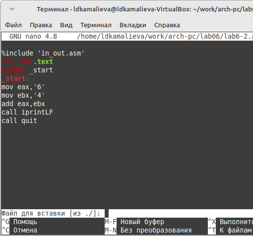

Шаг 8. Проверяем программу

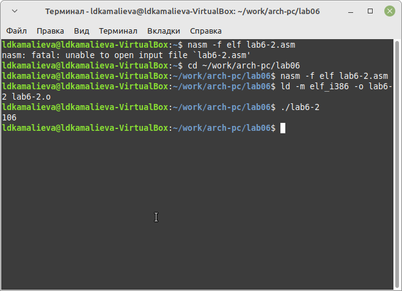

Шаг 9. Аналогично предыдущему примеру изменим символы на числа, создаём исполняемый файл и запускаем его

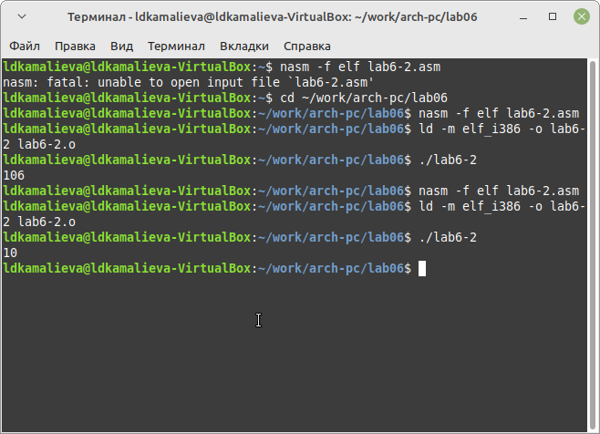

Шаг 10. Замените функцию iprintLF на iprint. Создаём исполняемый файл и запускаем его.

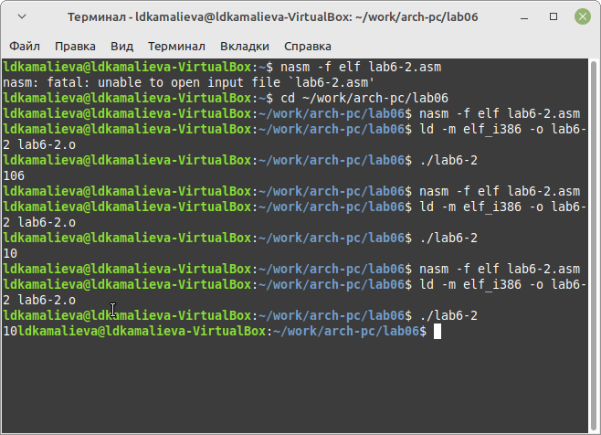

## 1.2 Выполнение арифметических операций в NASM

### В качестве примера выполнения арифметических операций в NASM приведем программу вычисления арифметического выражения F(x) = (5 * 2 + 3)/3

Шаг 1. Создаём файл lab6-3.asm в каталоге ~/work/arch-pc/lab06, пишем в нем программу и запускаем её.

%include 'in_out.asm' ; подключение внешнего файла
SECTION .data
div: DB 'Результат: ',0
rem: DB 'Остаток от деления: ',0
SECTION .text
GLOBAL _start
_start:
; ---- Вычисление выражения
mov eax,5 ; EAX=5
mov ebx,2 ; EBX=2
mul ebx ; EAX=EAX*EBX
add eax,3 ; EAX=EAX+3
xor edx,edx ; обнуляем EDX для корректной работы div
mov ebx,3 ; EBX=3
div ebx ; EAX=EAX/3, EDX=остаток от деления
mov edi,eax ; запись результата вычисления в 'edi'
; ---- Вывод результата на экран
mov eax,div ; вызов подпрограммы печати
call sprint ; сообщения 'Результат: '
mov eax,edi ; вызов подпрограммы печати значения
call iprintLF ; из 'edi' в виде символов
mov eax,rem ; вызов подпрограммы печати
call sprint ; сообщения 'Остаток от деления: '
mov eax,edx ; вызов подпрограммы печати значения
call iprintLF ; из 'edx' (остаток) в виде символов
call quit ; вызов подпрограммы завершения

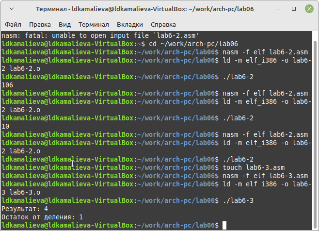

Шаг 2. Изменяем текст программы для вычисления выражения 𝑓(𝑥) = (4 ∗ 6 + 2)/5.

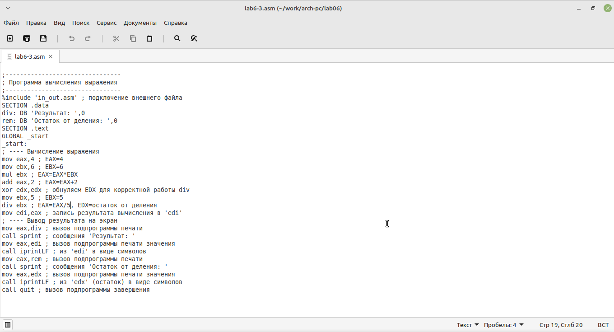
 
Шаг 3. Создаем исполняемый файл и проверьте его работу

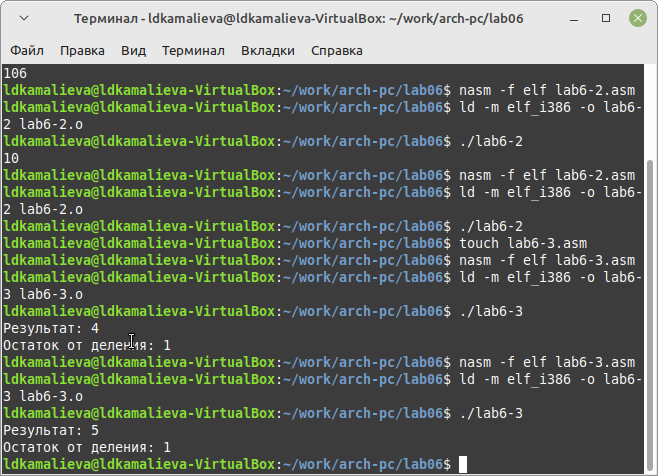

Шаг 4. Рассмотрим также программу, вычисляющую вриант задания по номеру студенческого билета, для этого создаем файл variant.asm. Создаём исполняемый файл и запускаем его.

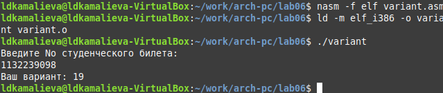

Ответы на вопросы:
#### 1. Какие строки листинга 6.4 отвечают за вывод на экран сообщения ‘Ваш вариант:’?

За вывод на экран отвечает строка:
mov eax,rem, которая загружает в регистр адрес строки с текстом

#### 2. Для чего используется следующие инструкции?
mov ecx, x
mov edx, 80
call sread

первая команда помещает x в регистр
а вторая команда делает тоже самое, но с регистром edx и значением 80
команда call spread обеспечивает считывание студенчиского билета и присваивание его x

#### 3. Для чего используется инструкция “call atoi”?

эта функция переводит строковые данные в целочисленное значение

#### 4. Какие строки листинга 6.4 отвечают за вычисления варианта?

xor edx,edx
mov ebx,20
div ebx
inc edx

#### 5. В какой регистр записывается остаток от деления при выполнении инструкции “div ebx”?

edx, также мы его часто обнуляем

#### 6. Для чего используется инструкция “inc edx”?

команда inc edx увеличивает значение регистра на 1

####7. Какие строки листинга 6.4 отвечают за вывод на экран результата вычислений?

mov eax,edx
call iprintLF

## 1.3 Задание для самостоятельной работы

 Написать программу вычисления выражения y = F(x). Программа должна выводить
выражение для вычисления, выводить запрос на ввод значения 𝑥, вычислять задан-
ное выражение в зависимости от введенного 𝑥, выводить результат вычислений. Вид
функции F(x) выбрать из таблицы 6.3 вариантов заданий в соответствии с номером
полученным при выполнении лабораторной работы. Создайте исполняемый файл и
проверьте его работу для значений x1 и x2 из 6.3
У меня это вариант №19

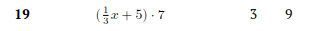

Шаг 1. создаем файл lab6-4.asm

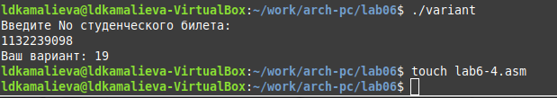

Шаг 2. пишем программу по вычисению примера

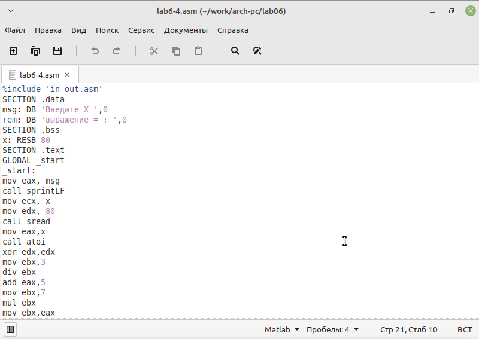

Шаг3. делаем проверку корней

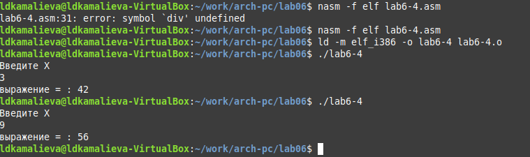

# Выводы

Вывод: я научилась писать арифметические инструкции в ассемблере NASM

# Список литературы{.unnumbered}

