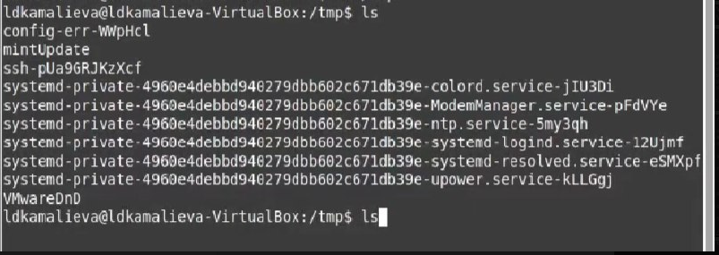
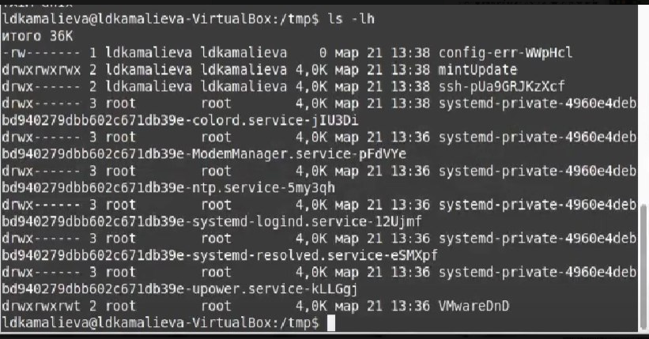
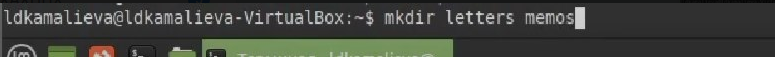
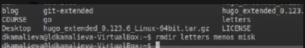
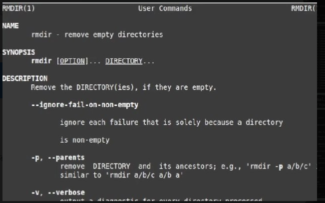
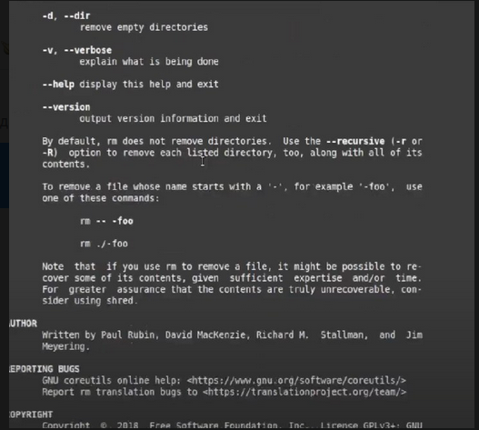
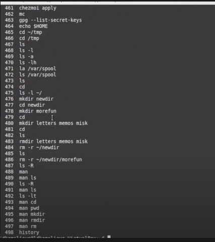

---
## Front matter
title: "Отчет по лабораторной №6"
subtitle: "Основы интерфейса взаимодействия пользователя с системой Unix на уровне командной строки"
author: "Камалиева Лия Дамировна"

## Generic otions
lang: ru-RU
toc-title: "Содержание"

## Bibliography
bibliography: bib/cite.bib
csl: pandoc/csl/gost-r-7-0-5-2008-numeric.csl

## Pdf output format
toc: true # Table of contents
toc-depth: 2
lof: true # List of figures
lot: true # List of tables
fontsize: 12pt
linestretch: 1.5
papersize: a4
documentclass: scrreprt
## I18n polyglossia
polyglossia-lang:
  name: russian
  options:
	- spelling=modern
	- babelshorthands=true
polyglossia-otherlangs:
  name: english
## I18n babel
babel-lang: russian
babel-otherlangs: english
## Fonts
mainfont: PT Serif
romanfont: PT Serif
sansfont: PT Sans
monofont: PT Mono
mainfontoptions: Ligatures=TeX
romanfontoptions: Ligatures=TeX
sansfontoptions: Ligatures=TeX,Scale=MatchLowercase
monofontoptions: Scale=MatchLowercase,Scale=0.9
## Biblatex
biblatex: true
biblio-style: "gost-numeric"
biblatexoptions:
  - parentracker=true
  - backend=biber
  - hyperref=auto
  - language=auto
  - autolang=other*
  - citestyle=gost-numeric
## Pandoc-crossref LaTeX customization
figureTitle: "Рис."
tableTitle: "Таблица"
listingTitle: "Листинг"
lofTitle: "Список иллюстраций"
lotTitle: "Список таблиц"
lolTitle: "Листинги"
## Misc options
indent: true
header-includes:
  - \usepackage{indentfirst}
  - \usepackage{float} # keep figures where there are in the text
  - \floatplacement{figure}{H} # keep figures where there are in the text
---

# Цель работы

Приобретение практических навыков взаимодействия пользователя с системой по средствам командной строки.

# Задание

Работа с командами mkdir, rmdir, ls, cd в терминале

# Теоретическое введение

В операционной системе типа Linux взаимодействие пользователя с системой обычно
осуществляется с помощью командной строки посредством построчного ввода ко-
манд. При этом обычно используется командные интерпретаторы языка shell: /bin/sh;
/bin/csh; /bin/ksh.
Формат команды. Командой в операционной системе называется записанный по
специальным правилам текст (возможно с аргументами), представляющий собой ука-
зание на выполнение какой-либо функций (или действий) в операционной системе.
Обычно первым словом идёт имя команды, остальной текст — аргументы или опции,
конкретизирующие действие.
Общий формат команд можно представить следующим образом:
<имя_команды><разделитель><аргументы>

# Выполнение лабораторной работы

Шаг 1. используя команду echo $HOME, определяем полное имя домашнего каталога

Шаг 2. Далее переходим в каталог /tmp

Шаг 3. C команды ls выводим содержимое каталога

Шаг 4. используем команду ls -l, она позволяет вывести содержимое каталога в длинном формате, показывая различные атрибуты файлов

Шаг 5. использую команду ls -a, чтобы выводит все файлы, включая скрытые файлы 

Шаг 6. использую команду ls -lh, которая выводит содержимое каталога в удобночитаемом формате, указывая размеры файлов в байтах, килобайтах и так далее. 

Шаг 7. Их разница заключается в том, как отображается содержимое каталога - в кратком виде, с дополнительной информацией или в удобочитаемом формате.

Шаг 8.Проверяем, есть ли в каталоге /var/spool подкаталог с именем cron

Шаг 9. При помощи команды ls -l ~/ определяю, кто является владельцем файлов и подкаталогов

Шаг 10. В домашнем каталоге создаем новый каталог под названием newdir

Шаг 11. В этом каталоге создаем новый каталог morefun 

Шаг 12.  В домашнем каталоге создаю одной командой три новых каталога с именами
letters, memos, misk.

Шаг 13. В домашнем каталоге, также одной командой удаляю созданные каталоги

Шаг 14. Удаляю ранее созданный каталог ~/newdir командой rm

Шаг 15. С помощью команды man ls определяю какую команду надо использовать для для просмотра содержимое не только указанного каталога, но и подкаталогов, входящих в него, это команда ls -R

Шаг 16. ls -lt команда позволяющая отсортировать по времени последнего изменения выводимый список содержимого каталога
с развёрнутым описанием файлов

Шаг 17. Используйте команду man для просмотра описания следующей команды: cd

Шаг 18. Используйте команду man для просмотра описания следующей команды: pwd

Шаг 19. Используйте команду man для просмотра описания следующей команды: mkdir

Шаг 20. Используйте команду man для просмотра описания следующей команды: rmdir

Шаг 21. Используйте команду man для просмотра описания следующей команды: rm

Шаг 22. Используя информацию, полученную при помощи команды history, выполните мо-
дификацию и исполнение нескольких команд из буфера команд.

## Контрольные вопросы

1. Что такое командная строка? Терминал Linux предоставляет интерфейс, в котором можно вводить команды и видеть результат, напечатанный в виде текста. Можно использовать терминал для выполнения таких задач, как перемещение файлов или навигация по каталогу, без использования графического интерфейса.
2. При помощи какой команды можно определить абсолютный путь текущего каталога? Приведите пример. При помощи команды pwd.
3. При помощи какой команды и каких опций можно определить только тип файлов и их имена в текущем каталоге? Приведите примеры. ls -F.
4. Каким образом отобразить информацию о скрытых файлах? Приведите при-
меры. Для того, чтобы отобразить имена скрытых файлов, необходимо исполь-
зовать команду ls с опцией a.
5. При помощи каких команд можно удалить файл и каталог? Можно ли это
сделать одной и той же командой? Приведите примеры. rmdir и rm.
6. Каким образом можно вывести информацию о последних выполненных поль-
зователем командах? работы?
7. Как воспользоваться историей команд для их модифицированного выполнения?
Приведите примеры. С помощью команды history.
8. Приведите примеры запуска нескольких команд в одной строке.
9. Дайте определение и приведите примера символов экранирования. Экраниро-
вание символов — замена в тексте управляющих символов на соответствующие
текстовые подстановки.
10. Охарактеризуйте вывод информации на экран после выполнения команды
ls с опцией l. Чтобы вывести на экран подробную информацию о файлах и
каталогах, необходимо использовать опцию l. При этом о каждом файле и
каталоге будет выведена следующая информация: тип файла, право доступа,
число ссылок, владелец, размер, дата последней ревизии, имя файла или
каталога.
11. Что такое относительный путь к файлу? Приведите примеры использования
относительного и абсолютного пути при выполнении какой-либо команды.
Относительный путь представляет собой путь по отношению к текущему
рабочему каталогу пользователя или активных приложений.
12. Как получить информацию об интересующей вас команде? При помощи ко-
манды man.
13. Какая клавиша или комбинация клавиш служит для автоматического допол-
нения вводимых команд? Tab.
# Выводы

я научилась пользоваться файловой системой при помощи терминала

# Список литературы{.unnumbered}

