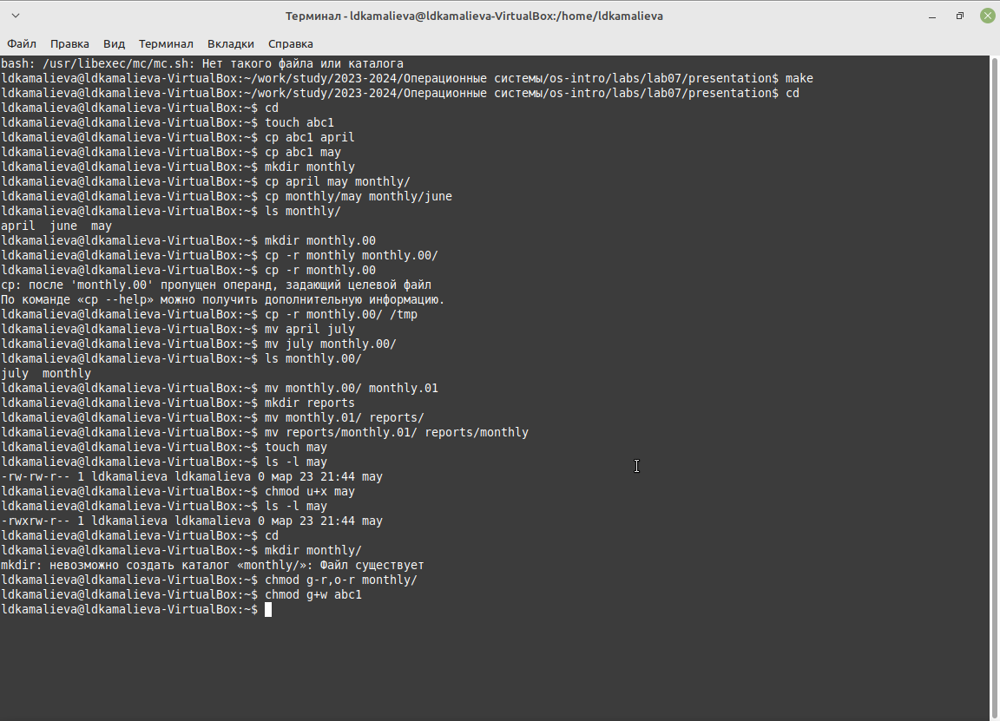
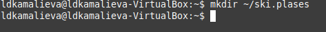
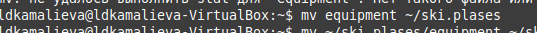
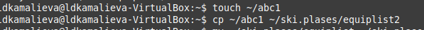
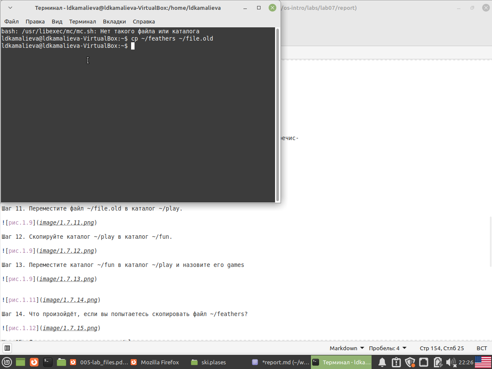
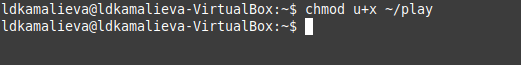
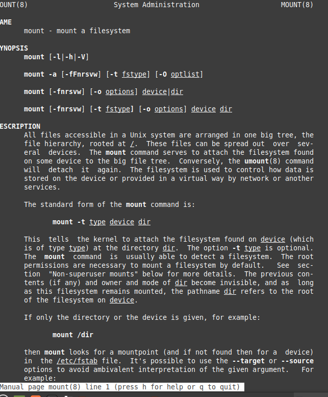

---
## Front matter
lang: ru-RU
title: Лабораторная работа №7
author:
  - Камалиева Лия Дамировна\inst{1}
institute:
   \inst{1}Российский университет дружбы народов, Москва, Россия
date: 23 марта, 2024

## i18n babel
babel-lang: russian
babel-otherlangs: english

## Formatting pdf
toc: false
toc-title: Содержание
slide_level: 2
aspectratio: 169
section-titles: true
theme: metropolis
header-includes:
 - \metroset{progressbar=frametitle,sectionpage=progressbar,numbering=fraction}
 - '\makeatletter'
 - '\beamer@ignorenonframefalse'
 - '\makeatother'
---

## Цели и задачи

Ознакомление с файловой системой Linux, её структурой, именами и содержанием
каталогов. Приобретение практических навыков по применению команд для работы
с файлами и каталогами, по управлению процессами (и работами), по проверке исполь-
зования диска и обслуживанию файловой системы.

# Выполнение лабораторной работы

##  Выполняю все примеры, приведённые в первой части описания лабораторной работы.

{ #fig:001 width=70% }

## В домашнем каталоге создала директорию ~/ski.plases.

{ #fig:002 width=70% }

## Переименовала файл ~/ski.plases/equipment в ~/ski.plases/equiplist

{ #fig:003 width=70% }

## Создалв в домашнем каталоге файл abc1 и скопировала его в каталог ~/ski.plases, назовите его equiplist2.

{ #fig:004 width=70% }

## Переместилв файлы ~/ski.plases/equiplist и equiplist2 в каталог ~/ski.plases/equipment.

{ #fig:005 width=70% }

##  Скопировала файл ~/feathers в файл ~/file.old

{ #fig:006 width=70% }

## Переместила каталог ~/fun в каталог ~/play и назвала его games

{ #fig:007 width=70% }

## Лишите владельца каталога ~/play права на выполнение.

){ #fig:008 width=70% }

## Дайте владельцу каталога ~/play право на выполнение.

{ #fig:009 width=70% }

## man mount.  команда для подключения файловых систем к директории в иерархии файловой системы Linux. Пример: mount /dev/sdb1 /mnt/usb - подключение USB устройства к директории /mnt/usb, насчет других команд я написата в отчете

{ #fig:010 width=70% }

#Выводы

## Итоговый слайд (вывод)

я научилась работать с файловой системой линукс

