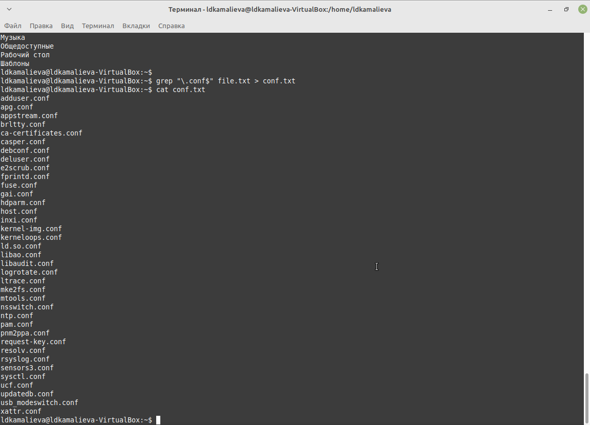
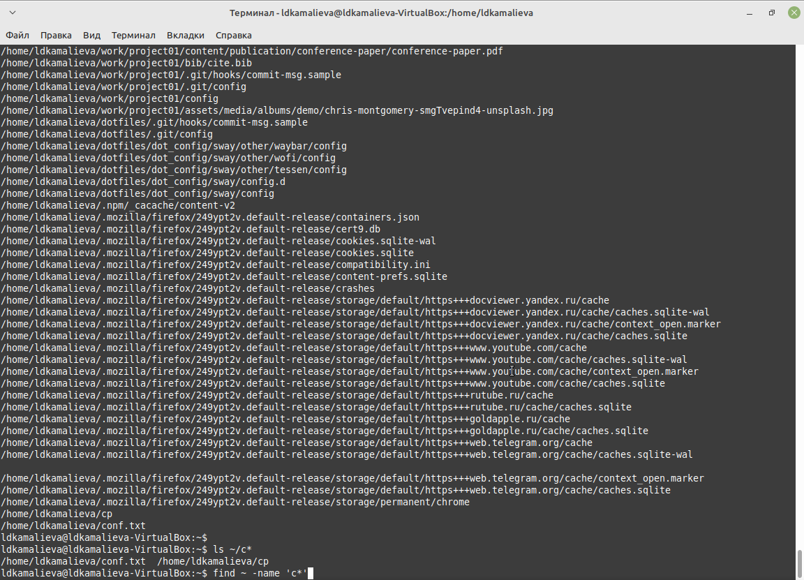
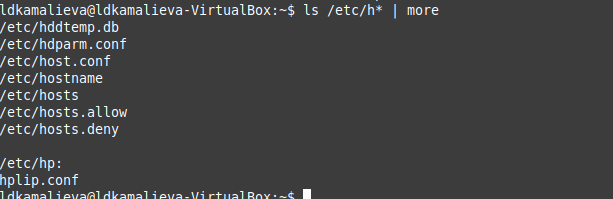
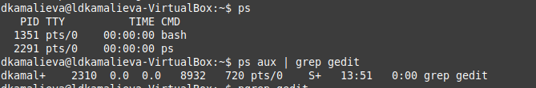
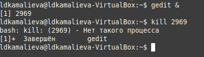
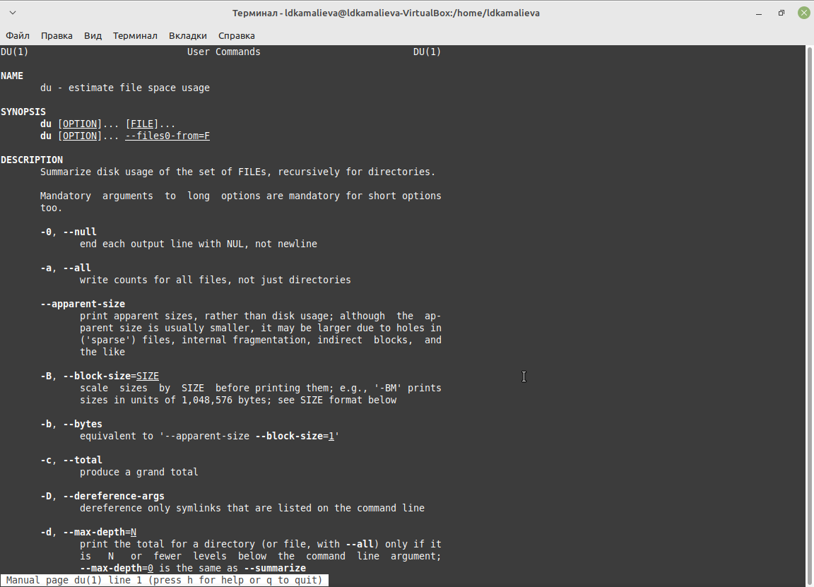
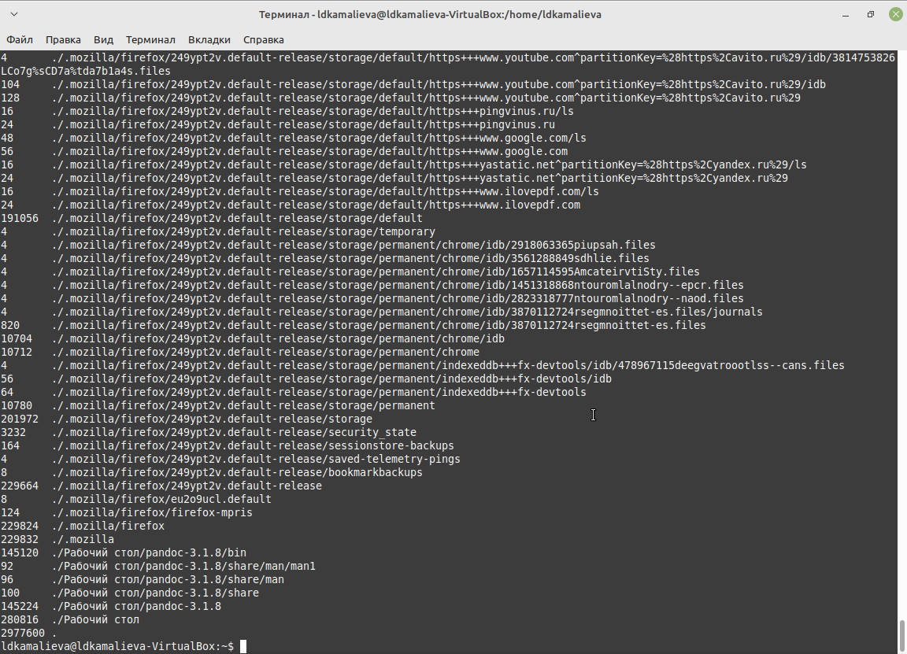
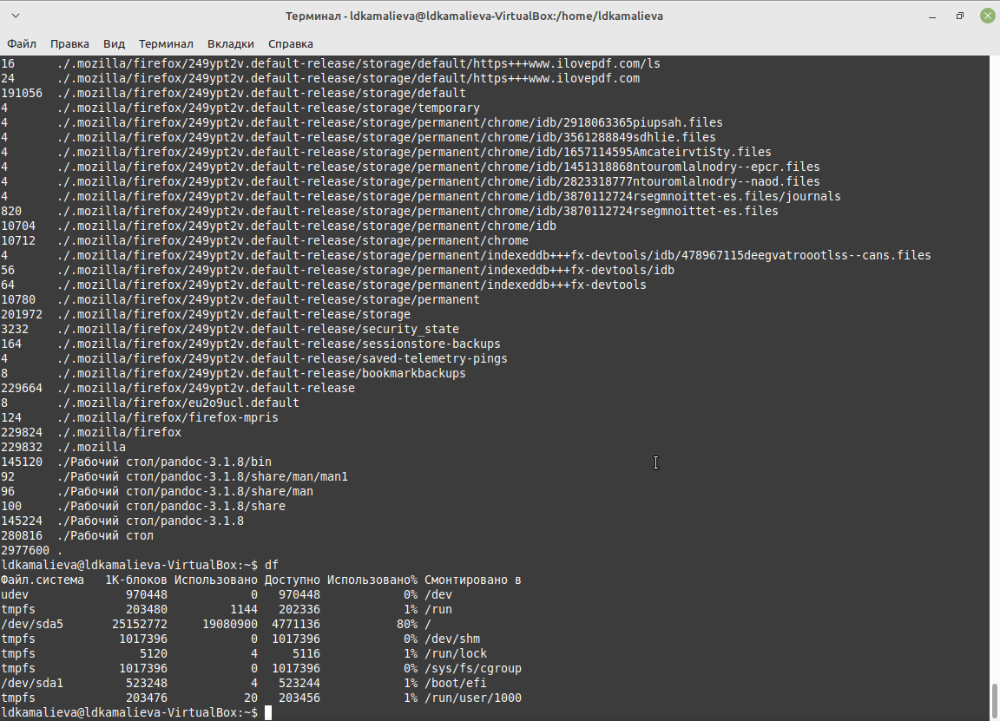
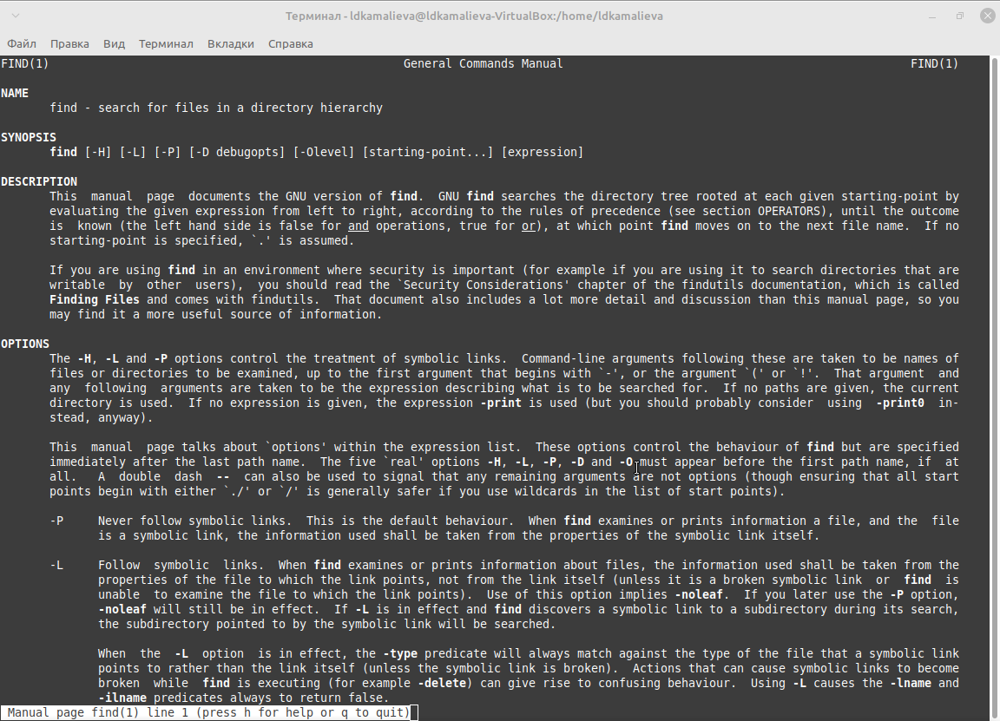
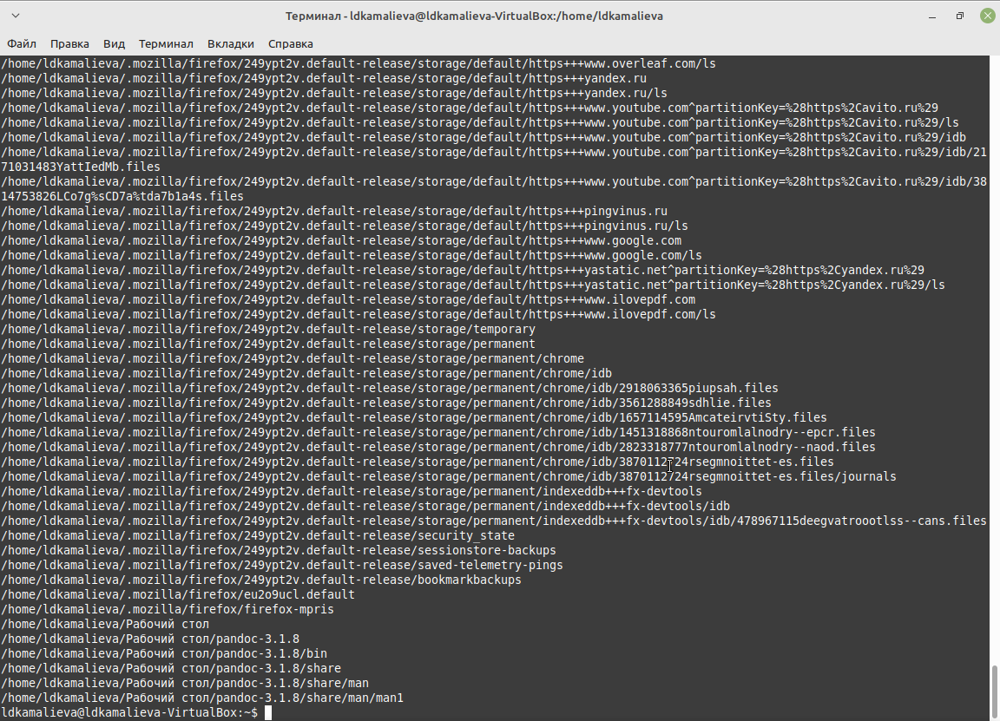

---
## Front matter
title: "Отчет по лабораторной №8"
subtitle: "Поиск файлов. Перенаправление ввода-вывода. Просмотр запущенных процессов"
author: "Камалиева Лия Дамировна"

## Generic otions
lang: ru-RU
toc-title: "Содержание"

## Bibliography
bibliography: bib/cite.bib
csl: pandoc/csl/gost-r-7-0-5-2008-numeric.csl

## Pdf output format
toc: true # Table of contents
toc-depth: 2
lof: true # List of figures
lot: true # List of tables
fontsize: 12pt
linestretch: 1.5
papersize: a4
documentclass: scrreprt
## I18n polyglossia
polyglossia-lang:
  name: russian
  options:
	- spelling=modern
	- babelshorthands=true
polyglossia-otherlangs:
  name: english
## I18n babel
babel-lang: russian
babel-otherlangs: english
## Fonts
mainfont: PT Serif
romanfont: PT Serif
sansfont: PT Sans
monofont: PT Mono
mainfontoptions: Ligatures=TeX
romanfontoptions: Ligatures=TeX
sansfontoptions: Ligatures=TeX,Scale=MatchLowercase
monofontoptions: Scale=MatchLowercase,Scale=0.9
## Biblatex
biblatex: true
biblio-style: "gost-numeric"
biblatexoptions:
  - parentracker=true
  - backend=biber
  - hyperref=auto
  - language=auto
  - autolang=other*
  - citestyle=gost-numeric
## Pandoc-crossref LaTeX customization
figureTitle: "Рис."
tableTitle: "Таблица"
listingTitle: "Листинг"
lofTitle: "Список иллюстраций"
lotTitle: "Список таблиц"
lolTitle: "Листинги"
## Misc options
indent: true
header-includes:
  - \usepackage{indentfirst}
  - \usepackage{float} # keep figures where there are in the text
  - \floatplacement{figure}{H} # keep figures where there are in the text
---

# Цель работы

Ознакомление с инструментами поиска файлов и фильтрации текстовых данных.
Приобретение практических навыков: по управлению процессами (и заданиями), по
проверке использования диска и обслуживанию файловых систем.

# Задание

1. Осуществите вход в систему, используя соответствующее имя пользователя.
2. Запишите в файл file.txt названия файлов, содержащихся в каталоге /etc. Допи-
шите в этот же файл названия файлов, содержащихся в вашем домашнем каталоге.
3. Выведите имена всех файлов из file.txt, имеющих расширение .conf, после чего
запишите их в новый текстовой файл conf.txt.
4. Определите, какие файлы в вашем домашнем каталоге имеют имена, начинавшиеся
с символа c? Предложите несколько вариантов, как это сделать.
5. Выведите на экран (по странично) имена файлов из каталога /etc, начинающиеся
с символа h.
6. Запустите в фоновом режиме процесс, который будет записывать в файл ~/logfile
файлы, имена которых начинаются с log.
7. Удалите файл ~/logfile.
8. Запустите из консоли в фоновом режиме редактор gedit.
9. Определите идентификатор процесса gedit, используя команду ps, конвейер и фильтр
grep. Как ещё можно определить идентификатор процесса?
10. Прочтите справку (man) команды kill, после чего используйте её для завершения
процесса gedit.
11. Выполните команды df и du, предварительно получив более подробную информацию
об этих командах, с помощью команды man.
12. Воспользовавшись справкой команды find, выведите имена всех директорий, имею-
щихся в вашем домашнем каталоге.

# Теоретическое введение

Перенаправление ввода-вывода
В системе по умолчанию открыто три специальных потока:
– stdin — стандартный поток ввода (по умолчанию: клавиатура), файловый дескриптор
0;
– stdout — стандартный поток вывода (по умолчанию: консоль), файловый дескриптор
1;
– stderr — стандартный поток вывод сообщений об ошибках (по умолчанию: консоль),
файловый дескриптор 2.
Большинство используемых в консоли команд и программ записывают результаты
своей работы в стандартный поток вывода stdout. Например, команда ls выводит в стан-
дартный поток вывода (консоль) список файлов в текущей директории. Потоки вывода
и ввода можно перенаправлять на другие файлы или устройства. Проще всего это делается
с помощью символов >, >>, <, <<. Рассмотрим пример

# Выполнение лабораторной работы

Шаг 1. Записываю в файл file.txt названия файлов, из каталога /etc.

Шаг 2.  вывожу имена всех файлов из file.txt с расширением .conf, и записываю их в файл conf.txt

Шаг 3. определяю, какие файлы в домашнем каталоге имеют имена, начинающиеся с символа c

Шаг 4. выводим на экран имена файлов начинающиеся на h

Шаг 5. запускаю в фоновом режиме процесс, который будет записывать в файл ~/logfile, файлы имена которых будут начинаться с filelog, тут мой ноутбук не выдержал и выключился, поэтому скрина не будет.

Шаг 6. удаляю файл filelog

Шаг 7. определяю идентификатор процесса gedit, используя команду gedit

Шаг 8. использую команду kill.. для завершения процесса gedit

Шаг 9. через команду man df просматриваю команды

Шаг 10. через команду man du просматриваю команды

Шаг 11. выполняю команду df

Шаг 12. выполняю команду du

Шаг 13. смотрю информацию о команде find, с помощью команды find man

Шаг 15. использую команду find ~ -type d вывожу имена всех директорий, имею-
щихся в моем домашнем каталоге

## Контрольные вопросы
1. Какие потоки ввода вывода вы знаете?
Ввод и вывод распределяется между тремя стандартными потоками: - stdin —
стандартный ввод (клавиатура), - stdout — стандартный вывод (экран), - stderr —
стандартная ошибка (вывод ошибок на экран).
2. Объясните разницу между операцией > и ».
Основное отличие: > : Перезаписывает существующий файл или создает файл,
если файл с указанным именем отсутствует в каталоге. » : добавляет существующий
файл или создает файл, если файл с указанным именем отсутствует в каталоге.
3. Что такое конвейер?
Конвейер (англ. pipeline) в терминологии операционных систем семейства Unix —
некоторое множество процессов, для которых выполнено следующее перенаправление
ввода-вывода: то, что выводит на поток стандартного вывода предыдущий процесс,
попадает в поток стандартного ввода следующего процесса.
4. Что такое процесс? Чем это понятие отличается от программы?
Процесс - это: - программа на стадии выполнения - “объект”, которому выделено
процессорное время - асинхронная работа
5. Что такое PID и GID?
Идентификатор процесса (PID). Каждому новому процессу ядро присваивает
уникальный идентификационный номер. В любой момент времени идентификатор
процесса является уникальным, хотя после завершения процесса он может исполь-
зоваться снова для другого процесса. Некоторые идентификаторы зарезервированы
системой для особых процессов. Так, процесс с идентификатором 1 - это процесс
инициализации init, являющийся предком всех других процессов в системе.
Идентификатор группы GID и эффективный идентификатор группы (EGID) GID
- это идентификационный номер группы данного процесса. EGID связан с GID
также, как EUID с UID.
6. Что такое задачи и какая команда позволяет ими управлять?
Принудительное завершение процесса и изменение его приоритета) можно выпол-
нить и без команды top. Процессы в Linux имеют возможность обмениваться так
называемыми “сигналами” с ядром и другими процессами. При получении сигнала
процессом, управление передается подпрограмме его обработки или ядру, если такой
подпрограммы не существует. В Linux имеется команда kill, которая позволяет
послать заданному процессу любой сигнал.
7. Найдите информацию об утилитах top и htop. Каковы их функции?
top - интерактивный просмотрщик процессов. htop аналог top. Программа top
динамически выводит в режиме реального времени информации о работающей
системе, т.е. о фактической активности процессов. По умолчанию она выдает задачи,
наиболее загружающие процессор сервера, и обновляет список каждые две секунды.
8. Назовите и дайте характеристику команде поиска файлов. Приведите примеры
использования этой команды.
find : Для поиска файлов из командной строки вы можете использовать команду
“find”. У этой команды следующий синтаксис:
find path criteria action - “path” - Секция для указания директории поиска. Если
ничего не указано поиск идет по текущей директории. - “criteria” - Опции поиска.- “action” -Опции, которые влияют на состояние поиска или контролируют его,
например, - “–print”
9. Можно ли по контексту (содержанию) найти файл? Если да, то как?
Для поиска файла по содержимому проще всего воспользоваться командой grep
(вместо find).
Пример: grep -r строка_поиска каталог
10. Как определить объем свободной памяти на жёстком диске?
Самый простой способ найти свободное место на диске в Linux - это используйте
команду df. Команда df означает «свободное от диска» и, очевидно, показывает вам
свободное и доступное дисковое пространство в системах Linux. Работы С Нами -h
вариант, он показывает дисковое пространство в удобочитаемом формате (МБ и
ГБ).
11. Как определить объем вашего домашнего каталога?
В операционных системах на базе Linux посмотреть размер папки (директории)
можно с помощью команды du. Эта команда, выполняемая в консоли, позволяет
оценить используемый объем места на жестком диске отдельно по папкам и файлам,
просуммировать результат, узнать общий размер папки.
12. Как удалить зависший процесс?
Убиваем процессы в Linux — команды ps, kill и killall
• Находим PID зависшего процесса Каждый процесс в Linux имеет свой иденти-
фикатор, называемый PID.
• «Убиваем» процесс командой kill. Когда известен PID процесса, мы можем
убить его командой kill.
• Убиваем процессы командой killall.
• Заключение

# Выводы

я научилась фильтровать файлы и искать их

# Список литературы{.unnumbered}

