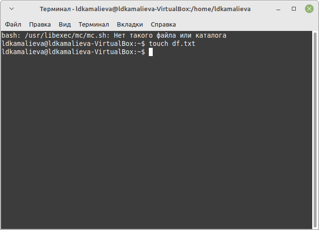

---
## Front matter
lang: ru-RU
title: Лабораторная работа №9
author:
  - Камалиева Лия Дамировна\inst{1}
institute:
   \inst{1}Российский университет дружбы народов, Москва, Россия
date: 05 апреля, 2024

## i18n babel
babel-lang: russian
babel-otherlangs: english

## Formatting pdf
toc: false
toc-title: Содержание
slide_level: 2
aspectratio: 169
section-titles: true
theme: metropolis
header-includes:
 - \metroset{progressbar=frametitle,sectionpage=progressbar,numbering=fraction}
 - '\makeatletter'
 - '\beamer@ignorenonframefalse'
 - '\makeatother'
---

## Цели и задачи

Освоение основных возможностей командной оболочки Midnight Commander. Приоб-
ретение навыков практической работы по просмотру каталогов и файлов; манипуляций
с ними

# Выполнение лабораторной работы

##  Создаю текстовой файл text.txt

{ #fig:001 width=70% }

## Открываю этот файл с помощью встроенного в mc редактора

{ #fig:002 width=70% }

## Вставляю в открытый файл небольшой фрагмент текста, скопированный из любого другого файла или Интернета.

{ #fig:003 width=70% }

## Удаляю строку текста.

{ #fig:004 width=70% }

## Сохраняю файл

{ #fig:005 width=70% }

##  Перехожу в конец файла и пишу некоторый текст

{ #fig:006 width=70% }

##  Перехожу в начало файла и пишу некоторый текст

{ #fig:007 width=70% }

##  Сохраняю и закрываю файл

{ #fig:008 width=70% }

##  Открываю файл с программой и выключаю подсветку

{ #fig:009 width=70% }

#Выводы

## Итоговый слайд (вывод)

я научилась пользоваться командой mc

