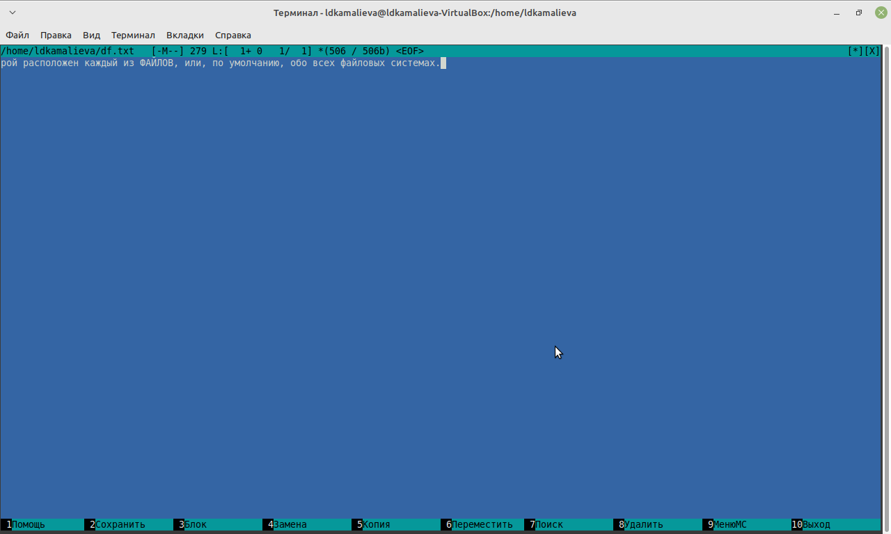
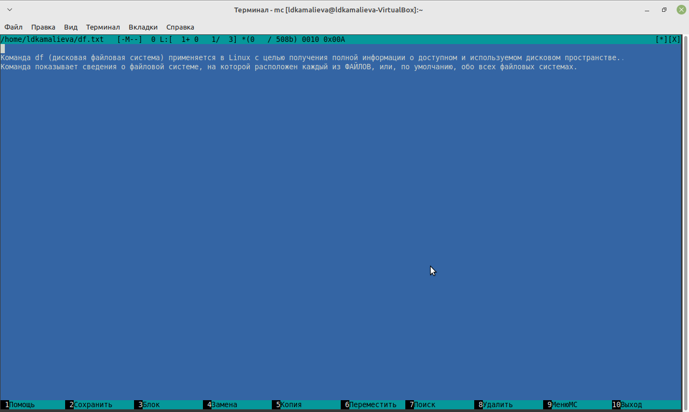
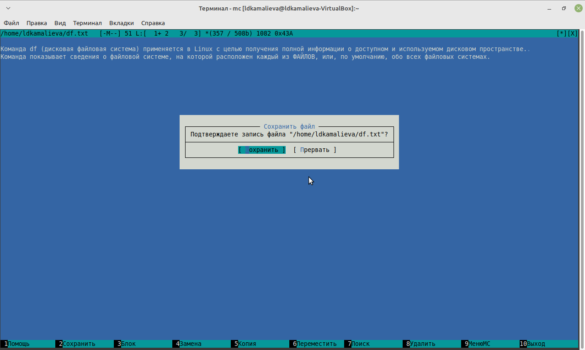
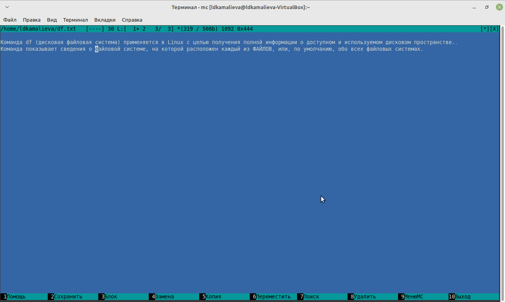
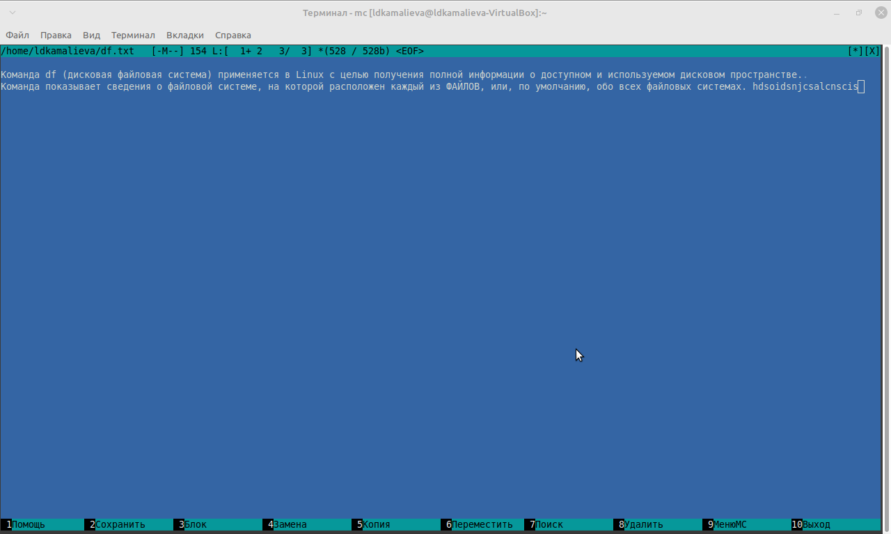
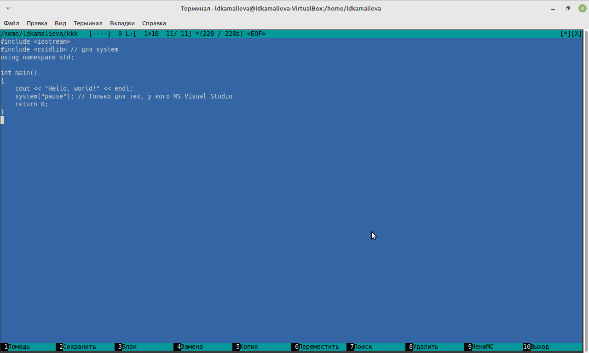

---
## Front matter
title: "Отчет по лабораторной №9"
subtitle: "Командная оболочка Midnight Commander"
author: "Камалиева Лия Дамировна"

## Generic otions
lang: ru-RU
toc-title: "Содержание"

## Bibliography
bibliography: bib/cite.bib
csl: pandoc/csl/gost-r-7-0-5-2008-numeric.csl

## Pdf output format
toc: true # Table of contents
toc-depth: 2
lof: true # List of figures
lot: true # List of tables
fontsize: 12pt
linestretch: 1.5
papersize: a4
documentclass: scrreprt
## I18n polyglossia
polyglossia-lang:
  name: russian
  options:
	- spelling=modern
	- babelshorthands=true
polyglossia-otherlangs:
  name: english
## I18n babel
babel-lang: russian
babel-otherlangs: english
## Fonts
mainfont: PT Serif
romanfont: PT Serif
sansfont: PT Sans
monofont: PT Mono
mainfontoptions: Ligatures=TeX
romanfontoptions: Ligatures=TeX
sansfontoptions: Ligatures=TeX,Scale=MatchLowercase
monofontoptions: Scale=MatchLowercase,Scale=0.9
## Biblatex
biblatex: true
biblio-style: "gost-numeric"
biblatexoptions:
  - parentracker=true
  - backend=biber
  - hyperref=auto
  - language=auto
  - autolang=other*
  - citestyle=gost-numeric
## Pandoc-crossref LaTeX customization
figureTitle: "Рис."
tableTitle: "Таблица"
listingTitle: "Листинг"
lofTitle: "Список иллюстраций"
lotTitle: "Список таблиц"
lolTitle: "Листинги"
## Misc options
indent: true
header-includes:
  - \usepackage{indentfirst}
  - \usepackage{float} # keep figures where there are in the text
  - \floatplacement{figure}{H} # keep figures where there are in the text
---

# Цель работы

Освоение основных возможностей командной оболочки Midnight Commander. Приоб-
ретение навыков практической работы по просмотру каталогов и файлов; манипуляций
с ними

# Задание

1. Создайте текстовой файл text.txt.
2. Откройте этот файл с помощью встроенного в mc редактора.
3. Вставьте в открытый файл небольшой фрагмент текста, скопированный из любого
другого файла или Интернета.
4. Проделайте с текстом следующие манипуляции, используя горячие клавиши:
4.1. Удалите строку текста.
4.2. Выделите фрагмент текста и скопируйте его на новую строку.
4.3. Выделите фрагмент текста и перенесите его на новую строку.
4.4. Сохраните файл.
4.5. Отмените последнее действие.
4.6. Перейдите в конец файла (нажав комбинацию клавиш) и напишите некоторый
текст.
4.7. Перейдите в начало файла (нажав комбинацию клавиш) и напишите некоторый
текст.
4.8. Сохраните и закройте файл.
5. Откройте файл с исходным текстом на некотором языке программирования (напри-
мер C или Java)
6. Используя меню редактора, включите подсветку синтаксиса, если она не включена,
или выключите, если она включена.

# Теоретическое введение

Командная оболочка — интерфейс взаимодействия пользователя с операционной систе-
мой и программным обеспечением посредством команд.
Midnight Commander (или mc) — псевдографическая командная оболочка для UNIX/Linux
систем. Для запуска mc необходимо в командной строке набрать mc и нажать Enter .
Рабочее пространство mc имеет две панели, отображающие по умолчанию списки
файлов двух каталогов

# Выполнение лабораторной работы

Шаг 1. Создаю текстовой файл text.txt

Шаг 2. Открываю этот файл с помощью встроенного в mc редактора

Шаг 3. Вставляю в открытый файл небольшой фрагмент текста, скопированный из любого другого файла или Интернета.

Шаг 4. Удаляю строку текста.

Шаг 5. Выделяю фрагмент текста и переношу его на новую строку

Шаг 7. Сохраняю файл

Шаг 8. Отменяю последнее действие

Шаг 9. Перехожу в конец файла и пишу некоторый
текст

Шаг 10. Перехож в начало файла и пишу некоторый текст

Шаг 11. Сохраняю и закрываю файл

Шаг 12. Открываю файл с программой и выключаю подсветку

## Контрольные вопросы
1. Режимы работы в MC:
- Режим командной строки (Command Mode): в этом режиме можно вводить команды и выполнить различные операции над файлами, каталогами и т.д.- Режим списка файлов (File Listing Mode): в этом режиме показывается список файлов и каталогов в текущем каталоге.
- Режим редактирования (Edit Mode): позволяет редактировать файлы с помощью встроенного редактора.- Режим просмотра (View Mode): позволяет просматривать содержимое файлов без возможности редактирования.
2. Операции с файлами, которые можно выполнить как с помощью команд shell, так и с помощью меню MC:
- Создание нового каталога или файла.
- Копирование, перемещение и удаление файлов и каталогов.- Переименование файлов и каталогов.
- Изменение разрешений доступа к файлам.- Поиск файлов и каталогов.
3. Структура меню левой (или правой) панели MC:
- Панель навигации: показывает список файлов и каталогов в текущем рабочем каталоге.
- Команды для работы с файлами: копирование, перемещение, удаление, переименование и т.д.- Команды для работы с отображением файлов: сортировка, фильтрация, изменение видимости файлов и каталогов.
- Различные опции и настройки.
4. Структура меню Файл MC:
- Открыть файл: для просмотра или редактирования.- Изменить атрибуты: для изменения разрешений доступа или времени создания файла.
- Создать каталог: для создания нового каталога.- Удалить: для удаления выбранного файла или каталога.
- Выйти: для выхода из MC.
5. Структура меню Команда MC:
- Выполнить команду: для выполнения произвольной команды в командной строке.- Закрыть панель: для скрытия или открытия панели с командами.
- Обновить сведения: для обновления списка файлов и каталогов в текущем каталоге.
6. Структура меню Настройки MC:
- Отображение файлов: изменение способа отображения файлов и каталогов.- Файловый менеджер: настройки поведения самого MC.
- Внешний редактор: указание внешнего редактора для редактирования файлов.- Различные другие настройки.
7. Встроенные команды MC:
- Использование клавиатурных сочетаний для выполнения операций (например, F5 для копирования, F6 для перемещения и т.д.).
- Выполнение команд shell прямо из MC.- Возможность создания и использования макросов для автоматизации повторяющихся действий.
8. Команды встроенного редактора MC:
- Открытие и редактирование файлов.
- Сохранение и закрытие файлов.- Поддержка основных функций редактирования текста, таких как копирование, вставка, поиск и замена.
9. Средства MC для создания меню, определяемые пользователем:
- Возможность настройки клавиатурных сочетаний для выполнения определенных действий.
- Создание собственных макросов для автоматизации операций.- Использование встроенных средств настройки для изменения внешнего вида и поведения MC.
10. Средства MC для выполнения действий, определяемых пользователем, над текущим файлом:
- Возможность задания команд shell для выполнения определенных действий над файлами.- Поддержка использования встроенных редакторов для редактирования содержимого файлов.
- Возможность создания и использования собственных скриптов и макросов для манипуляции файлами.

# Выводы

я научилась пользоваться командой mc

# Список литературы{.unnumbered}

