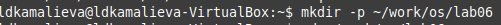
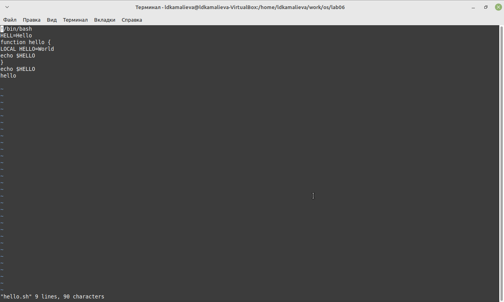

---
## Front matter
lang: ru-RU
title: Лабораторная работа №10
author:
  - Камалиева Лия Дамировна\inst{1}
institute:
   \inst{1}Российский университет дружбы народов, Москва, Россия
date: 13 апреля, 2024

## i18n babel
babel-lang: russian
babel-otherlangs: english

## Formatting pdf
toc: false
toc-title: Содержание
slide_level: 2
aspectratio: 169
section-titles: true
theme: metropolis
header-includes:
 - \metroset{progressbar=frametitle,sectionpage=progressbar,numbering=fraction}
 - '\makeatletter'
 - '\beamer@ignorenonframefalse'
 - '\makeatother'
---

## Цели и задачи

Познакомиться с операционной системой Linux. Получить практические навыки работы с редактором vi, установленным по умолчанию практически во всех дистрибутивах.

# Выполнение лабораторной работы

##  Cоздаю каталог с именем ~/work/os/lab06

{ #fig:001 width=70% }

## Вызываю vi и создаю файл hello.sh

{ #fig:002 width=70% }

## Ввожу текст

{ #fig:003 width=70% }

## Делаю файл исполныемым

{ #fig:004 width=70% }

## заменяю HELL на HELLO

{ #fig:005 width=70% }

##  Удаляю LOCAL

{ #fig:006 width=70% }

#Выводы

## Итоговый слайд (вывод)

я научилась пользоваться редактором vi

