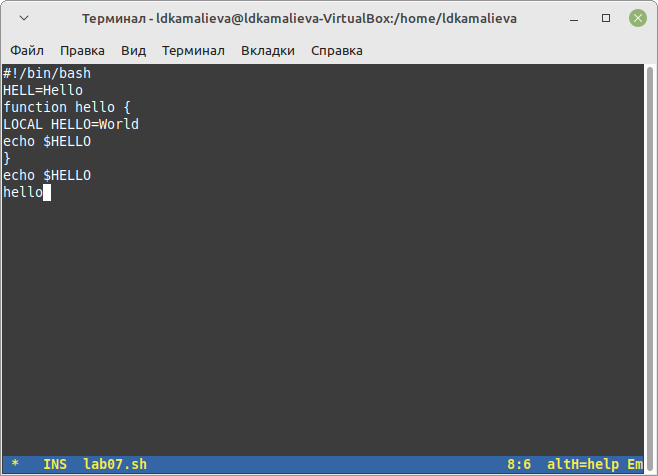
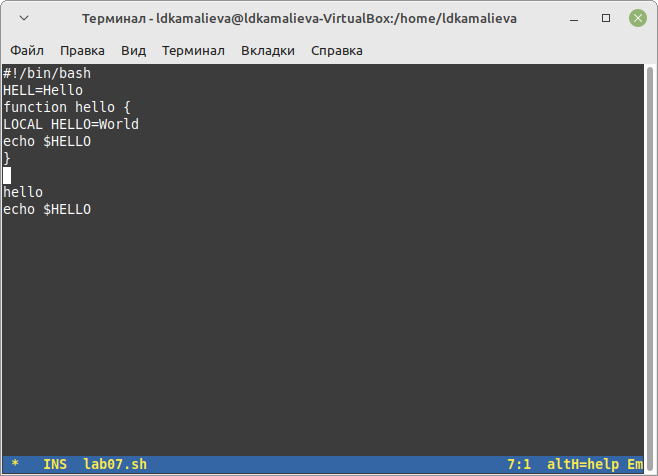
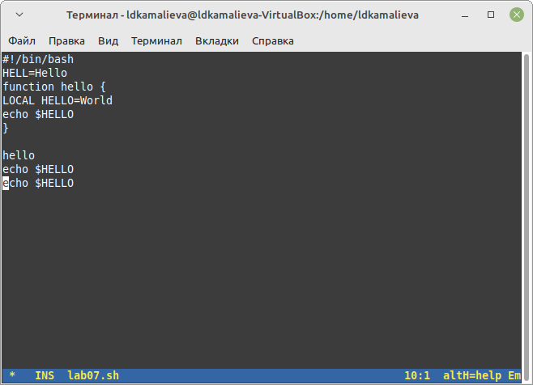

---
## Front matter
lang: ru-RU
title: Лабораторная работа №11
author:
  - Камалиева Лия Дамировна\inst{1}
institute:
   \inst{1}Российский университет дружбы народов, Москва, Россия
date: 20 апреля, 2024

## i18n babel
babel-lang: russian
babel-otherlangs: english

## Formatting pdf
toc: false
toc-title: Содержание
slide_level: 2
aspectratio: 169
section-titles: true
theme: metropolis
header-includes:
 - \metroset{progressbar=frametitle,sectionpage=progressbar,numbering=fraction}
 - '\makeatletter'
 - '\beamer@ignorenonframefalse'
 - '\makeatother'
---

## Цели и задачи

Emacs представляет собой мощный экранный редактор текста, написанный на языке высокого уровня Elisp.

# Выполнение лабораторной работы

##  Скачиваю emacs

{ #fig:001 width=70% }

## Cоздаю файл lab07.sh с помощью комбинации Ctrl-x Ctrl-f (C-x C-f)

{ #fig:002 width=70% }

## Набираю текст

{ #fig:003 width=70% }

## Вырезать одной командой целую строку

{ #fig:004 width=70% }

## Вставить эту строку в конец файла (C-y)

{ #fig:005 width=70% }

##  Переместите курсор в начало строки (C-a)

{ #fig:006 width=70% }

## Переместите курсор в конец строки (C-e)

{ #fig:007 width=70% }

## Испробуйте другой режим поиска, нажав M-s o. Объясните, чем он отличается от обычного режима?

Режим поиска M-s o (isearch-forward-symbol-at-point) отличается от обычного режима поиска тем, что он автоматически использует текущее слово под курсором как искомое слово. Таким образом, нет необходимости вводить текст для поиска, просто нажмите комбинацию клавиш M-s o, и Emacs найдет следующее вхождение этого слова в тексте. Этот режим упрощает поиск конкретных символов или переменных в тексте, делая процесс более быстрым и удобным.

#Выводы

## Итоговый слайд (вывод)

я ознакомилась с функциями emacs

