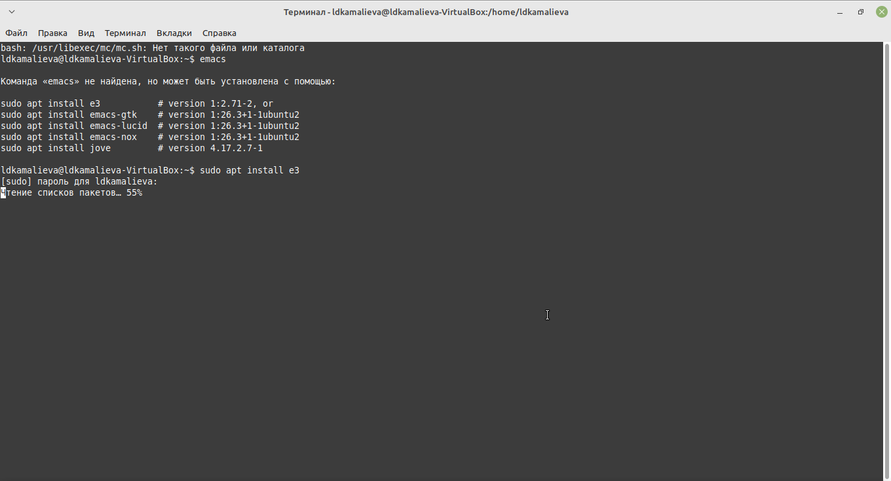
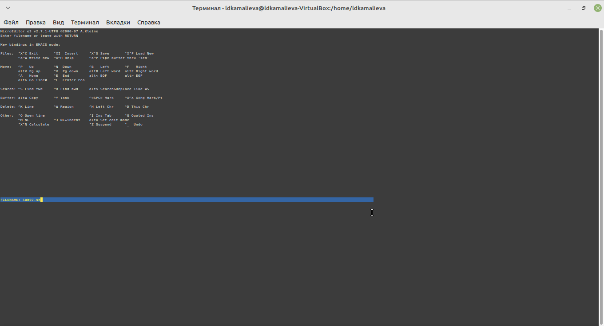
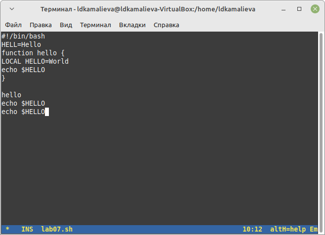

---
## Front matter
title: "Отчет по лабораторной №11"
subtitle: ""
author: "Камалиева Лия Дамировна"

## Generic otions
lang: ru-RU
toc-title: "Содержание"

## Bibliography
bibliography: bib/cite.bib
csl: pandoc/csl/gost-r-7-0-5-2008-numeric.csl

## Pdf output format
toc: true # Table of contents
toc-depth: 2
lof: true # List of figures
lot: true # List of tables
fontsize: 12pt
linestretch: 1.5
papersize: a4
documentclass: scrreprt
## I18n polyglossia
polyglossia-lang:
  name: russian
  options:
	- spelling=modern
	- babelshorthands=true
polyglossia-otherlangs:
  name: english
## I18n babel
babel-lang: russian
babel-otherlangs: english
## Fonts
mainfont: PT Serif
romanfont: PT Serif
sansfont: PT Sans
monofont: PT Mono
mainfontoptions: Ligatures=TeX
romanfontoptions: Ligatures=TeX
sansfontoptions: Ligatures=TeX,Scale=MatchLowercase
monofontoptions: Scale=MatchLowercase,Scale=0.9
## Biblatex
biblatex: true
biblio-style: "gost-numeric"
biblatexoptions:
  - parentracker=true
  - backend=biber
  - hyperref=auto
  - language=auto
  - autolang=other*
  - citestyle=gost-numeric
## Pandoc-crossref LaTeX customization
figureTitle: "Рис."
tableTitle: "Таблица"
listingTitle: "Листинг"
lofTitle: "Список иллюстраций"
lotTitle: "Список таблиц"
lolTitle: "Листинги"
## Misc options
indent: true
header-includes:
  - \usepackage{indentfirst}
  - \usepackage{float} # keep figures where there are in the text
  - \floatplacement{figure}{H} # keep figures where there are in the text
---

# Цель работы

Emacs представляет собой мощный экранный редактор текста, написанный на языке
высокого уровня Elisp.

# Задание

1. Ознакомиться с теоретическим материалом.
2. Ознакомиться с редактором emacs.
3. Выполнить упражнения.
4. Ответить на контрольные вопросы

# Теоретическое введение

Определение 1. Буфер — объект, представляющий какой-либо текст.
Буфер может содержать что угодно, например, результаты компиляции программы
или встроенные подсказки. Практически всё взаимодействие с пользователем, в том
числе интерактивное, происходит посредством буферов.
Определение 2. Фрейм соответствует окну в обычном понимании этого слова. Каждый
фрейм содержит область вывода и одно или несколько окон Emacs.
Определение 3. Окно — прямоугольная область фрейма, отображающая один из буфе-
ров.
# Выполнение лабораторной работы

Шаг 1. Скачиваю emacs

Шаг 2. Cоздаю файл lab07.sh с помощью комбинации Ctrl-x Ctrl-f (C-x C-f)

Шаг 3. Набираю текст

Шаг 4. Сохраняю файл с помощью комбинации Ctrl-x Ctrl-s (C-x C-s)

Шаг 5. Вырезать одной командой целую строку

Шаг 6.Вставить эту строку в конец файла (C-y)

Шаг 7. Вновь выделить эту область и на этот раз вырезать её (C-w)

Шаг 8. Переместите курсор в начало строки (C-a)

Шаг 9. Переместите курсор в конец строки (C-e)

Шаг 10. Поделите фрейм на 4 части: разделите фрейм на два окна по вертикали (C-x 3), а затем каждое из этих окон на две части по горизонтали (C-x 2)

Шаг 11. Испробуйте другой режим поиска, нажав M-s o. Объясните, чем он отличается от
обычного режима?

Режим поиска M-s o (isearch-forward-symbol-at-point) отличается от обычного режима поиска тем, что он автоматически использует текущее слово под курсором как искомое слово. Таким образом, нет необходимости вводить текст для поиска, просто нажмите комбинацию клавиш M-s o, и Emacs найдет следующее вхождение этого слова в тексте. Этот режим упрощает поиск конкретных символов или переменных в тексте, делая процесс более быстрым и удобным.

## Контрольные вопросы

1 Кратко охарактеризуйте редактор emacs.
Emacs это один из наиболее мощных и широко распространённых редакторов,
используемых в мире Unix. По популярности он соперничает с редактором vi и
его клонами. В зависимости от ситуации, Emacs может быть текстовым редакто-
ром; программой для чтения почты и новостей Usenet; интегрированной средой
разработки (IDE); операционной системой и т.д. Всё это разнообразие достигается
благодаря архитектуре Emacs, которая позволяет расширять возможности редактора
при помощи языка Emacs Lisp. На языке C написаны лишь самые базовые и низко-
уровневые части Emacs, включая полнофункциональный. интерпретатор языка Lisp.
Таким образом, Emacs имеет встроенный язык программирования, который может
использоваться для настройки, расширения и изменения поведения редактора. В
действительности, большая часть того редактора, с которым пользователи Emacs
работают в наши дни,написана на языке Lisp.
2 Какие особенности данного редактора могут сделать его сложным для освоения
новичком?
Основную трудность для новичков при освоении данного редактора могут со-
ставлять большое количество команд, комбинаций клавиш, которые не получится
все запомнить с первого раза и поэтоупридется часто обращаться к справочным
материалам.
3 Своими словами опишите, что такое буфер и окно в терминологии emacs’а.
Буфер–это объект, представляющий собой текст. Если имеется несколько буферов,
то редактировать можно только один. Обычно буфер считывает данные из файла
или записывает в файл данные из буфера. Окно–это область экрана, отображаю-
щая буфер. При запуске редактора отображается одно окно, но при обращении к
некоторым функциям могут открыться дополнительные окна. Окна Emacsи окна
графической среды XWindow–разные вещи. Одно окно XWindowможет быть разбито
на несколько окон в смысле Emacs, в каждом из которых отображается отдельный
буфер.
4 Можно ли открыть больше 10 буферов в одном окне?
Да, можно.
5 Какие буферы создаются по умолчанию при запуске emacs?
При запуске Emacsпо умолчанию создаются следующие буферы: «scratch»(буфер
для несохраненного текста) «Messages»(журнал ошибок, включающий такжеинфор-
мацию, которая появляется в области EchoArea) «GNUEmacs»(справочный буфер о
редакторе).
6 Какие клавиши вы нажмёте, чтобы ввести следующую комбинацию C-c | и C-c
C-|?
C-c |сначала, удерживая «ctrl»,нажимаю «c»,после –отпускаюобе клавишии на-
жимаю «|» C-cC-|сначала, удерживая «ctrl»,нажимаю «с», после –отпускаю обе
клавиши и, удерживая «ctrl», нажимаю «|».
7 Как поделить текущее окно на две части?
Чтобы поделить окно на две части необходимо воспользоваться комбинацией
«Ctrl-x 3»(по вертикали) или «Ctrl-x 2» (по горизонтали).
8 В каком файле хранятся настройки редактора emacs?
Настройки Emacsхранятся в файле .emacs.
9 Какую функцию выполняет клавиша и можно ли её переназначить?
По умолчанию клавиша «←» удаляет символперед курсором, нов редакторе её
можно переназначить. Для этого необхдимоизменить конфигурацию файла .emacs.
10 Какой редактор вам показался удобнее в работе vi или emacs? Поясните почему.
Более удобным я считаю редактор emacs, потому чтов нем проще открывать
другие файлы, можно использовать сразу несколько окон, нет «Командногорежи-
ма», «Режима ввода», «Режима командной строки», которые являются немного
непривычными и в какой-то степени неудобным.

# Выводы

я ознакомилась с функциями emacs

# Список литературы{.unnumbered}

