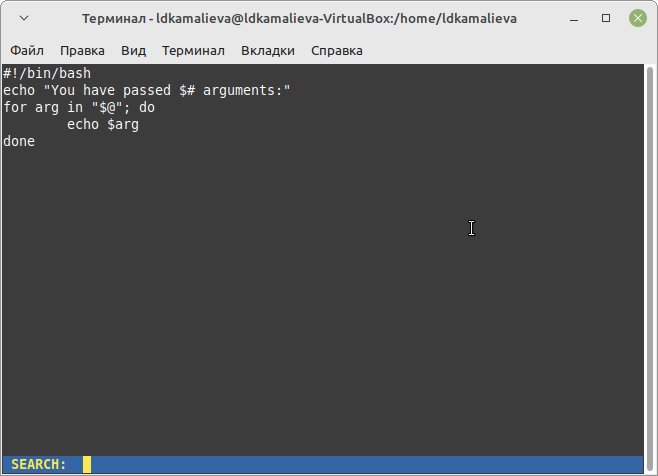
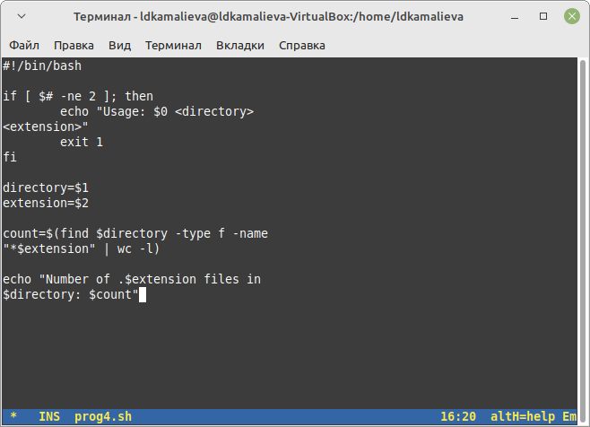

---
## Front matter
lang: ru-RU
title: Лабораторная работа №12
author:
  - Камалиева Лия Дамировна\inst{1}
institute:
   \inst{1}Российский университет дружбы народов, Москва, Россия
date: 27 апреля, 2024

## i18n babel
babel-lang: russian
babel-otherlangs: english

## Formatting pdf
toc: false
toc-title: Содержание
slide_level: 2
aspectratio: 169
section-titles: true
theme: metropolis
header-includes:
 - \metroset{progressbar=frametitle,sectionpage=progressbar,numbering=fraction}
 - '\makeatletter'
 - '\beamer@ignorenonframefalse'
 - '\makeatother'
---

## Цели и задачи

Изучить основы программирования в оболочке ОС UNIX/Linux. Научиться писать
небольшие командные файлы.

# Выполнение лабораторной работы

##  Создаю файл prog1.sh

{ #fig:001 width=70% }

## Пишу скрипт, который при запуске будет делать резервную копию самого себя  в другую директорию backup в вашем домашнем каталоге

{ #fig:002 width=70% }

## использую команду chmod -x prog1.sh

{ #fig:003 width=70% }

## проверяю на рабочем столе, что архив создался

{ #fig:004 width=70% }

## Написать пример командного файла, обрабатывающего любое произвольное число аргументов командной строки, в том числе превышающее десять. Например, скрипт может последовательно распечатывать значения всех переданных аргументов. Прописываю этот скрипт в файле prog2.sh

{ #fig:005 width=70% }

##  Написать командный файл — аналог команды ls (без использования самой этой команды и команды dir). Требуется, чтобы он выдавал информацию о нужном каталоге и выводил информацию о возможностях доступа к файлам этого каталога. Прописываю этот скрипт в файле prog3.sh

{ #fig:006 width=70% }

## Пользуюсь командой chmod -x prog3.sh

{ #fig:007 width=70% }

## Написать командный файл, который получает в качестве аргумента командной строки
формат файла (.txt, .doc, .jpg, .pdf и т.д.) и вычисляет количество таких файлов
в указанной директории. Путь к директории также передаётся в виде аргумента ко-
мандной строки. Прописываю этот скрипт в файле prog4.sh

{ #fig:008 width=70% }

#Выводы

## Итоговый слайд (вывод)

я начала писать скрипты в emacs

