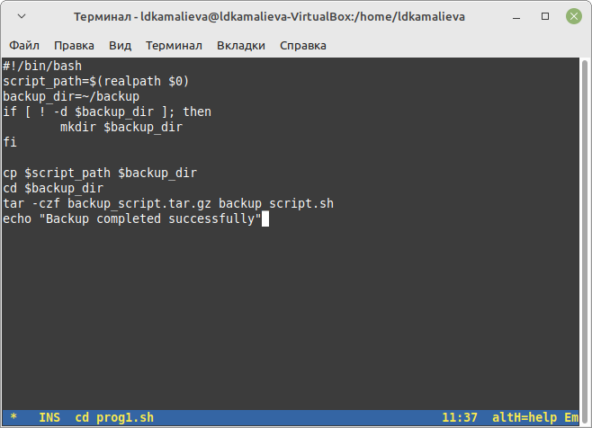
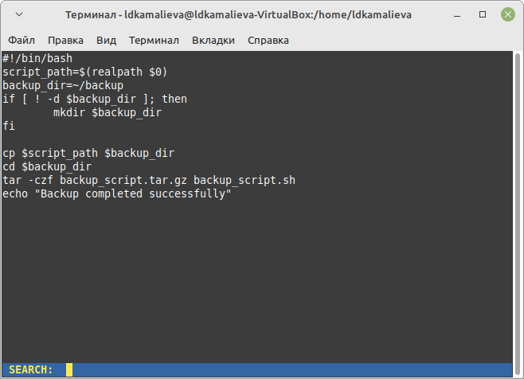
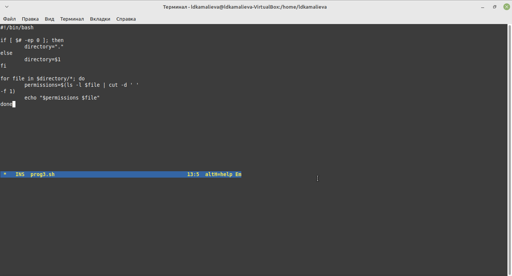
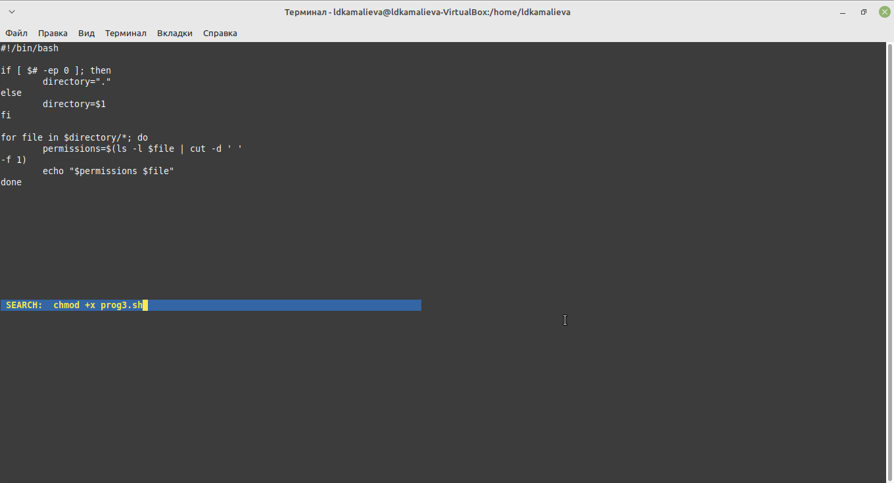

---
## Front matter
title: "Отчет по лабораторной №12"
subtitle: ""
author: "Камалиева Лия Дамировна"

## Generic otions
lang: ru-RU
toc-title: "Содержание"

## Bibliography
bibliography: bib/cite.bib
csl: pandoc/csl/gost-r-7-0-5-2008-numeric.csl

## Pdf output format
toc: true # Table of contents
toc-depth: 2
lof: true # List of figures
lot: true # List of tables
fontsize: 12pt
linestretch: 1.5
papersize: a4
documentclass: scrreprt
## I18n polyglossia
polyglossia-lang:
  name: russian
  options:
	- spelling=modern
	- babelshorthands=true
polyglossia-otherlangs:
  name: english
## I18n babel
babel-lang: russian
babel-otherlangs: english
## Fonts
mainfont: PT Serif
romanfont: PT Serif
sansfont: PT Sans
monofont: PT Mono
mainfontoptions: Ligatures=TeX
romanfontoptions: Ligatures=TeX
sansfontoptions: Ligatures=TeX,Scale=MatchLowercase
monofontoptions: Scale=MatchLowercase,Scale=0.9
## Biblatex
biblatex: true
biblio-style: "gost-numeric"
biblatexoptions:
  - parentracker=true
  - backend=biber
  - hyperref=auto
  - language=auto
  - autolang=other*
  - citestyle=gost-numeric
## Pandoc-crossref LaTeX customization
figureTitle: "Рис."
tableTitle: "Таблица"
listingTitle: "Листинг"
lofTitle: "Список иллюстраций"
lotTitle: "Список таблиц"
lolTitle: "Листинги"
## Misc options
indent: true
header-includes:
  - \usepackage{indentfirst}
  - \usepackage{float} # keep figures where there are in the text
  - \floatplacement{figure}{H} # keep figures where there are in the text
---

# Цель работы

Изучить основы программирования в оболочке ОС UNIX/Linux. Научиться писать
небольшие командные файлы.

# Задание

1. писать скрипт, который при запуске будет делать резервную копию самого себя (то
есть файла, в котором содержится его исходный код) в другую директорию backup
в вашем домашнем каталоге. При этом файл должен архивироваться одним из ар-
хиваторов на выбор zip, bzip2 или tar. Способ использования команд архивации
необходимо узнать, изучив справку.
2. Написать пример командного файла, обрабатывающего любое произвольное число
аргументов командной строки, в том числе превышающее десять. Например, скрипт
может последовательно распечатывать значения всех переданных аргументов.
3. Написать командный файл — аналог команды ls (без использования самой этой ко-
манды и команды dir). Требуется, чтобы он выдавал информацию о нужном каталоге
и выводил информацию о возможностях доступа к файлам этого каталога.
4. Написать командный файл, который получает в качестве аргумента командной строки
формат файла (.txt, .doc, .jpg, .pdf и т.д.) и вычисляет количество таких файлов
в указанной директории. Путь к директории также передаётся в виде аргумента ко-
мандной строки.

# Теоретическое введение

Командный процессор (командная оболочка, интерпретатор команд shell) — это про-
грамма, позволяющая пользователю взаимодействовать с операционной системой
компьютера. В операционных системах типа UNIX/Linux наиболее часто используются
следующие реализации командных оболочек:
– оболочка Борна (Bourne shell или sh) — стандартная командная оболочка UNIX/Linux,
содержащая базовый, но при этом полный набор функций;
– С-оболочка (или csh) — надстройка на оболочкой Борна, использующая С-подобный
синтаксис команд с возможностью сохранения истории выполнения команд;
– оболочка Корна (или ksh) — напоминает оболочку С, но операторы управления програм-
мой совместимы с операторами оболочки Борна;
– BASH — сокращение от Bourne Again Shell (опять оболочка Борна), в основе своей сов-
мещает свойства оболочек С и Корна (разработка компании Free Software Foundation)

# Выполнение лабораторной работы

Шаг 1. Создаю файл prog1.sh

Шаг 2. пишу скрипт, который при запуске будет делать резервную копию самого себя  в другую директорию backup в вашем домашнем каталоге

Шаг 3. использую команду chmod -x prog1.sh

Шаг 4. проверяю на рабочем столе, что архив создался

Шаг 5. Написать пример командного файла, обрабатывающего любое произвольное число
аргументов командной строки, в том числе превышающее десять. Например, скрипт
может последовательно распечатывать значения всех переданных аргументов. Прописываю этот скрипт в файле prog2.sh

Шаг 6.  Написать командный файл — аналог команды ls (без использования самой этой команды и команды dir). Требуется, чтобы он выдавал информацию о нужном каталоге и выводил информацию о возможностях доступа к файлам этого каталога. Прописываю этот скрипт в файле prog3.sh

Шаг 7. Пользуюсь командой chmod -x prog3.sh

Шаг 8. Написать командный файл, который получает в качестве аргумента командной строки
формат файла (.txt, .doc, .jpg, .pdf и т.д.) и вычисляет количество таких файлов
в указанной директории. Путь к директории также передаётся в виде аргумента ко-
мандной строки. Прописываю этот скрипт в файле prog4.sh

## Контрольные вопросы

1 Каково предназначение команды getopts?
Команда getopts осуществляет синтаксический анализ командной строки, выделяя
флаги, ииспользуется для объявления переменных. Синтаксис команды следующий:
getopts option-string variable [arg. . . ] Флаги это опции командной строки, обычно
помеченные знаком минус; Например, для команды ls флагом может являться -F.
Строка опций option-string это список возможных букв и чисел соответствующего
флага. Если ожидается, что некоторый флаг будет сопровождаться некоторым
аргументом, то за символом, обозначающим этот флаг, должно следовать двоеточие.
Соответствующей переменной присваивается буква данной опции. Еслик оманда
getopts может распознать аргумент, то она возвращает истину. Принято включать
getopts в цикл while и анализировать введённые данные с помощью оператора
case. Функция getopts включает две специальные переменные среды OPTARG и
OPTIND. Если ожидается доплнительное значение,то OPTARG устанавливается в
значение этого аргумента. Функция getopts также понимает переменные типа массив,
следовательно, можно использовать её в функции не только для синтаксического
анализа аргументов функций, но и для анализа введённых пользователем данных.
2 Какое отношение метасимволы имеют к генерации имён файлов?
Приперечислении имён файлов текущего каталога можно использовать следу-
ющие символы: 1 соответствует произвольной, в том числе и пустой строке; 2 ?
соответствует любому одинарному символу; 3 [c1-c2] соответствует любому символу,
лексикографически находящемуся между символами с1 и с2. Например, 1.1 echo выведет имена всех файлов текущего каталога, что представляет собой простейший
аналог команды ls; 1.2. ls.c выведет все файлы с последними двумя символами,
совпадающими с.c. 1.3. echoprog.? выведет все файлы, состоящие из пяти или шести
символов, первыми пятью символами которых являются prog.. 1.4.[a-z] соответствует
произвольному имени файла в текущем каталоге, начинающемуся с любой строчной
буквы латинского алфавита.
3 Какие операторы управления действиями вы знаете?
Часто бывает необходимо обеспечить проведение каких-либо действий циклически
и управление дальнейшими действиями в зависимости от результатов проверки
некоторого условия. Для решения подобных задач язык программирования bash
предоставляет возможность использовать такие управляющие конструкции, как for,
case, if иwhile. С точки зрения командного процессора эти управляющие конструкции
являются обычными командами и могут использоваться как при создании команд-
ных файлов, так и при работе в интерактивном режиме. Команды, реализующие
подобные конструкции, по сути, являются операторами языка программирования
bash. Поэтому при описании языка программирования bash термин оператор будет
использоваться наравне с термином команда. Команды ОСUNIX возвращают код
завершения, значение которого может быть использовано для принятия решения о
дальнейших действиях. Команда test, например, создана специально для использо-
вания в командных файлах. Единственная функция этой команды заключается в
выработке кода завершения.
4 Какие операторы используются для прерывания цикла?
Два несложных способа позволяют вам прерывать циклы в оболочке bash. Ко-
манда break завершает выполнение цикла, а команда continue завершает данную
итерацию блока операторов. Команда break полезна для завершения цикла while в
ситуациях, когда условие перестаёт быть правильным. Команда continue исполь-
зуется в ситуациях, когда больше нет необходимости выполнять блок операторов,но вы можете захотеть продолжить проверять данный блок на других условных
выражениях.
5 Для чего нужны команды false и true?
Следующие две команды ОСUNIX используются только совместно с управля-
ющими конструкциями языка программирования bash: это команда true,которая
всегда возвращает код завершения, равный нулю(т.е.истина),и команда false,которая
всегда возвращает код завершения,неравный нулю(т.е.ложь).Примеры бесконечных
циклов:while true do echo hello andy done until false do echo hello mike done.
6 Что означает строка if test -f mans/i.$s, встреченная в командном файле?
Строка if test-fmans/i.sпроверяет,существуетлифайлmans/i.s и является ли этот
файл обычным файлом.Если данный файл является каталогом,то команда вернет
нулевое значение (ложь).
7 Объясните различия между конструкциями while и until.
Выполнение оператора цикла while сводится к тому,что сначала выполняет-
ся последовательность команд(операторов), которую задаёт список-команд в
строке, содержащей служебное слово while,а затем,если последняя выполненная
команда из этой последовательности команд возвращает нулевой код заверше-
ния(истина),выполняется последовательность команд(операторов),которую задаёт
список-команд в строке,содержащей служебное слово do,после чего осуществляется
безусловный переход на начало оператора цикла while.Выход из цикла будет
осуществлён тогда,когда последняя выполненная команда из последовательности
команд (операторов),которую задаёт список-команд в строке,содержащей служебное
слово while, возвратит ненулевой код завершения(ложь). При замене в операторе
цикла while служебного слова while на until условие,при выполнении которого
осуществляется выход из цикла,меняется на противоположное.В остальном оператор
цикла while и оператор цикла until идентичны.

# Выводы

я ознакомилась с функциями emacs

# Список литературы{.unnumbered}

