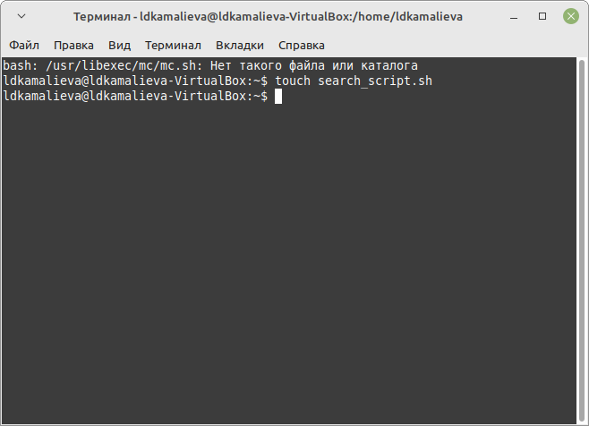
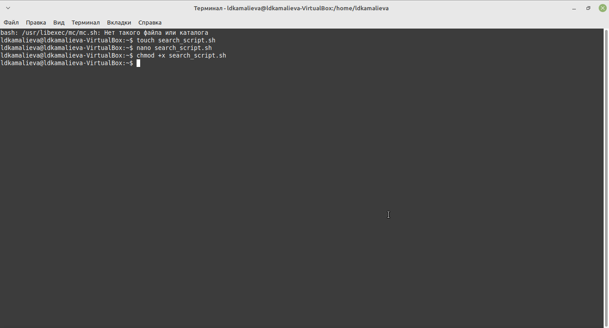
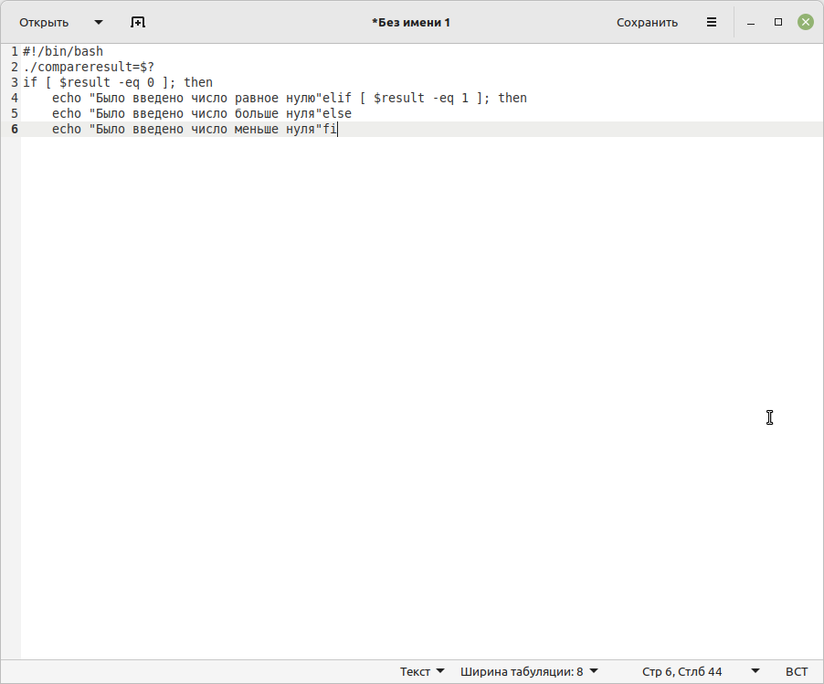
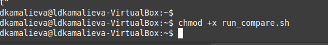

---
## Front matter
lang: ru-RU
title: Лабораторная работа №13
author:
  - Камалиева Лия Дамировна\inst{1}
institute:
   \inst{1}Российский университет дружбы народов, Москва, Россия
date: 27 апреля, 2024

## i18n babel
babel-lang: russian
babel-otherlangs: english

## Formatting pdf
toc: false
toc-title: Содержание
slide_level: 2
aspectratio: 169
section-titles: true
theme: metropolis
header-includes:
 - \metroset{progressbar=frametitle,sectionpage=progressbar,numbering=fraction}
 - '\makeatletter'
 - '\beamer@ignorenonframefalse'
 - '\makeatother'
---

## Цели и задачи

изучить основы программирования в оболочке ОС UNIX. Научится писать более
сложные командные файлы с использованием логических управляющих конструкций
и циклов.

# Выполнение лабораторной работы

##  Создаю файл research_script.sh

{ #fig:001 width=70% }

## пишу скрипт, по заданию
 написать командный файл, который анализирует
командную строку с ключами:
– -iinputfile — прочитать данные из указанного файла;
– -ooutputfile — вывести данные в указанный файл;
– -pшаблон — указать шаблон для поиска;
– -C — различать большие и малые буквы;
– -n — выдавать номера строк.
а затем ищет в указанном файле нужные строки, определяемые ключом -p.

{ #fig:002 width=70% }

## сохраняю файл

{ #fig:003 width=70% }

## использую команду chmod +x research_script.sh

{ #fig:004 width=70% }

## открываю программу gedit

{ #fig:005 width=70% }

##  прописываю скрипт

{ #fig:006 width=70% }

## прописываю еще один скрип для запуска

{ #fig:007 width=70% }

## даю файлу права на выполнение

{ #fig:008 width=70% }

## создаю файл и прописываю в нем скрипт

{ #fig:009 width=70% }

## проверяю работу кода

{ #fig:010 width=70% }

#Выводы

## Итоговый слайд (вывод)

я начала писать скрипты в emacs

