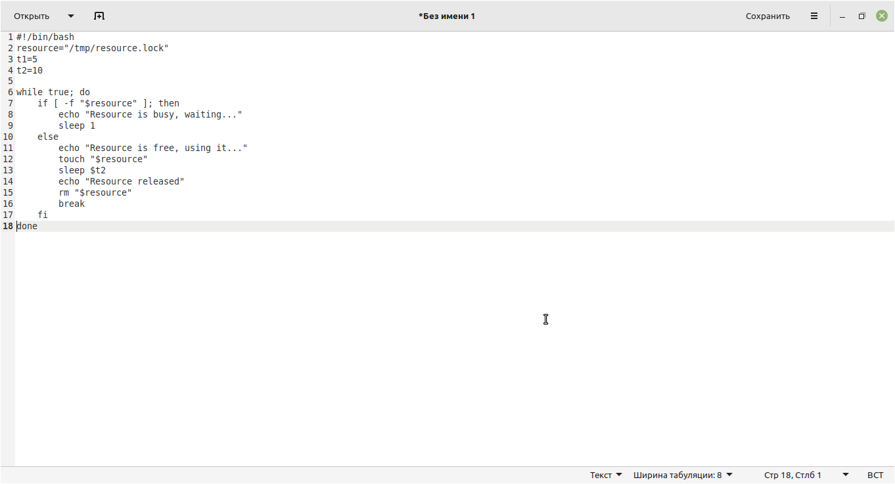
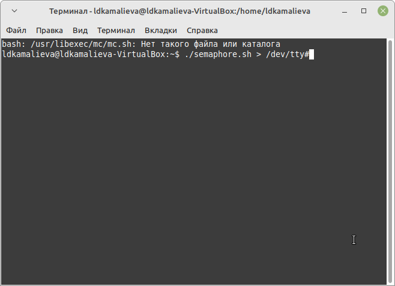
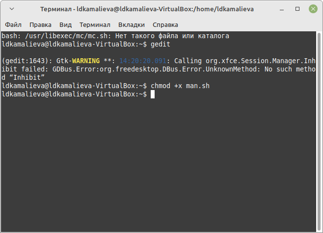
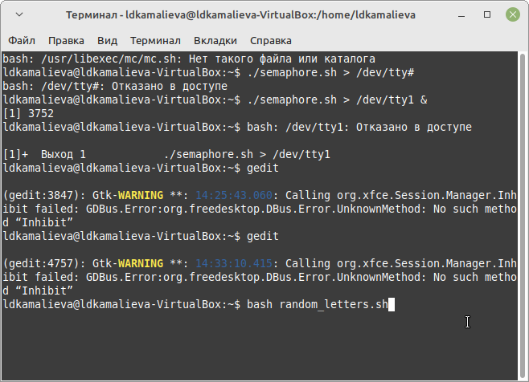
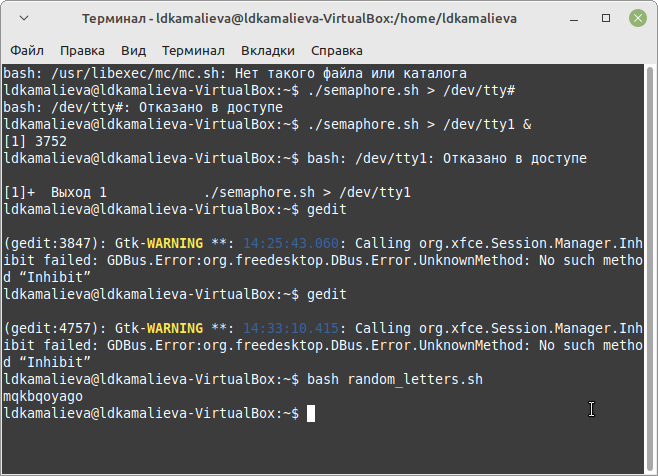

---
## Front matter
lang: ru-RU
title: Лабораторная работа №14
author:
  - Камалиева Лия Дамировна\inst{1}
institute:
   \inst{1}Российский университет дружбы народов, Москва, Россия
date: 11 мая, 2024

## i18n babel
babel-lang: russian
babel-otherlangs: english

## Formatting pdf
toc: false
toc-title: Содержание
slide_level: 2
aspectratio: 169
section-titles: true
theme: metropolis
header-includes:
 - \metroset{progressbar=frametitle,sectionpage=progressbar,numbering=fraction}
 - '\makeatletter'
 - '\beamer@ignorenonframefalse'
 - '\makeatother'
---

## Цели и задачи

Изучить основы программирования в оболочке ОС UNIX. Научиться писать более
сложные командные файлы с использованием логических управляющих конструкций
и циклов

# Выполнение лабораторной работы

##  Прописываю код по первому заданию и создаю файл semaphore.sh

{ #fig:001 width=70% }

## запускаю код

{ #fig:002 width=70% }

## прописываю код по 2 заданию и сохраняю файл под именем man.sh

{ #fig:003 width=70% }

## делаю код исполняемым

{ #fig:004 width=70% }

## Этот скрипт будет пытаться найти файл справки для указанной команды и откроет его в less, если он найден. Если файла справки нет, он выдаст сообщение об отсутствии справки.

{ #fig:005 width=70% }

##  прописываю скрипт для задания с рандомными числами

{ #fig:006 width=70% }

## пишу команду, чтобы запустить код

{ #fig:007 width=70% }

## проверяю работу, всё работает

{ #fig:008 width=70% }

#Выводы

## Итоговый слайд (вывод)

я начала писать скрипты в emacs

