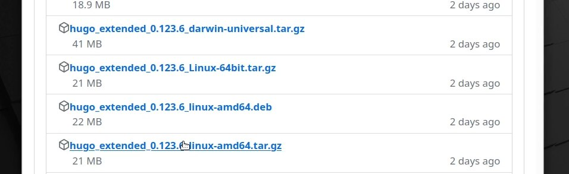
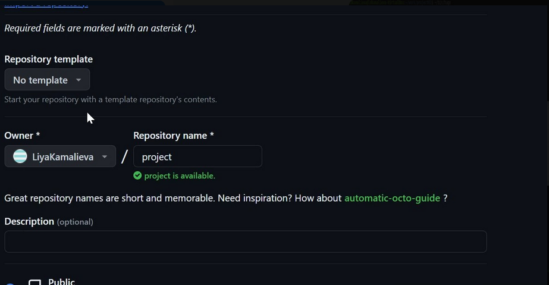
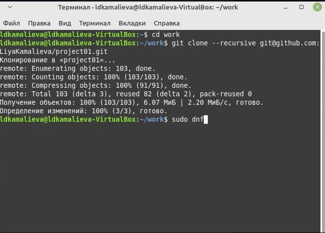
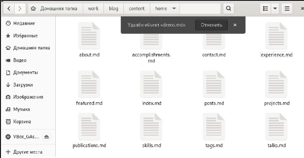
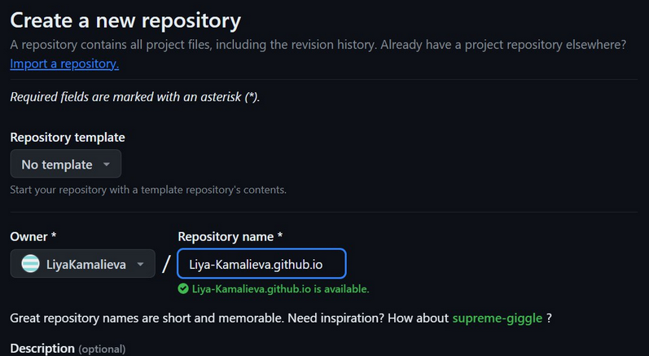

---
## Front matter
lang: ru-RU
title: Отчёт по первому этапу выполнения индивидуального проекта
author:
  - Камалиева Лия Дамировна\inst{1}
institute:
   \inst{1}Российский университет дружбы народов, Москва, Россия
date: 28 февраля, 2024

## i18n babel
babel-lang: russian
babel-otherlangs: english

## Formatting
toc: false
slide_level: 2
theme: metropolis
header-includes:
 - \metroset{progressbar=frametitle,sectionpage=progressbar,numbering=fraction}
 - '\makeatletter'
 - '\beamer@ignorenonframefalse'
 - '\makeatother'
aspectration: 43
section-titles: true
---

## Цели и задачи

Создать сайт

# Выполнение ип
## скачиваем исполняемый файл

 { #fig:001 width=70% }

## извлекаем файлы в папку bib

{ #fig:002 width=70% }

## cоздаю свой репозиторий

{ #fig:003 width=70% }

## клонирую его 

{ #fig:003 width=70% }

## Cкачиваю go 

{ #fig:004 width=70% }

## пользуюсь командой ~/bin/hugo

{ #fig:005 width=70% }

## пользуясь командой ~/bin/hugo server получаем ссылку на сайт

{ #fig:006 width=70% }

## удаляем файл demo.md

{ #fig:007 width=70% }

## github и создаем рекозиторий

{ #fig:008 width=70% }

## клонируем его

{ #fig:009 width=70% }

#Выводы

Мы научились размещать заготовки на github pages

## Итоговый слайд (вывод)

Я научилась устанавливать виртуальную машину в вирчал боксе, и начала работу с новой для себя ОС.
